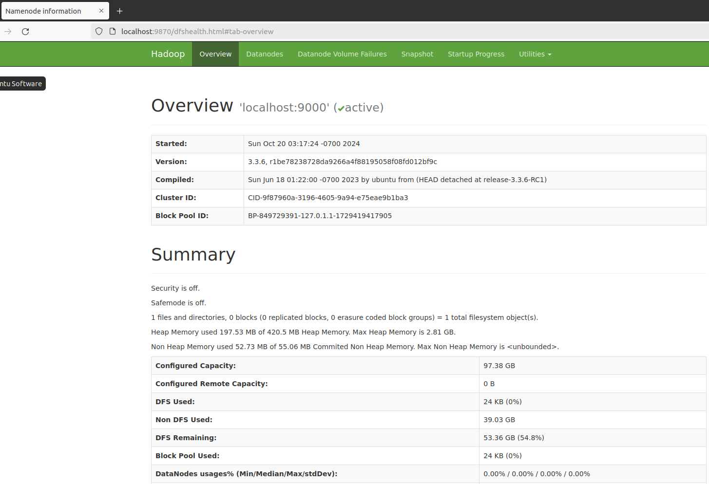

[TOC]

## 一、预备知识

### 1.1 Hadoop 发行版本

Hadoop 的发行版本有：

- **Apache Hadoop**：官方版本，由 Apache 软件基金会维护。
- **Hortonworks Data Platform (HDP)**：基于 Apache Hadoop 的企业级发行版，提供了额外的工具和组件（如 Hive、HBase、Spark 等），适合企业用户。
- **Cloudera Data Platform (CDP)**：Cloudera 的企业级解决方案，整合了 Hortonworks 和 Cloudera 的产品，提供更全面的功能和支持。

其中，Apache Hadoop 最适合新手入门学习。


### 1.2 部署方式

部署方式主要有以下三种：

- **单节点模式**：所有 Hadoop 组件运行在同一台机器上。这比较适合适合开发和测试。
- **伪分布模式**：在单台机器上模拟分布式环境，Hadoop 各组件在不同的进程中运行。这比较适合适合小规模测试和开发。

- **完全分布式模式**：在多台机器上部署 Hadoop 集群，每个节点上运行不同的 Hadoop 组件。这适合生产环境，要求对集群进行详细配置。


## 二、预备条件

### 2.1 环境准备

- 安装 JDK。在 [Hadoop Java Versions - Hadoop - Apache Software Foundation](https://cwiki.apache.org/confluence/display/HADOOP/Hadoop+Java+Versions) 查看Hadhoop 推荐的 Java 版本，最佳版本为 JDK 8 。

- 配置 SSH 免密登录。如果要使用可选的启动和停止脚本，则必须安装 ssh 并且运行 sshd 才 能使用管理远程 Hadoop 守护进程的 Hadoop 脚本。此外，建议还安装 pdsh 以更好地管理ssh资源。

  ```shell
  $ sudo apt-get install ssh
  $ sudo apt-get install pdsh
  ```

  注意，pdsh 的远程命令类型为 rsh， 建议修改成 ssh。


### 2.2 创建新用户(可选)

创建一个新用户，用户名和密码设置为 hadoop

```shell
$ sudo useradd -m hadoop -s /bin/bash
$ sudo passwd hadoop
```

为了避免权限造成的问题，为 hadoop 用户增加管理员权限。

```shell
$ sudo adduser hadoop sudo
```


### 2.3 配置 SSH 无密码登录

Hadoop 在启动时需要通过 SSH 连接到各个节点（包括本地主机）。因此，我们需要配置无密码登录。

简单地介绍已下 SSH 登录原理：

1. **密钥对生成**：用户在本地生成一对密钥：一个私钥和一个公钥。私钥保留在本地，公钥可以共享给任何希望访问的服务器。
2. **公钥复制**：用户将公钥添加到目标服务器的 `~/.ssh/authorized_keys` 文件中。
3. **身份验证过程**：当用户尝试通过 SSH 连接到服务器时，服务器会发送一条随机消息给用户。用户使用自己的私钥对该消息进行加密，然后将其返回给服务器。服务器使用存储在 `authorized_keys` 文件中的相应公钥来解密收到的消息。如果解密成功且消息匹配，身份验证通过，用户被允许访问。


**(1) 确保 SSH 服务正在运行**

首先，确保 SSH 服务在您的 Ubuntu 系统上运行。

```shell
# 检查 SSH 服务的状态
$ sudo systemctl status ssh

# 如果服务未运行， 启动 SSH 服务
$ sudo systemctl start ssh
```

**(2) 生成 SSH 密钥对**

使用  `ssh-keygen` 在 `~/.ssh` 目录下生成 SSH 密钥对。

```shell
# 输入密码 hadoop 才能登录。因此，我们需要实现无密登录
ssh localhost

# 若没有该目录，执行一次 ssh localhost 后会自动生成
$ cd ~/.ssh/ 

# 生成密钥对
$ ssh-keygen -t rsa -b 2048
Generating public/private rsa key pair.
Enter file in which to save the key (/home/hadoop/.ssh/id_rsa): 
Enter passphrase (empty for no passphrase): 
Enter same passphrase again: 
Your identification has been saved in /home/hadoop/.ssh/id_rsa
Your public key has been saved in /home/hadoop/.ssh/id_rsa.pub
The key fingerprint is:
SHA256:HGuMfZmVK09WBr0fPJ3Kj5xYnUuChwl08TlaSq5HN0k hadoop@ubuntu
The key's randomart image is:
+---[RSA 2048]----+
|           .o.   |
|         . ..oo  |
|        o ..oE+.o|
|       = +o+=++=.|
|      . S *=O+o.+|
|       . .oO.*.+.|
|         . .* * .|
|          .. + o |
|                 |
+----[SHA256]-----+

```

其中，`id_rsa` 为 私钥， `id_rsa.pub` 为公钥。

**(3) 将公钥添加到目标服务器的`authorized_keys`**

使用 `ssh-copy-id` 命令可以方便地将公钥复制到目标主机的 `authorized_keys` 文件中

```shell
# 方式一
$ ssh-copy-id -i ~/.ssh/id_rsa.pub localhost

# 方式二
$ cat ~/.ssh/id_rsa.pub >> ~/.ssh/authorized_keys
```

`authorized_keys` 是一个文本文件，位于用户的 `~/.ssh/` 目录下。它用于存储被授权可以无密码访问该用户帐户的 SSH 公钥。将公钥添加到 `authorized_keys` 文件中，以允许无密码访问。

确保 `~/.ssh/authorized_keys` 的权限设置正确：

```shell
chmod 0600 ~/.ssh/authorized_keys
chmod 700 ~/.ssh
```

**(4) 测试 SSH 连接**

在终端中尝试通过 SSH 连接到 localhost 和主机名：

```shell
$ ssh ubuntu
The authenticity of host 'ubuntu (127.0.1.1)' can't be established.
ECDSA key fingerprint is SHA256:Joilwgpgx1Mc2K3XnL1iszZ+Y/EK+GltbMG6B28luBY.
Are you sure you want to continue connecting (yes/no/[fingerprint])? yes
Warning: Permanently added 'ubuntu' (ECDSA) to the list of known hosts.
Welcome to Ubuntu 20.04.4 LTS (GNU/Linux 5.15.0-107-generic x86_64)

 * Documentation:  https://help.ubuntu.com
 * Management:     https://landscape.canonical.com
 * Support:        https://ubuntu.com/advantage

240 updates can be applied immediately.
123 of these updates are standard security updates.
To see these additional updates run: apt list --upgradable

Your Hardware Enablement Stack (HWE) is supported until April 2025.

The programs included with the Ubuntu system are free software;
the exact distribution terms for each program are described in the
individual files in /usr/share/doc/*/copyright.

Ubuntu comes with ABSOLUTELY NO WARRANTY, to the extent permitted by
applicable law.
```

其中， `ubuntu` 是为特定计算机设置的主机名，用于标识这台机器。


### 2.4 下载 Hadoop

在  [Apache Download Mirrors](http://www.apache.org/dyn/closer.cgi/hadoop/common/) 下载合适的 Hadoop 版本。如果官网下载太慢，可以考虑 [hadoop/common (huaweicloud.com)](https://repo.huaweicloud.com/artifactory/apache-local/hadoop/common/) 网站。

执行以下命令，下载 Hadoop 安装包。

```shell
# 下载安装包
$ wget --no-check-certificate https://repo.huaweicloud.com/apache/hadoop/common/hadoop-3.3.6/hadoop-3.3.6.tar.gz

# 解压安装包到指定目录
$ sudo tar -zxvf hadoop-3.3.6.tar.gz -C /usr/local/

# 将文件夹名改为hadoop
$ cd /usr/local
$ sudo mv ./hadoop-3.3.6/ ./hadoop            

# 修改文件权限
$ sudo chown -R hadoop ./hadoop     
```

输入如下命令来检查 Hadoop 是否可用，成功则会显示 Hadoop 版本信息：

```shell
$ cd /usr/local/hadoop
$ ./bin/hadoop version
```


### 2.5 编辑 hadoop-env.sh 脚本

编辑 hadoop-env.sh 脚本， 设置必要的一些参数。

```sh
# The java implementation to use. By default, this environment
# variable is REQUIRED on ALL platforms except OS X!
export JAVA_HOME=/usr/local/jdk/jdk1.8.0_421
```

查看 Hadoop 脚本的使用文档

```shell
$/usr/local/hadoop-3.3.6/bin/hadoop
```


### 2.6 编辑 dfs 和 yarn 脚本

在 sbin/start-dfs.sh 和 sbin/stop-dfs.sh 脚本中，添加以下参数：

```sh
HDFS_DATANODE_USER=root
HDFS_NAMENODE_USER=root
HDFS_SECONDARYNAMENODE_USER=root  
HDFS_DATANODE_SECURE_USER=hdfs
```

在 sbin/start-yarn.sh 和 sbin/stop-yarn.sh 脚本中，添加以下参数：

```sh
YARN_RESOURCEMANAGER_USER=root
YARN_NODEMANAGER_USER=root
```


## 三、单节点模式部署

**默认情况下，Hadoop配置为以非分布式模式运行**，作为单个Java进程。这对于调试很有用。

### 3.1 官方使用案例

将 `input` 文件夹中的所有文件作为输入，筛选当中符合正则表达式 dfs[a-z.]+ 的单词并统计出现的次数，最后输出结果到 `output` 文件夹中

```shell
$ cd /usr/local/hadoop

$ mkdir input

$ cp etc/hadoop/*.xml input

$ bin/hadoop jar share/hadoop/mapreduce/hadoop-mapreduce-examples-3.3.6.jar grep input output 'dfs[a-z.]+'
```


### 3.2 查看运行结果

查看运行结果：

```shell
$ cat output/*
1	dfsadmin
1	dfs.replication
1	dfs.permissions
```


## 四、伪分布模式部署

Hadoop 可以在单节点上以伪分布式的方式运行，Hadoop 进程以分离的 Java 进程来运行。

在  `/usr/local/hadoop/etc/hadoop/`  中，伪分布式需要修改2个配置文件 `core-site.xml` 和 `hdfs-site.xml` 。

### 4.1  修改配置文件

`etc/hadoop/core-site.xml`:

```xml
<configuration>
  <!-- 指定 Hadoop 文件系统的默认文件系统 URI -->
  <property>
	  <name>fs.defaultFS</name>
	  <value>hdfs://localhost:9000</value>
  </property>
  
  <!-- 指定 Hadoop 运行时生成的临时文件的存储目录 -->
  <property>
	  <name>hadoop.tmp.dir</name>
	  <value>file:/usr/local/hadoop/tmp</value>
    <description>Abase for other temporary directories.</description>
  </property>
</configuration>
```

`etc/hadoop/hdfs-site.xml`：

```xml
<configuration>
  <!-- 指定了 HDFS NameNode 存储其元数据的目录 -->
  <property>
      <name>dfs.namenode.name.dir</name>
      <value>file:/usr/local/hadoop/tmp/dfs/name</value>
  </property>

  <!-- 指定了 HDFS DataNode 存储实际数据块的目录 -->
  <property>
      <name>dfs.datanode.data.dir</name>
      <value>file:/usr/local/hadoop/tmp/dfs/data</value>
  </property>

  <!-- 定义 HDFS 文件的默认副本数量 -->
  <property>
    <name>dfs.replication</name>
    <value>1</value>
  </property>

  <!-- 定义 HDFS 是否启用权限检查 -->
  <property>
   <name>dfs.permissions</name>
   <value>false</value>
  </property>

  <!-- 控制 Secondary NameNode（次要 NameNode）执行 HDFS 检查点（checkpoint）的周期 -->
  <property>
   <name>fs.checkpoint.period</name>
   <value>3000</value>
  </property>
</configuration>
```


`etc/hadoop/mapred-site.xml`:

```xml
<configuration>
    <property>
        <name>mapreduce.framework.name</name>
        <value>yarn</value>
    </property>
    <property>
        <name>mapreduce.application.classpath</name>
        <value>$HADOOP_MAPRED_HOME/share/hadoop/mapreduce/*:$HADOOP_MAPRED_HOME/share/hadoop/mapreduce/lib/*</value>
    </property>
</configuration>
```


`etc/hadoop/yarn-site.xml`:

```xml
<configuration>
    <property>
        <name>yarn.nodemanager.aux-services</name>
        <value>mapreduce_shuffle</value>
    </property>
    <property>
        <name>yarn.nodemanager.env-whitelist</name>
        <value>JAVA_HOME,HADOOP_COMMON_HOME,HADOOP_HDFS_HOME,HADOOP_CONF_DIR,CLASSPATH_PREPEND_DISTCACHE,HADOOP_YARN_HOME,HADOOP_HOME,PATH,LANG,TZ,HADOOP_MAPRED_HOME</value>
    </property>
</configuration>
```


### 4.2 格式化 Hadoop(首次)

在第一次启动的时候，格式化 HDFS（Hadoop 分布式文件系统）。

```shell
# 进入 Hadoop 安装目录
$ cd /usr/local/hadoop

# 格式化 HDFS
$ bin/hdfs namenode -format
```

后面启动的时候，无需格式化。


### 4.3  启动 Hadoop

**(1) 启动 HDFS**

```shell
$ sbin/start-dfs.sh
Starting namenodes on [localhost]
Starting datanodes
Starting secondary namenodes [ubuntu]
```

在成功启动后，我们还可以访问 Hadoop Web 界面 http://localhost:9870。



**(2) 启动 YARN**

启动 YARN。

```shell
$ sbin/start-yarn.sh
Starting resourcemanager
Starting nodemanagers
```

在成功启动后，我们还可以访问 YARN 界面 http://localhost:8088 。


### 4.4 检查 Hadoop 状态

使用以下命令检查 Hadoop 服务的状态：

```shell
# 查看运行 Java 进程
$ jps
5079 ResourceManager
4508 DataNode
4348 NameNode
4782 SecondaryNameNode
5615 Jps
5231 NodeManager
```

此命令将显示当前正在运行的 Java 进程。您应该能够看到如下进程：


### 4.5 停止 Hadoop

```shell
$ sbin/stop-dfs.sh
Stopping namenodes on [localhost]
Stopping datanodes
Stopping secondary namenodes [ubuntu]

$ sbin/stop-yarn.sh
Stopping nodemanagers
Stopping resourcemanager
```


## 五、常见问题

### 5.1  启动 start-dfs.sh 脚本报错

**问题描述：**

```shell
$ sudo sbin/start-dfs.sh
Starting namenodes on [ubuntu]
pdsh@ubuntu: ubuntu: rcmd: socket: Permission denied
Starting datanodes
pdsh@ubuntu: localhost: rcmd: socket: Permission denied
Starting secondary namenodes [ubuntu]
pdsh@ubuntu: ubuntu: rcmd: socket: Permission denied

```

**解决方案：**

**(1) 查看 SSH 配置**

检查 `/etc/ssh/sshd_config` 配置文件，确保以下基本配置

```
# 
PermitRootLogin yes
PubkeyAuthentication yes
AuthorizedKeysFile     .ssh/authorized_keys
```

如果有更改，记得重启 SSH 服务

```shell
$ sudo systemctl restart ssh
```

（2）pdsh 执行命令

`pdsh`（并行分布式 Shell）执行远程命令时的默认远程命令类型为 rsh 时， 会出现[该问题](https://stackoverflow.com/questions/42756555/permission-denied-error-while-running-start-dfs-sh)。

```shell
# 检查 pdsh 的远程命令类型
$ pdsh -q -w localhost
```

更改为使用 ssh ：

```shell
# 1. 临时设置
$ export PDSH_RCMD_TYPE=ssh

# 2. 永久设置
$ echo 'export PDSH_RCMD_TYPE=ssh' >> ~/.bashrc
```

最后，重新加载 `~/.bashrc`：

```shell
$ source ~/.bashrc
```

（3）不建议的方案

在尝试以上方案后，依旧无法启动，建议删除 `pdsh`。

```
apt-get remove pdsh
```


### 5.2 启动脚本时拒绝访问

**报错信息：**

```shell
$ sudo sbin/start-dfs.sh
Starting namenodes on [ubuntu]
ubuntu: root@ubuntu: Permission denied (publickey,password).
Starting datanodes
localhost: root@localhost: Permission denied (publickey,password).
Starting secondary namenodes [ubuntu]
ubuntu: root@ubuntu: Permission denied (publickey,password).
```

**解决方案：**

不要使用 sudo。事实上，在没有使用 sudo 的情况下依旧可以运行，我们可以考虑直接为用户增加管理员权限。


## 参考资料

[Apache Hadoop 3.3.6 – Hadoop: Setting up a Single Node Cluster.](https://hadoop.apache.org/docs/stable/hadoop-project-dist/hadoop-common/SingleCluster.html#Fully-Distributed_Operation)

[hadoop - HDFS_NAMENODE_USER, HDFS_DATANODE_USER & HDFS_SECONDARYNAMENODE_USER not defined - Stack Overflow](https://stackoverflow.com/questions/48129029/hdfs-namenode-user-hdfs-datanode-user-hdfs-secondarynamenode-user-not-defined)

[Hadoop安装教程——单机 / 伪分布式配置-阿里云开发者社区 (aliyun.com)](https://developer.aliyun.com/article/1225964)