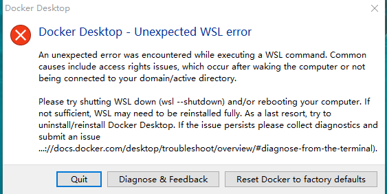
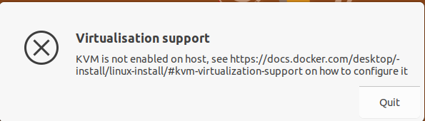

## 一、Docker Engine vs Docker Desktop 

`Docker Engine` 和 `Docker Desktop` 是 Docker 生态系统中两个不同的概念，它们在用途和适用场景上有一些区别。

**(1) Docker Engine:**

[Docker Engine](https://docs.docker.com/engine/) 是一种开源的容器运行时技术，用于构建和容器化应用程序。它使得开发者能够将应用程序和其依赖项打包成容器，以确保在不同环境中的一致性运行。Docker Engine 包括：

- **服务器端：** 拥有一个长时间运行的守护进程 `dockerd`，该守护进程负责管理和执行容器的创建、运行和停止等操作。
- **APIs：** 定义了用于与 Docker 守护进程通信的接口。这些 APIs 允许程序与 Docker 守护进程进行交互，并发出指令来执行各种容器相关的任务。
- **命令行界面 (CLI) 客户端 docker：**该客户端允许用户通过命令行发出指令，与 Docker 守护进程进行交互，从而进行容器的创建、管理和监控等操作。

Docker Engine 通常用于服务器环境，例如在云服务器、虚拟机或物理服务器上运行。它提供了创建和运行容器的基本功能，支持容器编排工具（如 Docker Compose 和 Kubernetes）来管理多个容器。


**(2) Docker Desktop:**

[Docker Desktop](https://docs.docker.com/desktop/)是适用于Mac、Linux或Windows环境的一键安装应用程序，可让您构建、共享和运行容器化应用程序和微服务。它在桌面操作系统上提供了用户友好的界面和集成开发环境。

它包含了一个完整的 Docker 环境，包括 Docker Engine、CLI 工具、Docker Compose 等。Docker Desktop 提供了一个方便的方式，让开发者能够在本地构建、测试和运行容器化应用。


**总结：**

- `Docker Engine` 是 Docker 运行时的核心组件，主要用于在服务器环境中运行容器。
- `Docker Desktop` 是一个桌面应用程序，包含 Docker Engine，并提供了一个本地开发环境，方便开发者在本地计算机上使用 Docker。


## 二、Install Docker Desktop on Windows

### 2.1 系统要求

值得注意的是，我们要查看一下 [系统要求](https://docs.docker.com/desktop/install/windows-install/#system-requirements)。
在 Docker for Windows 中，有2种不同的后端（backend）选项，分别是WSL 2 backend、Hyper-V backend and Windows containers。它们之间的主要区别在于底层技术和使用场景：

1. **WSL 2 Backend：**
   - **技术背景：** [WSL（Windows Subsystem for Linux）](https://learn.microsoft.com/zh-cn/windows/wsl/about)是一种在Windows上运行本机Linux二进制文件的兼容层。WSL 2是WSL的升级版本，采用了虚拟化技术，使用了Hyper-V虚拟机来运行Linux内核。
   - **使用场景：** WSL 2 backend适用于开发者希望在Windows上运行Linux容器，同时又想充分利用WSL提供的Linux开发环境。
2. **Hyper-V backend and Windows containers：**
   - **技术背景：** Hyper-V 是Windows的一种虚拟化技术，允许在Windows上运行虚拟机。Hyper-V backend 使用Hyper-V来创建和管理Docker容器。
   - **使用场景：** Hyper-V backend适用于需要在Windows上隔离运行容器的场景，尤其是在企业环境中，Hyper-V提供了更强大的虚拟化支持。

建议直接选择软件的推荐方式：


### 2.2 安装步骤

在windows系统，安装教程主要为：

- 访问 [Install Docker Desktop on Windows | Docker Docs](https://docs.docker.com/desktop/install/windows-install/)， 下载程序
- 按照安装向导上的说明授权安装程序并继续安装，安装完成后重启电脑
- 重启后，接受协议并设置 WSL 更新方式即可

安装完成后，添加的应用的如下


同时，我们可以看到，CPU虚拟化已启动


查看安装的 docker 和 wsl 版本 

```shell
C:\Users\zouhu>docker -v
Docker version 24.0.7, build afdd53b

C:\Users\zouhu>wsl -v
WSL 版本： 2.0.14.0
内核版本： 5.15.133.1-1
WSLg 版本： 1.0.59
MSRDC 版本： 1.2.4677
Direct3D 版本： 1.611.1-81528511
DXCore 版本： 10.0.25131.1002-220531-1700.rs-onecore-base2-hyp
Windows 版本： 10.0.19045.3803
```


### 2.3 可能出现的问题

#### 2.3.1  WSL 软件问题

在 Docker 软件中，WSL 扮演着重要的角色。如果后续 WSL 软件出现了问题，会导致 Docker Desktop 出现下面的错误



具体错误信息为：

```
deploying WSL2 distributions
ensuring main distro is deployed: deploying "docker-desktop": importing WSL distro "当前计算机配置不支持 WSL2。\r\n请启用“虚拟机平台”可选组件，并确保在 BIOS 中启用虚拟化。\r\n通过运行以下命令启用“虚拟机平台”: wsl.exe --install --no-distribution\r\n有关信息，请访问 https://aka.ms/enablevirtualization\r\n错误代码: Wsl/Service/RegisterDistro/CreateVm/HCS/HCS_E_HYPERV_NOT_INSTALLED\r\n" output="docker-desktop": exit code: 4294967295: running WSL command wsl.exe C:\WINDOWS\System32\wsl.exe --import docker-desktop <HOME>\AppData\Local\Docker\wsl\main C:\Program Files\Docker\Docker\resources\wsl\wsl-bootstrap.tar --version 2: 当前计算机配置不支持 WSL2。
请启用“虚拟机平台”可选组件，并确保在 BIOS 中启用虚拟化。
通过运行以下命令启用“虚拟机平台”: wsl.exe --install --no-distribution
有关信息，请访问 https://aka.ms/enablevirtualization
错误代码: Wsl/Service/RegisterDistro/CreateVm/HCS/HCS_E_HYPERV_NOT_INSTALLED
: exit status 0xffffffff
checking if isocache exists: CreateFile \\wsl$\docker-desktop-data\isocache\: The network name cannot be found.
```

解决方案：

(1) 打开Windows功能中的 `适用于Linux的Windows子系统` 和 `虚拟机平台`。


(2) 检查 wsl 状态

```cmd
$wsl --install
请求的操作需要提升。
正在安装: 虚拟机平台
已安装 虚拟机平台。
正在安装: 适用于 Linux 的 Windows 子系统
已安装 适用于 Linux 的 Windows 子系统。
正在安装: Ubuntu
已安装 Ubuntu。
请求的操作成功。直到重新启动系统前更改将不会生效。


# 以管理员身份运行 PowerShell, 下载并安装 WSL 2 内核（如果未安装）
$wsl --install --no-distribution
操作成功完成。

# 手动设置 WSL 2 为默认版本
$wsl --set-default-version 2
有关与 WSL 2 关键区别的信息，请访问 https://aka.ms/wsl2


wsl --shutdown

# 保证 Hyper-V 正常
bcdedit /set hypervisorlaunchtype auto
操作成功完成。
```


（3）重新安装  **Docker Desktop**

重新打开软件即可，Docker Desktop 软件会自动安装 WSL 发行版

```
# 检查 wsl 状态
$ wsl --status
默认版本: 2

# 显示了当前系统中安装的 WSL发行版
$ wsl --list --verbose
  NAME              STATE           VERSION
* docker-desktop    Stopped         2
```

注意：**Win10 家庭版不支持 Hyper-V, 从而不支持 WSL2**。Windows 家庭版默认不支持 **完整的 Hyper-V 功能**（比如你不能直接安装 Hyper-V 管理器创建虚拟机），但 **WSL2 仍然可以运行**。这是因为**WSL2 使用的是“轻量级 Hyper-V”**


2.3.2 

**问题描述**

在启动的时候，报错，具体信息如下：


**解决方案**

猜测是网络问题，等一会就好了


## 三、Install Docker Desktop on Linux

### 3.1 KVM虚拟化支持

(1) docker 依赖底层技术 KVM

Docker Desktop运行需要  [KVM support](https://www.linux-kvm.org/) 。

如果没有安装 KVM ，打开Docker软件的时候，系统会报下图中所示的错误



(2)安装 KVM

如果主机支持虚拟化，则kvm模块应自动加载。否则，要手动加载模块，请运行：

```
modprobe kvm
```

根据主机的处理器，必须加载相应的模块：

```
sudo modprobe kvm_intel  # Intel processors

sudo modprobe kvm_amd    # AMD processors
```


检查是否启用了KVM模块，运行：

```
kvm-ok
```

输出结果为：

```
INFO: /dev/kvm exists
KVM acceleration can be used
```


### 3.2 KVM 安装过程中可能遇到的问题

如果要在虚拟机上面启动 KVM， 需要确保虚拟机设置里面**开启了虚拟化引擎**。


但是，启动虚拟机后可能会遇到下图中的错误


解决方案：

（1）打开 `Windows安全中心>设备安全性>内核隔离`， 关闭内核隔离

（2）如果是在 Windows 上装了 wsl ，还要禁用Windows功能中的 `适用于Linux的Windows子系统`  和 `虚拟机平台`。 其中，[适用于 Linux 的 Windows 子系统](https://learn.microsoft.com/zh-cn/windows/wsl/about) (WSL) 是 Windows 的一项功能，可用于在 Windows   计算机上运行 Linux 环境，而无需单独的虚拟机或双引导。


糟糕的是，Windows 上可能就无法使用 Docker Desktop


### 3.3 安装 Docker Desktop

根据Linux发行版， 在 [官网](https://docs.docker.com/desktop/install/linux-install/) 下载正确的包，并使用相应的包管理器安装：

```
sudo apt-get update
sudo apt-get install ./docker-desktop-<version>-<arch>.deb
```

安装完成后，重启电脑即可。


## 四、常见问题

- Win10 家庭版不支持 Hyper-V, 从而不支持 WSL2


## 参考资料

[Install Docker Desktop on Windows | Docker Docs](https://docs.docker.com/desktop/install/windows-install/#system-requirements)

[Install Docker Desktop on Linux | Docker Docs](https://docs.docker.com/desktop/install/linux-install/)