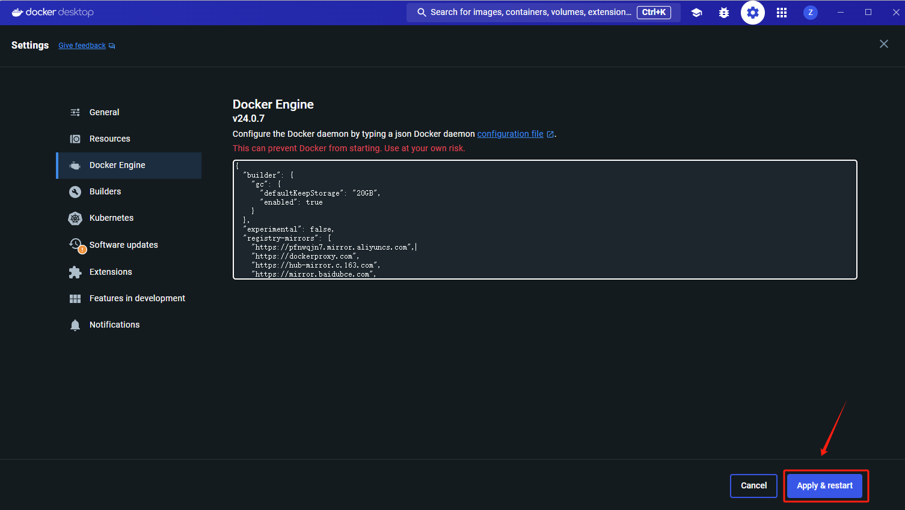

# 一、 Docker 镜像源

## 1.1 加速域名

- 阿里云 Docker 加速：类似 `xxxxxx.mirror.aliyuncs.com` 的个人专属加速地址；

- DockerProxy 代理加速：`dockerproxy.com`

- 百度云 Mirror: `mirror.baidubce.com`

- DaoCloud: `docker.m.daocloud.io`

- 南京大学：`docker.nju.edu.cn`

- 上海交大：`docker.mirrors.sjtug.sjtu.edu.cn`


## 1.2 阿里云镜像源（推荐）

[docker下载镜像卡死或太慢_docker 下载镜像卡柱-CSDN博客](https://blog.csdn.net/SuchASilly/article/details/106064689)


# 二、Docker 镜像源配置

Docker 镜像源配置步骤为：

1. 修改配置文件
2. 重启 Docker 服务
3. 检查是否配置成功


## 2.1 修改配置文件

Docker 镜像源配置的方式主要包括两种：

- Docker Desktop 配置
- 命令行配置

### 2.1.1 Docker Desktop 配置

在 Docker Desktop 的设置里面，添加以下代码：

```
{
    "registry-mirrors": [
        "https://dockerproxy.com",
        "https://hub-mirror.c.163.com",
        "https://mirror.baidubce.com",
        "https://ccr.ccs.tencentyun.com"
    ]
}
```


### 2.1.2 命令行配置

```
# 编辑 Docker 配置文件
$ sudo vim /etc/docker/daemon.json

# 加入以下配置项
{
    "registry-mirrors": [
        "https://dockerproxy.com",
        "https://hub-mirror.c.163.com",
        "https://mirror.baidubce.com",
        "https://ccr.ccs.tencentyun.com"
    ]
}
```


## 2.2 重启 Docker 服务

重启 Docker 服务的方式主要包括：

- Docker Desktop 重启

- 命令行重启

### 2.2.1  Docker Desktop 重启

在 Docker Desktop 界面， 点击右下角的 `Apply & restart` 按钮




### 2.2.2 命令行重启

命令行重启

```
# 方法一，采用 systemctl 来重启，推荐
$ sudo systemctl daemon-reload
$ sudo systemctl restart docker

# 方法二，采用 service 来重启
$ sudo service docker restart
```


## 2.3 检查是否配置成功

```
# 查看 Docker 信息
docker info

# 出现以下字段代表配置成功
Registry Mirrors:
  https://dockerproxy.com/
  https://hub-mirror.c.163.com/
  https://mirror.baidubce.com/
  https://ccr.ccs.tencentyun.com/
```


# 参考资料

[Docker 镜像库国内加速的几种方法-阿里云开发者社区 (aliyun.com)](https://developer.aliyun.com/article/1436840#:~:text=配置国内可用的 Docker Registry Mirrors 1 阿里云 Docker 加速：类似,DaoCloud%3A docker.m.daocloud.io 5 南京大学： docker.nju.edu.cn 6 上海交大： docker.mirrors.sjtug.sjtu.edu.cn)

[Windows Docker 配置国内镜像源的两种方法_docker desktop配置多个镜像源默认使用哪个镜像源-CSDN博客](https://blog.csdn.net/Lyon_Nee/article/details/124169099)

[Docker 配置国内源加速(2023/05/14)_docker国内源 Linux系统-CSDN博客](https://blog.csdn.net/qq_44797987/article/details/112681224)

