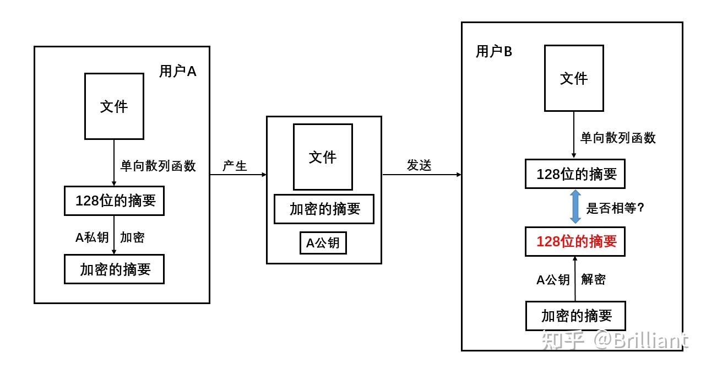

## 一、数字签名概述

### 什么是数字签名

数字签名是一种基于公钥加密技术的数字身份验证和数据完整性验证的技术手段。

数字签名必须实现的功能：

1. **报文鉴别**：接收者能够核实发送者对报文的签名。也就是说，接收者能够确信该报文的确是发
   送者发送的。其他人无法伪造对报文的签名。
2. **报文的完整性**：接收者确信所收到的数据和发送者发送的完全一样而没有被篡改过。
3. **不可否认**：发送者事后不能抵赖对报文的签名。

需要注意的是，数字签名只能通过公钥确认消息是持有私钥的一方发送的。如果公钥是伪造的话，这个确认将毫无意义。

## 二、数字签名工作原理

### 2.1 理论技术

数字签名主要**使用公钥算法和哈希函数技术来实现**。

- 哈希函数技术： 发送方使用哈希函数对消息进行摘要处理，生成消息摘要，接收方使用哈希函数对收到的消息进行摘要处理，从而确定消息的完整性和真实性。

- 公钥算法： 发送方使用私钥对消息摘要进行加密生成签名，接收方使用相应的公钥对数字签名进行解密，从而确保数据的完整性和真实性。（跟常规的公钥算法流程相反）

> 引用《 计算机网络（第7版》一书中的图片

### 2.2 工作流程

- 发送方使用哈希函数对消息进行摘要处理，生成消息摘要。
- 发送方使用自己的私钥对消息的摘要进行加密，形成数字签名。
- 接收方使用发送方的公钥对数字签名进行解密，得到消息的摘要。
- 接收方使用相同的哈希函数对收到的消息进行摘要计算。
- **接收方比较两个摘要是否匹配**。如果匹配，则确认消息来自发送方，并且消息在传输过程中未被篡改。

### 2.2 存在的问题

数字签名只能通过公钥确认消息是持有私钥的一方发送的。如果公钥是伪造的话，这个确认将毫无意义。

对应的解决方案为数字证书。

## 四、细节补充

### 数字签名是私钥加密公钥解密，而非对称算法是私钥解密公钥加密？

数字签名不同于普通的加密通信。在数字签名中，私钥用于签署（或加密）消息的摘要，以证明消息确实来自私钥的持有者，并且消息在传输过程中未被篡改。公钥用于验证签名，以确保签名的消息是来自私钥持有者，并且消息未被篡改。

这种方式能够确保数字签名的可靠性，因为只有私钥持有者才能生成有效的数字签名，并且任何人都可以使用公钥来验证签名，而无需了解私钥。

尽管看起来数字签名的流程似乎与非对称加密相反，但它实际上是利用了非对称加密算法的性质，通过**私钥签署和公钥验证的方式来保证数据的完整性和认证性**。

流程的不同，意味着目的也不相同：

- **公钥加密，私钥解密**。这个目的是为了保证内容传输的安全，因为被公钥加密的内容，其他人是无法解密的，只有持有私钥的人，才能解密出实际的内容;
- **私钥加密，公钥解密**。这个目的是为了保证消息不会被冒充，**因为私钥是不可泄露的**，如果公钥能正常解密出私钥加密的内容，就能证明这个消息是来源于持有私钥身份的人发送的。

## 参考资料

《 计算机网络（第7版）》

[什么是数字签名_数字签名简介_数字签名的优势以及应用场景-腾讯云开发者社区 (tencent.com)](https://cloud.tencent.com/developer/techpedia/1817)

[3.1 HTTP 常见面试题 | 小林coding (xiaolincoding.com)](https://xiaolincoding.com/network/2_http/http_interview.html#https-解决了-http-的哪些问题)