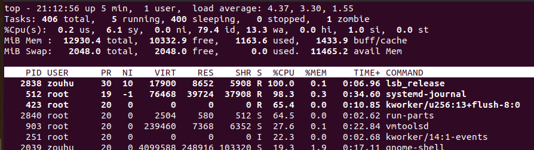

### 什么是 top 命令

[`top`](https://www.runoob.com/linux/linux-comm-top.html) 命令是用于**实时监控系统性能和进程活动**的命令行工具。它提供了关于系统当前运行的进程、CPU、内存使用情况的实时视图，帮助用户了解系统的负载、资源使用情况，并能动态调整进程优先级。

### top 命令的输出界面

#### 1.**系统总体信息（头部）**

- **uptime**：系统运行时间。
- **用户数量**：当前系统登录的用户数量。
- **负载平均值**：显示系统在过去1分钟、5分钟和15分钟的平均负载（load average），数值越大表示系统负载越高。

#### 2. **任务和CPU信息**

- **Tasks**：显示当前系统的总任务数，包括运行中的任务、睡眠中的任务和僵尸任务。
- **%Cpu(s)**：显示各类CPU使用情况的百分比，例如用户态使用、系统态使用、空闲时间等。

#### 3. **内存和交换分区信息**

- **Mem**：显示总内存、已使用内存、空闲内存、缓存等情况。
- **Swap**：显示总交换分区大小、已使用的交换分区和空闲的交换分区大小。

#### 4. **进程列表**

- **PID**：进程ID。
- **USER**：运行该进程的用户。
- **%CPU**：进程占用的CPU百分比。
- **%MEM**：进程占用的内存百分比。
- **TIME+**：进程使用的CPU时间总和。
- **COMMAND**：执行的命令或进程名称。