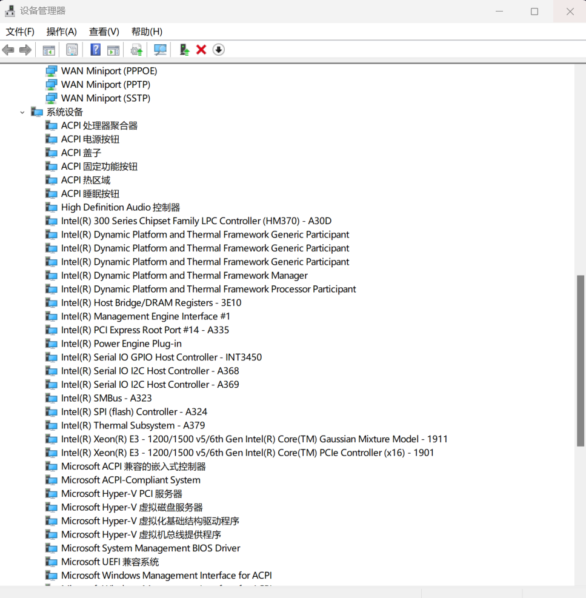

### 问题描述

安装发行版的时候，报如下错误：

```
$wsl.exe --install Ubuntu-20.04
正在安装: Ubuntu 20.04 LTS
已安装 Ubuntu 20.04 LTS。
正在启动 Ubuntu 20.04 LTS...
Installing, this may take a few minutes...
WslRegisterDistribution failed with error: 0x80370102
Please enable the Virtual Machine Platform Windows feature and ensure virtualization is enabled in the BIOS.
For information please visit https://aka.ms/enablevirtualization
Press any key to continue...
分发“Ubuntu-20.04”的安装过程失败，退出代码： 1。
错误代码: Wsl/InstallDistro/WSL_E_INSTALL_PROCESS_FAILED
```


### 原因分析

我们要保证以下三部分正常：

- CPU 虚拟化开启
- 虚拟机平台Windows功能开启
- 轻量级 Hyper-V 正常使用（这个比较难发现）。WSL2 底层依赖于 Hyper-V。


### 解决方案

经过排场，问题最终确定在 轻量级 Hyper-V。我们要查看以下三点：

（1）hypervisorlaunchtype 类型

```
# 保证 Hyper-V 正常
bcdedit /set hypervisorlaunchtype auto
操作成功完成。
```

（2）Hyper-V 服务可以运行

（3）Hyper-V 设备启动中

最后，我才发现因为自己不小心关闭了 Hyper-V  相关设备，才导致 wsl 无法正常运行。