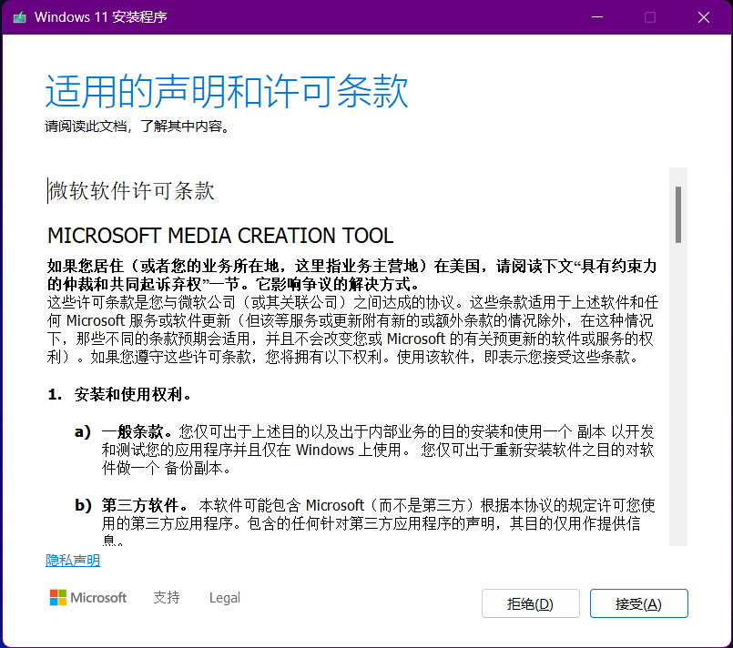
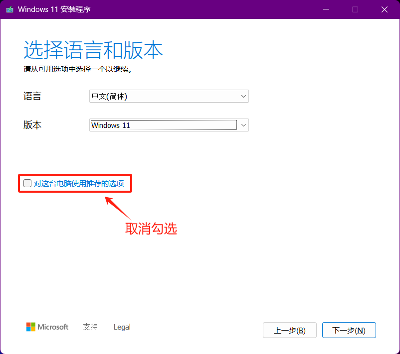
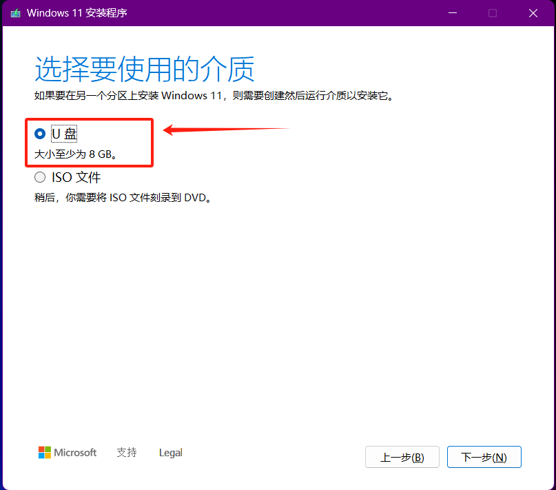
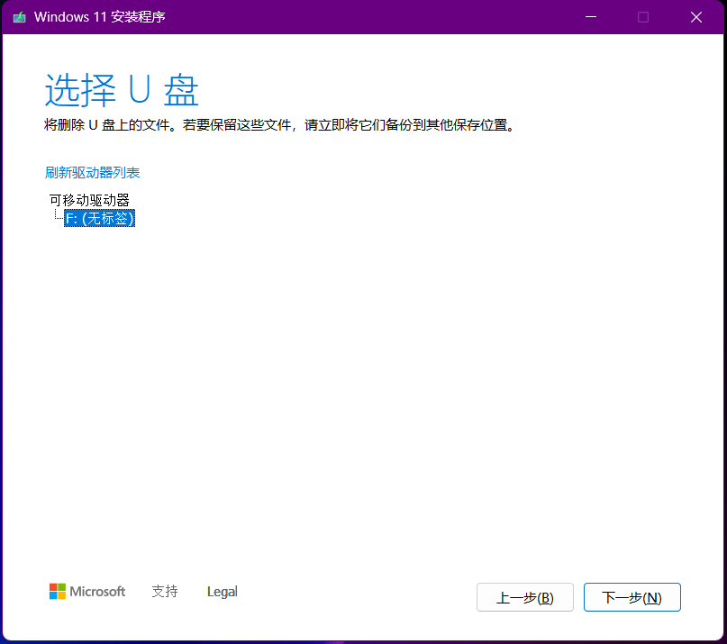
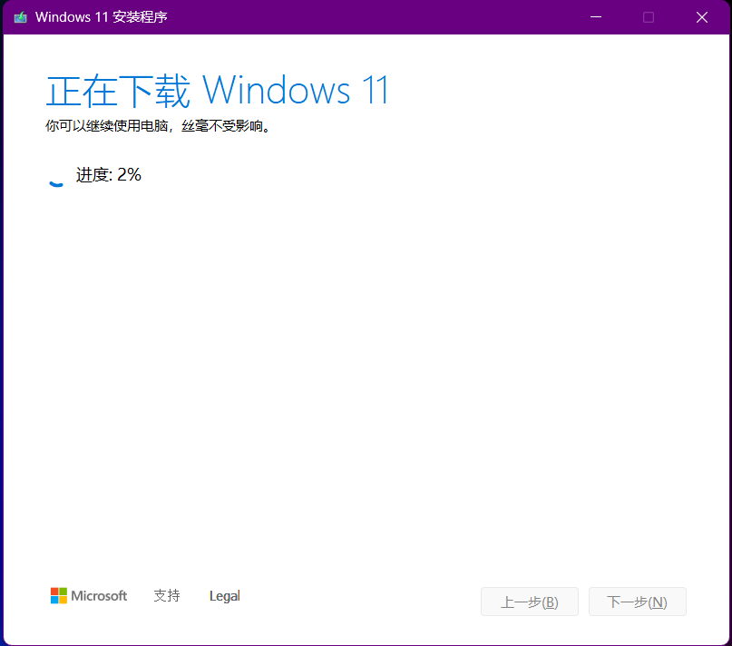
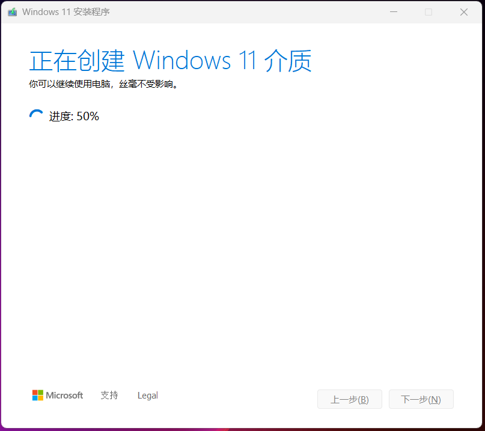
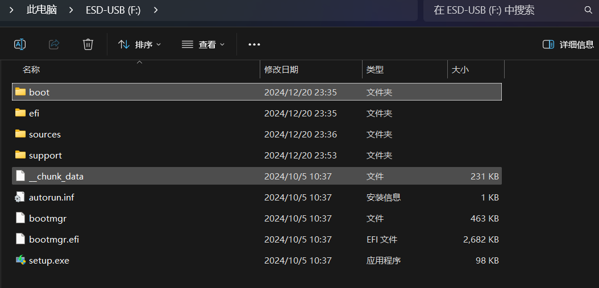
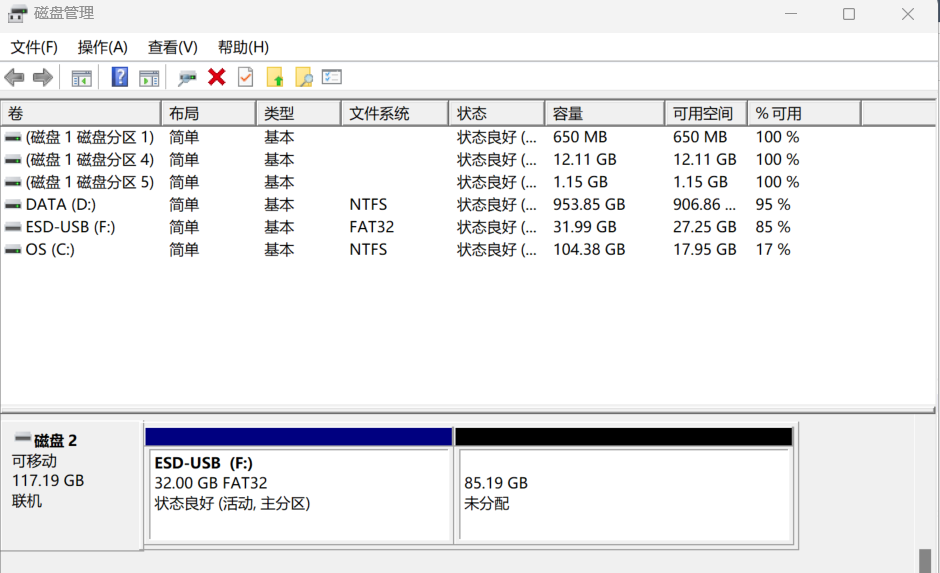

## 一、Windows 启动盘制作

启动盘是在操作系统制作的，它只起到"引导"启动"的作用。如进入BIOS、DOS界面和进入到操作系统的硬盘开始点，这个程序占用空间较小，可以复制、可放进光盘、移动硬盘、U盘。

### 1.1 **MediaCreationTool** 官方软件制作启动盘

> [为 Windows 创建安装媒体 - Microsoft 支持](https://support.microsoft.com/zh-cn/windows/创建适用于-windows-的安装介质-99a58364-8c02-206f-aa6f-40c3b507420d)
>
> [通过微软MediaCreationTool制作Win10系统安装U盘，安装纯净版Win10的通用教程-联想知识库](https://iknow.lenovo.com.cn/detail/26135.html)

#### 1.1.1 下载并运行 MediaCreationTool

1. 转到 [下载Windows 11](https://www.microsoft.com/software-download/windows11) 站点。
2. 在**“创建Windows 11安装媒体**”下，选择“**立即下载**”。 **下载MediaCreationTool.exe** 工具。
3. 运行 **MediaCreationTool.exe**。 媒体创建工具逐步讲解如何创建安装媒体。

#### 1.1.2 使用 MediaCreationTool 创建安装介质

如果您同意许可条款，请选择 **接受**。

选择 Windows 11 的语言、版本和架构（64 位）。此时，去掉左下角的勾选

选择您想使用的介质：

- **USB 闪存驱动器**：连接一个空的 USB 闪存驱动器，至少需要 8GB 的空间。闪存驱动器上的任何内容将被删除。
- **ISO 文件**：将 ISO 文件保存到您的电脑。这可以用于创建可启动的 DVD。下载文件后，您可以转到文件保存的位置，或选择 **打开 DVD 刻录机**，然后按照指示将文件刻录到 DVD 上。

选择 U 盘

等待 Windows 11 的安装

创建介质

最后，U 盘会被自动命名为 ESD-USB，该 U 盘的具体目录如下：

U 盘中只有 32 GB 被设置 FAT32 格式的文件系统，还有其他的未分配空间。

## 二、Windows 启动盘安装

[通过微软MediaCreationTool制作Win10系统安装U盘，安装纯净版Win10的通用教程-联想知识库](https://iknow.lenovo.com.cn/detail/26135.html)

[【重装系统】Win10最新安装教程【保姆级】_手把手教你win10专业版系统安装 csdn-CSDN博客](https://blog.csdn.net/waicsdn_haha/article/details/144404620)

关键步骤：

1. 插入 U 盘
2. 打开 BIOS ，更改启动项为 U 盘
3. 然后启动电脑，根据系统提示安装系统即可。

## 三、Windows 启动盘修复

### 3.1 引导相关原理

[Windows系统引导重建，Windows引导损坏修复_引导修复-CSDN博客](https://blog.csdn.net/qq_43681990/article/details/138276035)

### 3.2 修复引导项

[Windows 启动问题疑难解答 - Windows Client | Microsoft Learn](https://learn.microsoft.com/zh-cn/troubleshoot/windows-client/performance/windows-boot-issues-troubleshooting)

[使用U盘修复系统 - Microsoft Community](https://answers.microsoft.com/zh-hans/windows/forum/all/使用u盘修复/640183ff-244a-4748-a01e-4389cc91bf55)：该部分内容讲解得十分详细，建议作为首要参考教程。

[Windows 恢复环境 - Microsoft 支持](https://support.microsoft.com/zh-cn/windows/windows-recovery-environment-0eb14733-6301-41cb-8d26-06a12b42770b)： 查看其中使用安装媒体的修复过程