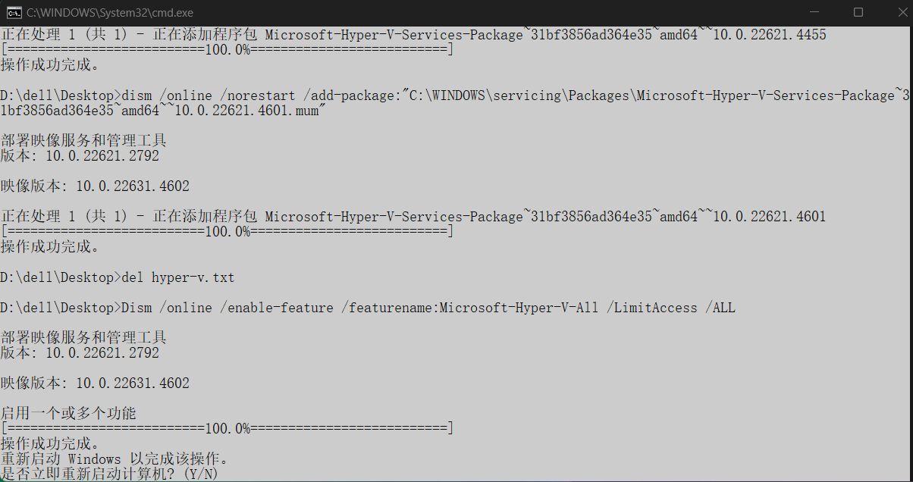

### 虚拟化技术

Windows 10 家庭版好像不支持 Hyper V, 从而不支持 WSL2


### 启动 Hyper-v

> [Win10 家庭中文版安装Docker(Win10家庭版 +Hyper-V+Docker） - 柠檬草不孤单 - 博客园](https://www.cnblogs.com/temari/p/13188168.html)

Win10家庭中文版无 Hyper-v，可以通过以下方式添加：

1. 桌面新建一个 `Hyper-V.bat` 文件，具体内容如下：

```bat
pushd "%~dp0"

dir /b %SystemRoot%\servicing\Packages\*Hyper-V*.mum >hyper-v.txt

for /f %%i in ('findstr /i . hyper-v.txt 2^>nul') do dism /online /norestart /add-package:"%SystemRoot%\servicing\Packages\%%i"

del hyper-v.txt

Dism /online /enable-feature /featurename:Microsoft-Hyper-V-All /LimitAccess /ALL
```

2. 鼠标右键选中“以管理员身份运行”，窗口运行执行代码，直到运行结束，显示提示是否重启，输入Y，重启电脑，如图：

3. 重启完毕，打开控制面板控->程序->程序和功能,点击“启用和关闭Windows功能”，弹出窗口，可看到 Hyper-V 已添加，如图：

​       


### 启动 Windows 功能

```shell
C:\Windows\System32>dism.exe /online /enable-feature /featurename:Microsoft-Windows-Subsystem-Linux /all /norestart

部署映像服务和管理工具
版本: 10.0.22621.2792

映像版本: 10.0.22631.4602

启用一个或多个功能
[==========================100.0%==========================]
操作成功完成。

C:\Windows\System32>dism.exe /online /enable-feature /featurename:VirtualMachinePlatform /all /norestart

部署映像服务和管理工具
版本: 10.0.22621.2792

映像版本: 10.0.22631.4602

启用一个或多个功能
[==========================100.0%==========================]
操作成功完成。
```


### 突破限制


## 参考资料

[Win10 家庭中文版安装Docker(Win10家庭版 +Hyper-V+Docker） - 柠檬草不孤单 - 博客园](https://www.cnblogs.com/temari/p/13188168.html)


[Windows 10家庭中文版中启用WSL 2_启用wsl2-CSDN博客](https://blog.csdn.net/weixin_44203681/article/details/114297151)