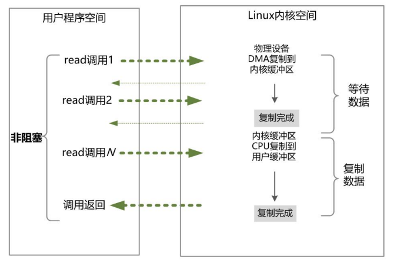
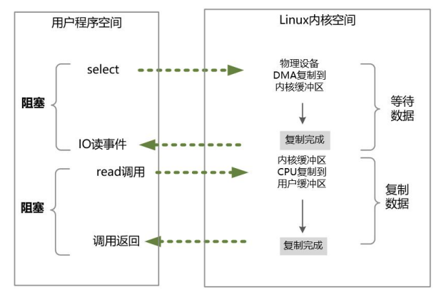
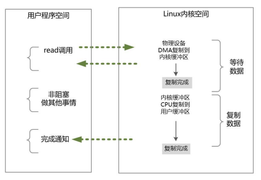

### 同步异步、阻塞非阻塞

阻塞与非阻塞，关注的是用户进程在IO过程中的等待状态。

- 前者用户进程需要为IO操作去阻塞等待
- 后者用户进程可以不用为IO操作去阻塞等待

同步和异步，是针对应用程序（如Java）与内核的交互过程的方向而言的。

- 同步 IO 是指用户空间（进程或者线程）是主动发起 IO 请求的一方，系统内核是被动接受方。应用进程发起IO操作，并阻塞等待，或者轮询的IO操作是否完成
- 异步 IO 则反过来，系统内核主动发起 IO 请求的一方，用户空间是被动接受方。应用程序在提前注册完成回调函数之后去做自己的事情，IO交给内核来 处理，在内核完成IO操作以后，启动进程的回调函数。

另外，异步 IO 必定是非阻塞的。

### IO 模型类型

- 同步阻塞IO（Blocking IO）
- 同步非阻塞NIO（Non-Blocking IO）
- IO 多路复用（IO Multiplexing）
- 信号驱动 IO 模型
- 异步IO （Asynchronous IO）

### 同步阻塞IO（Blocking IO）

这是最简单也是最传统的 I/O 模型，性能很低，基本上不可用。在这种模型中，当一个进程发起 I/O 操作时，它会被阻塞，直到操作完成。这意味着进程在等待数据准备好之前不会继续执行其他任务。

### 同步非阻塞NIO（Non-Blocking IO，NIO）

在非阻塞 I/O 模型中，应用程序的线程需要不断地进行IO系统调用，轮询数据是否已经准备好，如果没有准备好，就继续轮询，直到完成IO系统调用为止。

同步非阻塞IO的优点：实时性较好

同步非阻塞IO的缺点：不间断地轮询内核会降低性能

### IO 多路复用（IO Multiplexing）

为了解决同步非阻塞 NIO 模型的轮询等待问题，IO 多路复用模型引入了一种查询 IO 就绪状态的系统调用。

#### select/epoll就绪查询系统调用

在IO多路复用模型中，通过 select/epoll 系统调用，单个应用程序的线程，可以不断地轮询成百上千的 socket 连接的就绪状态，当某个或者某些 socket 网络连接有 IO 就绪状态，就返回 这些就绪的状态（或者说就绪事件）。

#### IO 多路复用模型的系统调用

在 Linux 系统中， 对应的系统调用为 select/epoll 系统调用。通过该系统调用，一个进程可以监视多个文件描述符（包括 socket 连接），一旦某个描述符就绪（一般是内核缓冲区可读/可写），内核能够将就绪的状态返回给应用程序。随后，应用程序根据就绪的状态，进行相应的IO 系统调用。

IO多路复用模型与同步非阻塞IO模型是有密切关系的，具体来说，注册在选择器上的 每一个可以查询的socket连接，一般都设置成为同步非阻塞模型。只是这一点对于用户程序而言，是无感知的。

### 信号驱动 I/O 模型 (Signal-driven I/O)

在信号驱动 I/O 模型中，当一个进程发起 I/O 操作时，如果数据没有准备好，系统不会阻塞进程，而是设置一个信号处理程序。一旦数据准备好，内核会向进程发送一个信号，通知它可以进行 I/O 操作。

### 异步 I/O 模型 (Asynchronous I/O)

异步 I/O 模型是最先进的一种模型。在这种模型中，当一个进程发起 I/O 操作时，系统会立即返回，进程可以继续执行其他任务。内核在后台处理 I/O 操作，操作完成后，内核会通知进程。

### 参考资料

《极致经典（卷2）：Java高并发核心编程(卷2 加强版)》

[【IO】IO底层原理以及常见模型 - 酷酷- - 博客园 (cnblogs.com)](https://www.cnblogs.com/kukuxjx/p/17354520.html)