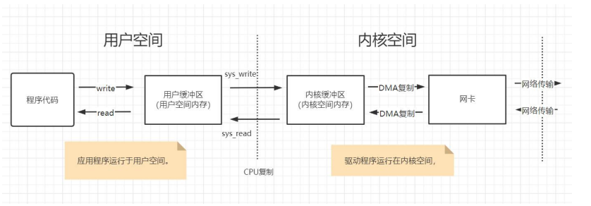

###  IO 读写的基础原理

用户程序进行 IO 的读写，依赖于底层的 IO 读写，基本上会用到底层的两大系统调用： 

- `sys_read` :  把数据从内核缓冲区复制到应用程序的进程缓冲区
- `sys_write`: 把数据从应用程序的进程缓冲区复制到操作系统内核缓冲区

> 用户态切换到内核态的常见方式是系统调用

`sys_read&sys_write` 两大系统调用，都不负责数据在内核缓冲区和物理设备（如磁盘、网卡 等）之间的交换。另外，在不同的操作系统中，`sys_read&sys_write` 两大系统调用的名称和形式可能不完全一样，但是他们的基本功能是一样的。

总的来说，**应用程序的 IO 操作，实际上不是物理设备级别的读写，而是应用程序进程缓冲区和内核缓冲区之间的数据交换**。

### 为什么设置内核缓冲区与进程缓冲区

**内核缓冲区与应用缓冲区在数量上不同**。在 Linux 系统中，操作系统内核只有一个内核缓冲区。而每个用户程序（进程）则有自己独立的缓冲区，叫做用户缓冲区或者进程缓冲区。Linux系统中的用户程序的IO读写程序，在大多数情况下，并没有进行实际的 IO 操作， 而是在用户缓冲区和内核缓冲区之间直接进行数据的交换。

**内核缓冲区**的目的是为了**减少频繁地与设备之间的物理交换**。操作系统会对内核缓冲区进行监控，等待缓冲区达到一定数量的时候， 再进行 IO 设备的中断处理，集中执行物理设备的实际 IO 操作，通过这种机制来提升系统的性能。

**进程缓冲区**的目的是为了**减少对系统调用的频繁请求**，通过缓存数据，提高进程的执行效率。

