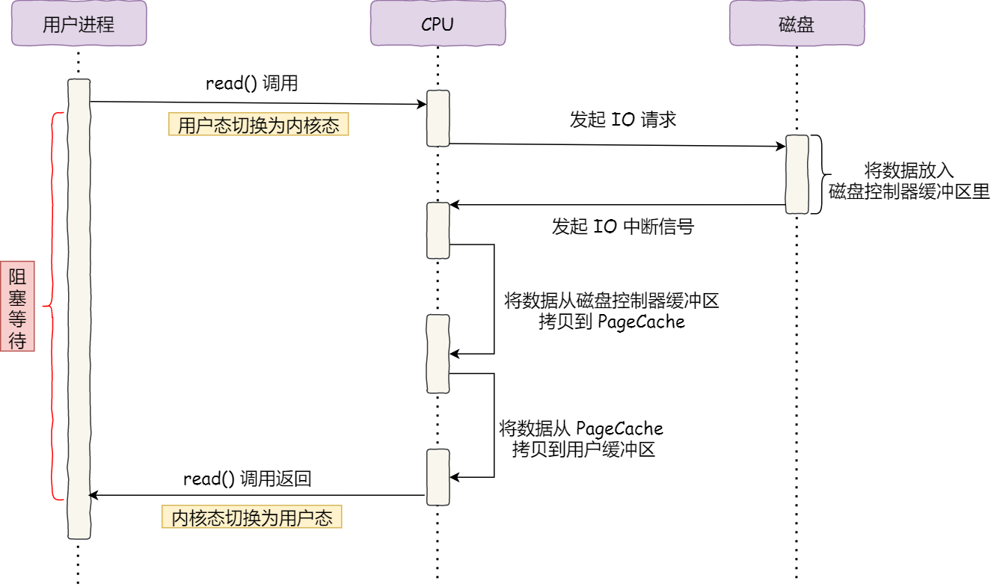
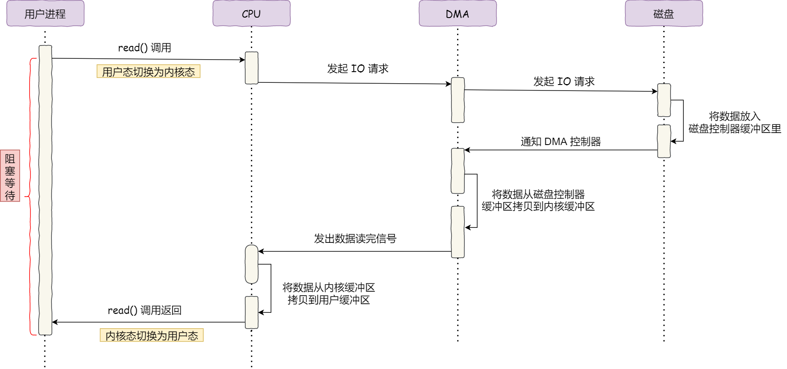

### 什么是 DMA 技术

**DMA（Direct Memory Access，直接内存访问）**是一种计算机硬件技术，它**允许外围设备（如硬盘、网络接口卡、声卡等）直接与内存进行数据传输**，而不需要通过 CPU 来进行大量的中间数据处理。这种技术大大提高了数据传输的效率，减少了 CPU 的负担。

现如今，每个 I/O 设备里面都有自己的 DMA 控制器。

### DMA 技术的工作原理

在没有引入 DMA 技术前，CPU 参与了数据传输的全过程，不能参与其他事情。

引入 DMA 技术后，**DMA 控制器完成外围设备的数据移动拷贝到内核缓冲区这部分工作**。注意的是，将数据从内核缓冲区拷贝到用户缓冲区这部分工作依旧由 CPU 完成。这是因为只有 CPU 拥有对进程空间的控制权，知道如何将数据从内核空间正确地传输到用户空间的缓冲区中。

### 参考资料

[9.1 什么是零拷贝？ | 小林coding (xiaolincoding.com)](https://xiaolincoding.com/os/8_network_system/zero_copy.html#为什么要有-dma-技术)

