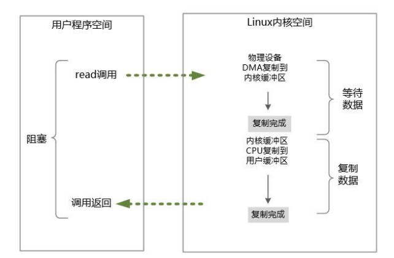
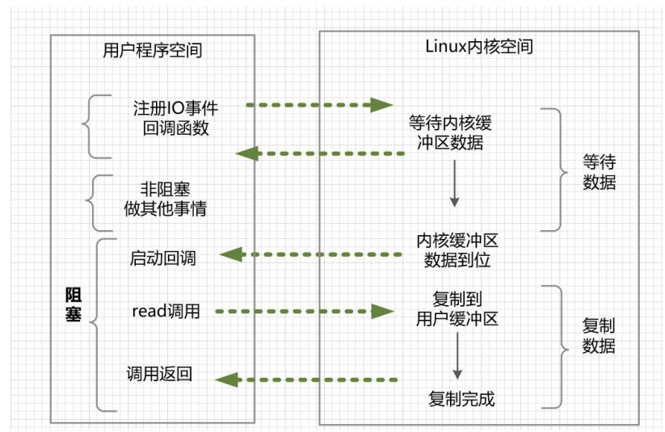

## 一、基础概念

### 1.1 IO 调用过程

当用户进程发起 IO 调用后，会经历以下两个步骤：

1. **物理设备 DMA 复制到内核缓冲区**：内核首先需要等待 I/O 设备（如硬盘、网卡等）准备好数据。例如，在读取磁盘文件时，I/O 设备控制器（如硬盘控制器）将数据从设备读取到内核缓冲区中。。
2. **内核缓冲区 CPU 复制到用户缓冲区**：内核将数据从内核缓冲区拷贝到用户缓冲区。该步骤涉及 CPU 参与，无法像 DMA 那样直接由硬件完成，并在完成后解除用户进程的阻塞状态。

在同步 I/O 模型，用户进程通常会在这两个阶段中阻塞。

### 1.2 阻塞和非阻塞

阻塞与非阻塞，关注的是用户进程在 IO 过程中的**等待状态**。

- **阻塞 IO**：线程发起 I/O 操作后会被阻塞，直到 I/O 操作完成或发生错误。线程在等待 I/O 操作完成期间无法执行其他操作。
- **非阻塞 IO**: 线程发起 I/O 操作后不会被阻塞。当 I/O 操作无法立即完成（例如，数据尚未到达），线程会立即返回，而不是停下来等待。线程可以继续执行其他任务或再次尝试 I/O 操作。

### 1.3 同步和异步

同步和异步，是针对应用程序（如Java）与内核的交互过程的方向而言的，也可以简单理解为**是否需要等待结果返回**。

- **同步 IO** ： 用户空间（进程或者线程）是主动发起 IO 请求的一方，系统内核是被动接受方。应用进程发起 IO 操作，阻塞等待 或者 非阻塞等待( 轮询 IO 操作是否完成)
- **异步 IO** ： 系统内核主动发起 IO 请求的一方，用户空间是被动接受方。应用程序在提前注册完成回调函数之后去做自己的事情，IO 交给内核来处理，在内核完成 IO 操作以后，启动进程的回调函数。

另外，异步 IO 必定是非阻塞的。

## 二、IO 模型类型

常见的 IO 模型主要有：

- 同步阻塞IO（Blocking IO）
- 同步非阻塞NIO（Non-Blocking IO）
- IO 多路复用（IO Multiplexing）
- 信号驱动 IO 模型
- 异步IO （Asynchronous IO）

### 同步阻塞 BIO（Blocking IO）

这是最简单也是最传统的 I/O 模型，性能很低，基本上不可用。在这种模型中，当一个进程发起 I/O 操作时，它会被阻塞，直到操作完成。这意味着进程在等待数据准备好之前不会继续执行其他任务。

### 同步非阻塞 NIO（Non-Blocking IO，NIO）

在非阻塞 I/O 模型中，用户线程采用**轮询机制**，不断地进行 IO 系统调用，轮询数据是否已经准备好。同步非阻塞 NIO 性能较低，依旧不可用。

在每次轮询的时候，会出现以下两种情况：

- 在内核缓冲区中没有数据的情况下，系统调用会立即返回而不阻塞，返回一个调用失败的信息
- 在内核缓冲区中有数据的情况下，在数据的复制过程中系统调用是阻塞的，直到 完成数据从内核缓冲复制到用户缓冲。复制完成后，系统调用返回成功，用户进程（或者线 程）可以开始处理用户空间的缓存数据。

同步非阻塞IO的优点：不会阻塞，实时性较好

同步非阻塞IO的缺点：不间断地轮询内核，降低性能

### IO 多路复用（IO Multiplexing）

为了解决同步非阻塞 NIO 模型的轮询等待问题，IO 多路复用模型**引入了一种查询 IO 就绪状态的系统调用**。

IO 多路复用模型与同步非阻塞 IO 模型是有密切关系的，具体来说，注册在选择器上的每一个可以查询的 socket 连接，一般都设置成为同步非阻塞模型。只是这一点对于用户程序而言，是无感知的。

**(1) 工作原理**

在 I/O 多路复用模型中，应用程序会通过一个专门的系统调用（如 `select`、`poll`、`epoll` 等）来监控多个文件描述符（如 socket 连接）。当某个文件描述符准备就绪时（例如有数据可以读取或可以写入），操作系统会通知应用程序，然后应用程序可以集中处理就绪的 I/O 事件。

实际上，**选择器代替了用户线程本身轮询 IO 事件, 让应用程序能够在多个 IO 操作上复用同一个线程**。

**(2) 就绪查询系统调用**

就绪查询系统调用允许一个程序同时监听多个文件描述符，检测哪些文件描述符可以执行 I/O 操作（如读、写、异常处理），从而避免为每个文件描述符都创建独立的线程或进程。

多路复用模型的典型系统调用都有其优缺点：

- **`select`**：通过一组文件描述符进行监控，但受限于文件描述符的最大数量，效率较低
- **`poll`**：没有文件描述符数量的限制，监控效率也比 `select` 更高。
- **`epoll`**（Linux 特有）：适合高并发场景，性能更好，因为它使用了事件通知机制，而不是轮询所有描述符。

**(3) IO 多路复用模型实现流程**

通过该系统调用，一个进程可以监视多个文件描述符（包括 socket 连接），一旦某个描述符就绪（一般是内核缓冲区可读/可写），内核能够将就绪的状态返回给应用程序。随后，应用程序根据就绪的状态，进行相应的IO 系统调用。

发起一个多路复用 IO 的 `sys_read` 读操作的系统， 调用具体步骤为:

1. **选择器注册**：将需要 `sys_read` 操作的目标文件描述符（socket 连接），提前注册到 Linux 的select/epoll 选择器中，在 Java 中所对应的选择器类是 Selector 类。 然后，才可以开启整个 IO 多路复用模型的轮询流程。
2. **就绪状态轮询**: 通过选择器的查询方法，查询所有的提前注册过的目标文件描述符（socket连接）的 IO 就绪状态。通过查询的系统调用，内核会返回一个就绪的 socket 列表。当任何一个注册过的 socket 中的数据准备好或者就绪了，就是内核缓冲区有数据了，内核就将该 socket 加入到就绪的列表中，并且返回就绪事件。
3. **处理就绪事件**： 当用户线程从选择器中获得一个或多个处于就绪状态的文件描述符时，遍历这些就绪的描述符，根据具体的 socket 连接发起 `sys_read` 系统调用。此时，用户线程阻塞。内核开始复制数据，将数据从内核缓冲区复制到用户缓冲区。
4. **数据复制与返回**：数据复制完成后，内核将读取的数据返回给用户线程，用户线程的阻塞状态解除，继续处理后续逻辑（如解析数据、业务逻辑处理等）

**（4）优缺点**

IO多路复用模型的优点：一个选择器查询线程，可以同时处理成千上万的网络连接， 所以，用户程序不必创建大量的线程，也不必维护这些线程，从而大大减小了系统的开销。 这是一个线程维护一个连接的阻塞IO模式相比，使用多路IO复用模型的最大优势。

IO多路复用模型的缺点：本质上，select/epoll系统调用是阻塞式的，属于同步阻塞 IO。 都需要在读写事件就绪后，由系统调用本身负责进行读写，也就是说这个事件的查询过程是阻塞的。

### 信号驱动 I/O 模型 (Signal-driven I/O)

在信号驱动 I/O 模型中，当一个进程发起 I/O 操作时，如果数据没有准备好，系统不会阻塞进程，而是设置一个信号处理程序。一旦数据准备好，内核会向进程发送一个信号，通知它可以进行 I/O 操作。

### 异步 I/O 模型 (Asynchronous I/O)

异步 I/O 模型是最先进的一种模型。在这种模型中，当一个进程发起 I/O 操作时，系统会立即返回，进程可以继续执行其他任务。内核在后台处理 I/O 操作，操作完成后，内核会通知进程。

## 参考资料

《极致经典（卷1）：Java高并发核心编程(卷2 加强版)》

[【IO】IO底层原理以及常见模型 - 酷酷- - 博客园 (cnblogs.com)](https://www.cnblogs.com/kukuxjx/p/17354520.html)