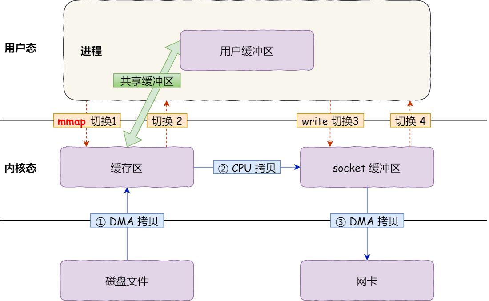
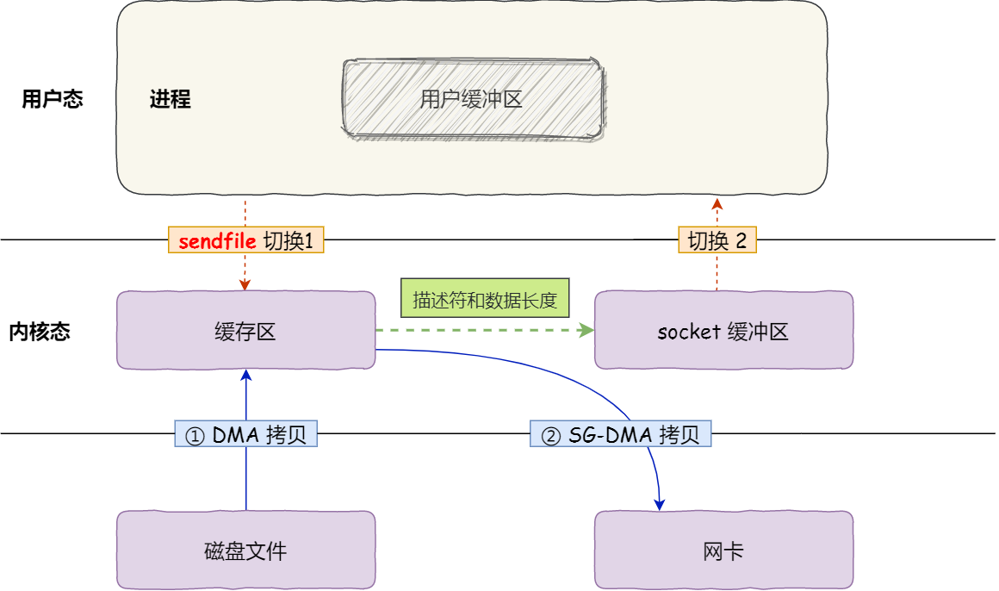

### 什么是零拷贝技术

**零拷贝技术**（Zero-Copy）是一种优化技术，**旨在减少在数据传输过程中不必要的用户态与内核态的上下文切换数据拷贝操作**，从而提高数据处理的效率，降低 CPU 的负担，提升系统的性能。

### 传统的 I/O 操作的局限性

在传统的 I/O 操作(比如文件读取、网络传输等)中，数据在内核空间与用户空间之间往往需要经过多次拷贝。

以网络传输为例，期间发生了 **4 次用户态与内核态的上下文切换**， **4 次数据拷贝**。

但是，从内核的读缓冲区拷贝到用户的缓冲区里，再从用户的缓冲区里拷贝到 socket 的缓冲区里，这个过程是没必要的。因为 **用户空间并不会对数据再加工**。

### 零拷贝技术的实现

零拷贝技术实现的方式通常有 2 种：

- mmap + write
- sendfile

在使用零拷贝技术的过程中，尽量内核缓冲区和用户缓冲区的数据拷贝，从而减少在数据传输过程中不必要的用户态与内核态的上下文切换数据拷贝操作。

#### mmap + write

`mmap()` 调用将内核缓冲区里里面的数据映射到进程的虚拟内存地址空间。程序可以像操作内存一样直接访问文件内容，而不需要通过传统的读写操作来进行数据拷贝。

以网络传输为例，期间发生了 **4 次用户态与内核态的上下文切换**， **3 次数据拷贝**。

####  sendfile

在 Unix/Linux 系统中，`sendfile()` 系统调用可以将数据直接从内核空间发送到网络套接字，而无需将数据首先拷贝到用户空间。具体过程如下：

1. 通过 DMA 将磁盘上的数据拷贝到内核缓冲区里。
2. 缓冲区描述符和数据长度传到 socket 缓冲区，这样网卡的 SG-DMA 控制器就可以直接将内核缓存中的数据拷贝到网卡的缓冲区里，此过程不需要将数据从操作系统内核缓冲区拷贝到 socket 缓冲区中。

以网络传输为例，期间发生了 **2 次用户态与内核态的上下文切换**， **2 次数据拷贝**。

### 零拷贝技术的限制

**零拷贝技术只适用于小文件，不适合大文件**。

在高并发的场景下，针对大文件的传输的方式，应该使用「异步 I/O + 直接 I/O」来替代零拷贝技术。

### 参考资料

[什么是零拷贝？ | 小林coding (xiaolincoding.com)](https://xiaolincoding.com/os/8_network_system/zero_copy.html#传统的文件传输有多糟糕)