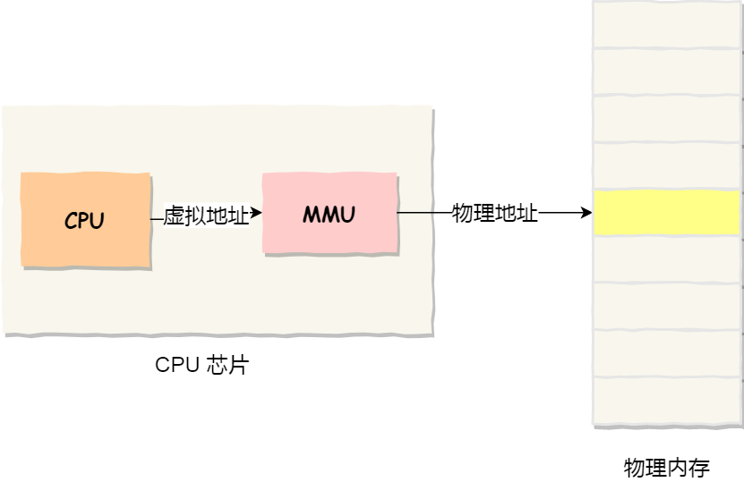

## 虚拟内存概述

### 为什么要有虚拟内存

在没有引入虚拟内存之前，不同进程之间使用绝对物理地址，可能会产生地址冲突。

为了避免这一问题，操作系统提供了虚拟内存，让每个进程使用虚拟内存地址，将不同**进程的虚拟地址和不同内存的物理地址映射起来**。同时，虚拟内存允许计算机的操作系统**将物理内存（RAM）扩展到硬盘上的一部分空间**，从而让程序有更多的内存可用。

### 虚拟内存的作用

- **内存扩展**：通过使用硬盘来扩展实际的物理内存容量。
- **隔离性**：将不同进程所使用的地址隔离开，避免了多进程之间地址冲突
- **简化编程模型**：程序可以认为它拥有一个连续的内存空间，而无需关心实际的物理内存。

## 虚拟内存的工作原理

虚拟内存允许计算机的操作系统**将物理内存（RAM）扩展到硬盘上的一部分空间**，从而让程序有更多的内存可用。虚拟内存通过将程序的地址空间分为多个块（通常称为“页”）并在物理内存和磁盘之间动态地交换这些块来实现。

### 地址映射

引入了虚拟内存，进程持有的虚拟地址会通过 CPU 芯片中的内存管理单元（MMU）的映射关系，来转换变成物理地址，然后再通过物理地址访问内存。

- 虚拟内存地址：程序使用的地址

- 物理内存地址：实际存在硬件里面的空间地址

### 分页

虚拟内存一般通过分页技术实现。将虚拟内存和物理内存都划分成相同大小的“页”（一般是4KB或更大）。当某个虚拟页被访问时，如果它不在物理内存中，操作系统会将该页从磁盘上读取到物理内存中。

### 页表

每个进程都有一个页表，记录着虚拟地址与物理地址之间的映射关系。当程序访问一个虚拟地址时，操作系统通过页表找到对应的物理地址。如果对应的页不在物理内存中，就发生“缺页中断”，操作系统将该页加载到物理内存。

### 缺页中断（Page Fault）

当程序访问一个不在物理内存中的虚拟地址时，会触发缺页中断。操作系统会将需要的页面从硬盘调入内存，并更新页表。在必要时，操作系统还可能将不常用的页从内存换出到硬盘。

### 内存交换技术

当物理内存比较紧张时，操作系统会通过**内存交换技术**将实现物理内存和物理磁盘之间的数据交换。

在物理磁盘里面，有一块空间专门作为 交换分区（Swap Partition）。我们可以使用 top 命令查看交换分区的使用情况。一般建议交换分区大小为物理内存的1到2倍，具体取决于系统的用途和内存使用情况。例如，对于大内存系统，交换分区可以设置为与物理内存相等或者更小。

## 总结

[4.1 为什么要有虚拟内存？ | 小林coding (xiaolincoding.com)](https://xiaolincoding.com/os/3_memory/vmem.html#虚拟内存)

