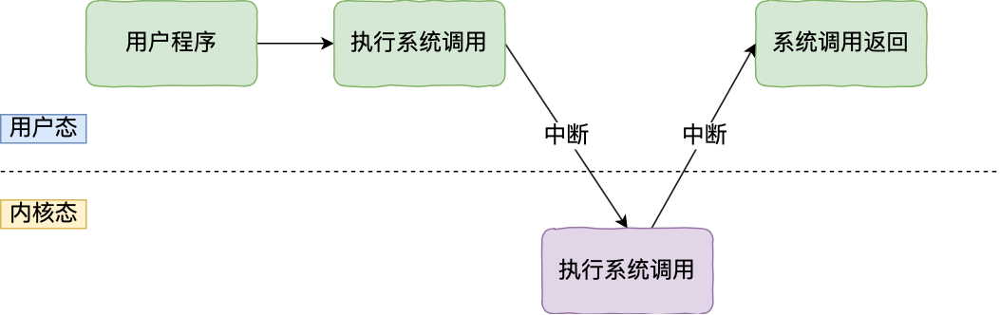

### 用户态和内核态

用户态是指**普通应用程序运行的环境，具有受限的访问权限**。在这种模式下，应用程序拥有有限的系统资源访问权限，只能在操作系统划定的特定空间内运行。用户态下运行的程序不能直接访问硬件设备或执行特权指令，所有对硬件的访问都必须通过操作系统进行。

内核态是**操作系统核心部分运行的环境，具有完全的访问权限**，可以执行任何指令并访问所有硬件资源。

### 用户态和内核态的切换方式

用户态切换到内核态的方式：

- 系统调用
- 中断
- 异常

### 系统调用

### 其他细节

用户态进程切换到内核态进程。这两个进程是同一个进程。

### 参考资料

[3.1 Linux 内核 vs Windows 内核 | 小林coding (xiaolincoding.com)](https://xiaolincoding.com/os/2_os_structure/linux_vs_windows.html#内核)