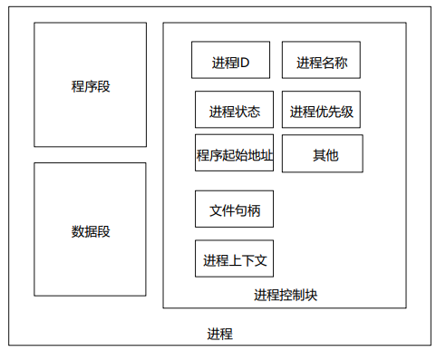

### 进程组成结构

进程由程序段、数据段和进程控制块三部分组成。

### 进程控制块组成

进程控制块（Process Control Block, PCB）是操作系统用于管理进程的重要数据结构。PCB主要由以下几部分组成：

### 进程上下文切换

CPU上下文切换：把前一个任务的 CPU 上下文（**CPU 寄存器和程序计数器**）保存起来，然后加载新任务的上下文到这些寄存器和程序计数器，最后再跳转到程序计数器所指的新位置，运行新任务。

进程上下文切换：操作系统将CPU从一个进程切换到另一个进程的过程