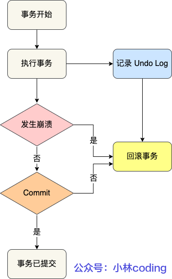

### 什么是 undo log

undo log 是 InnoDB 存储引擎层生成的逻辑日志，用于记录事务在修改数据之前的原始数据内容。

其主要作用有：

- **事务回滚**：当事务出现错误或用户主动要求回滚时，数据库可以利用 Undo Log 将已修改的数据恢复到事务开始之前的状态，从而撤销该事务的所有操作。
- **多版本并发控制**（MVCC）：在多版本并发控制中，Undo Log 也用于维护旧版本的数据，从而支持数据库的读操作不会受到写操作的影响，实现更高的并发性。

### undo log 存储内容

每当 InnoD8 引擎对一条记录进行操作(修改、删除、新增)时，要把回滚时需要的信息都记录到undo log 里，比如:

- 在插入一条记录时，主要把这条记录的主键值记下来，这样之后回滚时只需要把这个主键值对应的记录删掉就好了;
- 在删除一条记录时，!要把这条记录中的内容都记下来，这样之后回滚时再把由这些内容组成的记录插入到表中就好了:
- 在更新一条记录时，要把被更新的列的旧值记下来，这样之后回滚时再把这些列更新为旧值就好

### undo log 工作流程

1. **事务开始**：

   - 事务开始时，数据库会记录对数据的修改操作前的值，并将这些原始数据保存到 Undo Log 中。

2. **事务修改数据**：

   - 事务对数据进行修改时，数据库不会直接覆盖原数据，而是先记录原始数据，然后再进行修改。

3. **事务提交或回滚**：

   - 如果事务提交，Undo Log 会被丢弃，因为事务的修改已被正式应用到数据库中。

   - 如果事务回滚，数据库会读取 Undo Log，并按照日志中记录的原始数据进行回滚，将数据恢复到修改前的状态。

