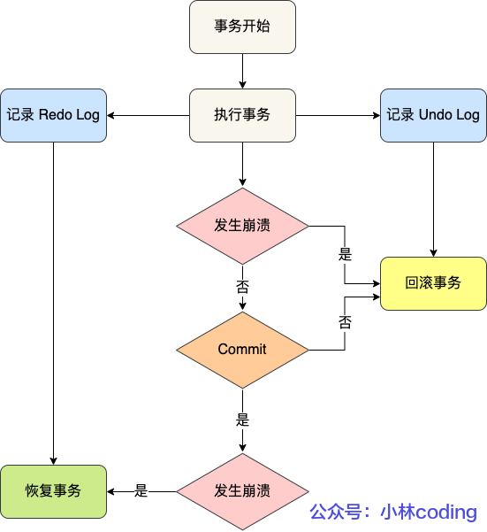

### 区别

- redo log 记录了此次事务**完成后**的数据状态，记录的是更新**之后**的值
- undo log 记录了此次事务**开始前**的数据状态，记录的是更新**之前**的值

redo log 是物理日志，undo log 是逻辑日志

### 联系

因为MySQL事务执⾏过程中产⽣的Undo Log也需要进⾏持久化操作，所以 **Undo Log也会产⽣Redo Log**。由于Undo Log的完整性和可靠性需要Redo Log来保证，因此数据库崩溃时需要先做Redo Log数据恢复，然后做Undo Log回滚。