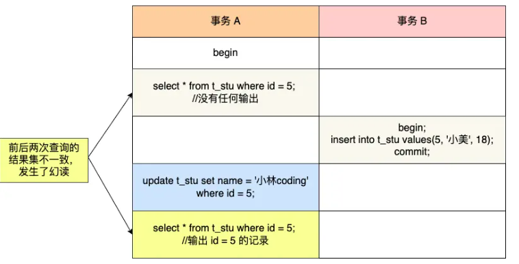

### 快照读和当前读

快照读指的是读取数据库中某一时刻的**一致性视图**的数据，即读取的不是当前最新的版本，而是事务开始时或某个时刻的历史数据。

此查询是通过 MVCC 实现的，不会对读取的记录加锁。

在 MySQL 中，执行快照读的典型 SQL 语句是：`SELECT ...`（没有 `FOR UPDATE` 或 `LOCK IN SHARE MODE`）。

```sql
SELECT * FROM t_coupon_template WHERE id = 1;
```


当前读指的是读取数据库中最新的、**已提交的**数据版本。此读操作会对当前读到的记录加锁，以防其他事务修改它，从而避免幻读问题。

在 MySQL 中，执行当前读的典型 SQL 语句是：`SELECT ... FOR UPDATE` 或 `SELECT ... LOCK IN SHARE MODE`，还包括所有 `INSERT`、`UPDATE` 和 `DELETE` 语句。因为**修改数据的时候，需要先查询数据，然后在查询数据的基础上做出修改**。

```sql
SELECT * FROM t_coupon_template WHERE id = 1 FOR UPDATE;
```


### 快照读和当前读的使用场景

- **快照读**：如果你的事务只需要查询数据而不需要修改，使用快照读可以提高并发性能，同时避免与其他事务冲突。
- **当前读**：如果你的事务需要更新或锁定某些数据，确保其他事务不会修改这些数据，就需要使用当前读来加锁。


### 可重复读级别避免幻读

- 针对快照读： MVCC
- 针对当前读： **通过 next-key lock（记录锁+间隙锁）方式**


### 无法避免幻读的情况

在事务 A 查询后，事务B插入数据并提交，事务A更新事务B插入的数据。此时，这条<font color="red">**新纪录的 trx_id 隐藏列的值变更为事务A 的id**</font> 。然后，再次查询，事务 A 就可以看到这条记录了。

前后两次查询的记录数不一样。




### 参考资料

[MySQL 可重复读隔离级别，完全解决幻读了吗？ | 小林coding (xiaolincoding.com)](https://xiaolincoding.com/mysql/transaction/phantom.html#当前读是如何避免幻读的)

