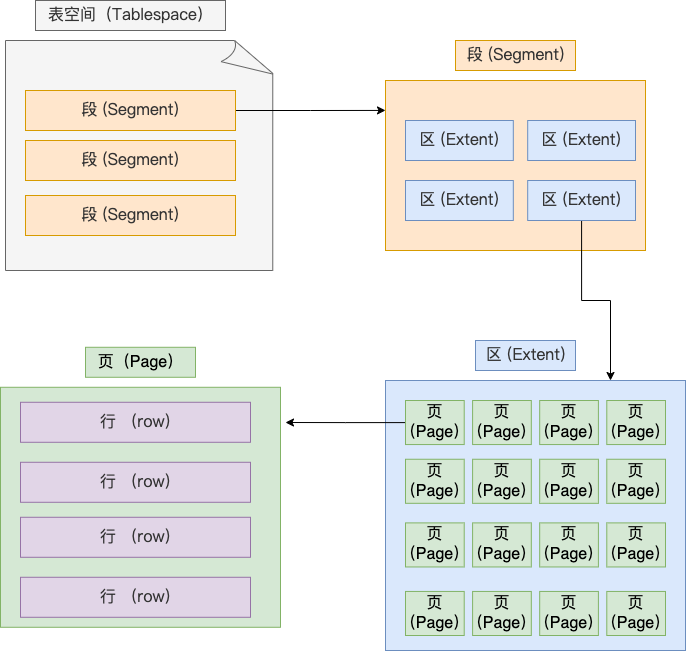
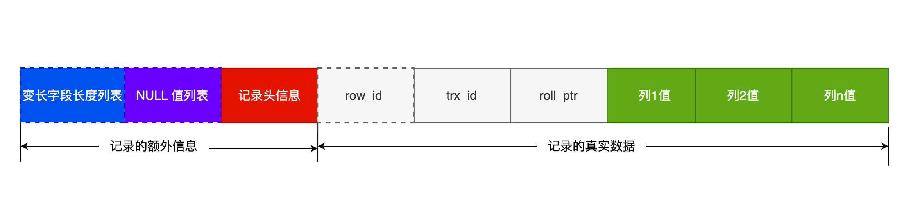
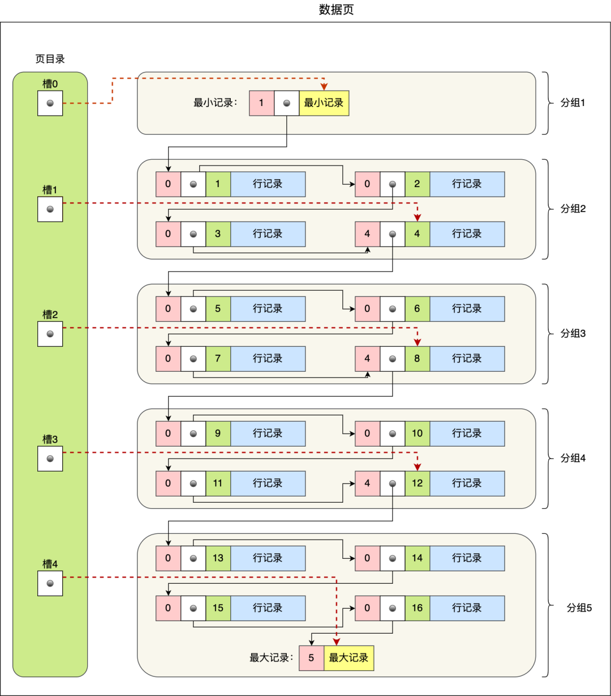

### 逻辑存储结构

**[表空间](https://dev.mysql.com/doc/refman/8.4/en/innodb-tablespace.html)(tablespace)由段（segment）、区（extent）、页（page）、行（row）组成**

- [**表空间**](https://dev.mysql.com/doc/refman/8.4/en/innodb-tablespace.html)是数据库的最高级别的物理存储单位，负责管理数据库文件的空间。InnoDB 中所有的数据和索引都会被存储在表空间中。
- **段** 是表空间的**逻辑划分**，每一个表或索引都有自己的段。它使表和索引的数据能够动态扩展，同时便于管理不同类型的数据，例如表数据段、索引段等。
- **区**是段的组成部分，表示**连续的一组物理磁盘块**，通常大小固定（InnoDB 中为 1 MB）。

- **页**是 InnoDB 中数据存储的基本单位。InnoDB 中每个页的大小固定为 16 KB。
- [**行**](https://dev.mysql.com/doc/refman/8.4/en/innodb-row-format.html#innodb-row-format-compact)是数据库存储的最小数据单位，一行代表表中某一条记录。在页中，行以一定的格式进行存储，行包含列数据和一些元数据信息（如主键、行锁等）。

### 行格式

InnoDB 存储引擎支持四种[行格式](https://dev.mysql.com/doc/refman/8.4/en/innodb-row-format.html#innodb-row-format-compact)：REDUNDANT、COMPACT、DYNAMIC 和 COMPRESSED。

| Row Format   | Compact Storage Characteristics | Enhanced Variable-Length Column Storage | Large Index Key Prefix Support | Compression Support | Supported Tablespace Types      |
| :----------- | :------------------------------ | :-------------------------------------- | :----------------------------- | :------------------ | :------------------------------ |
| `REDUNDANT`  | No                              | No                                      | No                             | No                  | system, file-per-table, general |
| `COMPACT`    | Yes                             | No                                      | No                             | No                  | system, file-per-table, general |
| `DYNAMIC`    | Yes                             | Yes                                     | Yes                            | No                  | system, file-per-table, general |
| `COMPRESSED` | Yes                             | Yes                                     | Yes                            | Yes                 | file-per-table, general         |

COMPACT 的格式如下图所示。其中虚线框表示可选字段。

在隐藏列中，

- trx_id: 6字节的事务ID字段。

- row_id: 7字节的滚动指针字段, 指向 `undo log` 的位置，便于事务回滚

**当行溢出后，在记录的真实数据处只会保存部分列的数据，剩余的数据会存到另外的溢出页中。**

### 页格式

InnoDB的数据是**按照数据页为单位来读写的**。也就是说，当需要读一条记录的时候，并不是将这个记录本身从磁盘读出来，而是以页为单位，将其整体读入内存。

[从数据页的角度看 B+ 树 | 小林coding (xiaolincoding.com)](https://xiaolincoding.com/mysql/index/page.html#innodb-是如何存储数据的)

不同数据页根据 File Header 组成双向链表

**数据页中的记录按照「主键」顺序组成单向链表**。同时，数据页中有一个**页目录**，起到记录的索引作用。在页目录中，每个槽指向分组的最后一个记录。

### 参考资料

[MySQL :: MySQL 8.4 Reference Manual :: 17.10 InnoDB Row Formats](https://dev.mysql.com/doc/refman/8.4/en/innodb-row-format.html#innodb-row-format-compact)