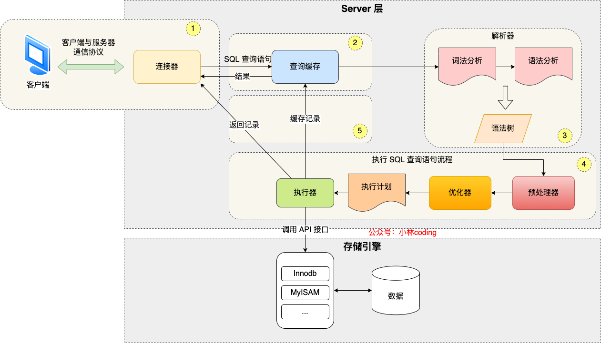

# 一、MySQL 基础架构

> [MySQL常见面试题总结 | JavaGuide](https://javaguide.cn/database/mysql/mysql-questions-01.html#mysql-基础架构)

MySQL架构主要分为**Server层**和**[存储引擎层](https://www.zhihu.com/search?q=存储引擎层&search_source=Entity&hybrid_search_source=Entity&hybrid_search_extra={"sourceType"%3A"answer"%2C"sourceId"%3A2579554549})**。

- 服务器层是 MySQL 数据库的核心部分，负责处理客户端的连接、权限认证、SQL 解析、查询优化、执行计划生成、事务管理等功能。
- 存储引擎层负责将数据存储到磁盘上，并提供对数据的 CRUD（创建、读取、更新、删除）操作。

**Server层**又分为[连接器](https://www.zhihu.com/search?q=连接器&search_source=Entity&hybrid_search_source=Entity&hybrid_search_extra={"sourceType"%3A"answer"%2C"sourceId"%3A2579554549})、缓存、分析器、优化器、执行器。所有跨存储引擎的功能都在这层实现，比如：函数、[存储过程](https://www.zhihu.com/search?q=存储过程&search_source=Entity&hybrid_search_source=Entity&hybrid_search_extra={"sourceType"%3A"answer"%2C"sourceId"%3A2579554549})、触发器、视图等。

**存储引擎**是可插拔式的，常见的存储引擎有MyISAM、InnoDB、Memory等，MySQL5.5之前默认的是MyISAM，之后默认的是InnoDB。

### MyISAM 和 InnoDB 区别

个人认为比较重要的区别：

- 锁的支持： 
- 事务： InnoDB 支持事务

- 索引实现方式：InnoDB 引擎中，索引是聚簇索引；MyISAM 引擎中，索引是非聚簇索引；

| 特性               | MyISAM                             | InnoDB                                    |
| ------------------ | ---------------------------------- | ----------------------------------------- |
| **事务支持**       | ❌ 不支持                           | ✅ 支持（提供 ACID 特性）                  |
| **外键约束**       | ❌ 不支持                           | ✅ 支持（可通过外键约束维护数据完整性）    |
| **锁机制**         | **表级锁**：操作时锁定整个表       | **行级锁**：只锁定相关数据行，支持高并发  |
| **崩溃恢复**       | ❌ 仅修复索引文件，可能导致数据丢失 | ✅ 通过 `Redo Log` 和 `Undo Log` 恢复数据  |
| **MVCC**           | ❌ 不支持                           | ✅ 支持（多版本并发控制）                  |
| **查询性能**       | 读操作速度较快，适合大量查询的场景 | 在写密集型、高并发场景下表现更优          |
| **表空间占用**     | 占用较小                           | 占用较大（由于事务日志和 MVCC）           |
| **全文索引**       | ✅ 支持（MySQL 5.6 及之前版本）     | ✅ 支持（MySQL 5.6 及之后版本）            |
| **数据存储**       | 数据和索引**分开存储**             | 数据和索引**聚簇存储**（Clustered Index） |
| **AUTO_INCREMENT** | 只能为表设置一个自增列             | 支持联合索引自增，灵活度更高              |
| **表锁定开销**     | 锁开销较低，适合读多写少的场景     | 行锁开销较高，适合高并发写操作            |
| **备份恢复**       | 通过拷贝表文件备份，速度快         | 支持热备份（在线备份），数据更安全        |

## 二、语句执行流程

[执行一条 select 语句，期间发生了什么？ | 小林coding](https://xiaolincoding.com/mysql/base/how_select.html#mysql-执行流程是怎样的)

**连接器**验证用户权限。

**查询缓存**检查是否有相同查询的缓存结果（MySQL 5.7 以下）。

**分析器**解析 SQL 语句的词法和语法。

**预处理器**：检查 SQL 查询语句中的表或者字段是否存在。

**优化器**选择最佳的执行计划，例如选择索引 `age`。

**执行器**调用 InnoDB 存储引擎，按照索引查找 `age > 20` 的记录。

**存储引擎**读取符合条件的数据，并通过执行器返回给客户端。