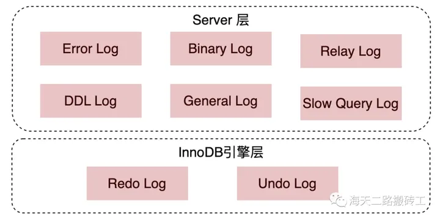

[TOC]

## 一、MySQL 日志

### 1.1 物理日志和逻辑日志

物理日志和逻辑日志是数据库系统中两种不同类型的日志。

物理日志会记录这些物理改变的具体细节，如修改的数据页、修改的偏移量以及修改的数据内容等。

逻辑日志会记录数据库操作层面的变化。逻辑日志不涉及具体的物理细节，而是记录了用户对数据库执行的逻辑操作。

| 特性         | 物理日志（Physical Log）           | 逻辑日志（Logical Log）                        |
| ------------ | ---------------------------------- | ---------------------------------------------- |
| **记录内容** | 数据的物理层变化，如页、块的修改   | 数据库操作的语义，如 SQL 语句                  |
| **记录粒度** | 物理块级别的修改                   | 逻辑操作级别的变更                             |
| **空间占用** | 相对较小，记录物理位置和改动内容   | 相对较大，记录完整的 SQL 操作语义              |
| **恢复方式** | 通过重做物理修改来恢复数据         | 通过重放操作来重新执行事务，恢复数据库状态     |
| **应用场景** | 崩溃恢复、高性能需求的系统         | 数据库主从复制、增量备份、历史数据回放         |
| **优点**     | 恢复速度快，适用于崩溃恢复         | 灵活性高，适用于分布式系统的复制和历史操作回放 |
| **缺点**     | 操作层面的信息不够详细，灵活性较差 | 占用空间较大，恢复速度较慢                     |

 

## 二、三大日志之间的关系

事务提交后，redo log 和 binlog 都要持久化到磁盘，

undolog 则是通过 redo log 来保证持久化。因为MySQL事务执⾏过程中产⽣的Undo Log也需要进⾏持久化操作，所以 **Undo Log也会产⽣Redo Log**。由于Undo Log的完整性和可靠性需要Redo Log来保证，因此数据库崩溃时需要先做Redo Log数据恢复，然后做Undo Log回滚。

### 5.1 redo log 和 undo log 的区别

| 特征       | Redo Log                                                     | Undo Log                                                     |
| ---------- | ------------------------------------------------------------ | ------------------------------------------------------------ |
| 目的       | 用于保障事务的**持久性**，确保事务提交后的修改操作不会丢失。 | 用于保障事务的**原子性**，确保事务执行时的修改操作可以回滚。 |
| 记录内容   | 记录事务对数据库的所有修改操作的**正向操作**。（物理日志）   | 记录事务对数据库的所有修改操作的**逆操作**。（逻辑日志）     |
| 写入时机   | 事务提交时将修改操作写入 Redo Log。                          | 事务开始执行时将修改操作写入 Undo Log。                      |
| 触发时机   | 事务提交时触发 Redo Log 的写入。                             | 事务执行时触发 Undo Log 的写入。                             |
| 使用场景   | 用于数据库崩溃或者系统故障时的数据恢复。                     | 用于事务回滚或者数据库崩溃时的数据恢复。                     |
| 持久性保障 | 保障事务提交后的修改操作可以永久保存。                       | 保障事务执行过程中的修改操作可以回滚。                       |

`redo log`在事务执行过程中可以不断写入，而`binlog`只有在提交事务时才写入。详情查看[MySQL三大日志(binlog、redo log和undo log)详解 | JavaGuide](https://javaguide.cn/database/mysql/mysql-logs.html#两阶段提交)

### binlog 和 redolog

[MySQL 日志：undo log、redo log、binlog 有什么用？ | 小林coding (xiaolincoding.com)](https://xiaolincoding.com/mysql/log/how_update.html#redo-log-和-binlog-有什么区别)

如果数据库数据全部丢失，我们使用 binlog 来恢复，但不能使用 redo log 来恢复。

redo log日志空间大小固定，会边写边擦除日志。

## 参考资料

[MySQL三大日志(binlog、redo log和undo log)详解 | JavaGuide](https://javaguide.cn/database/mysql/mysql-logs.html#前言)

[腾讯二面：MySQL 三大日志，介绍一下？ (qq.com)](https://mp.weixin.qq.com/s/f7E7e6qW_qk1hS0fIV_v6w)