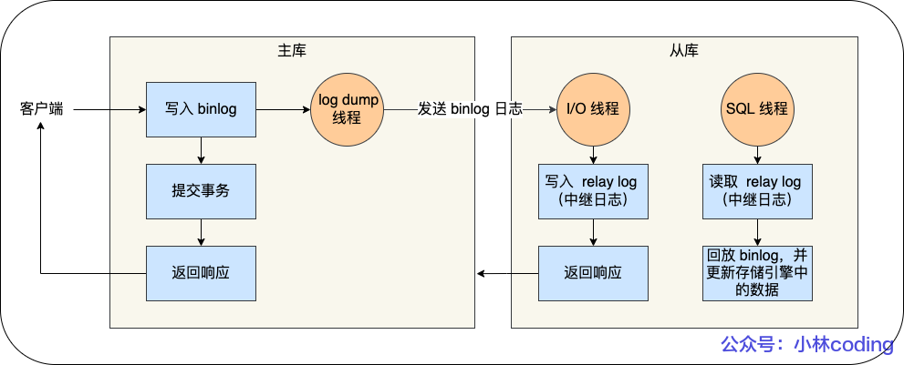
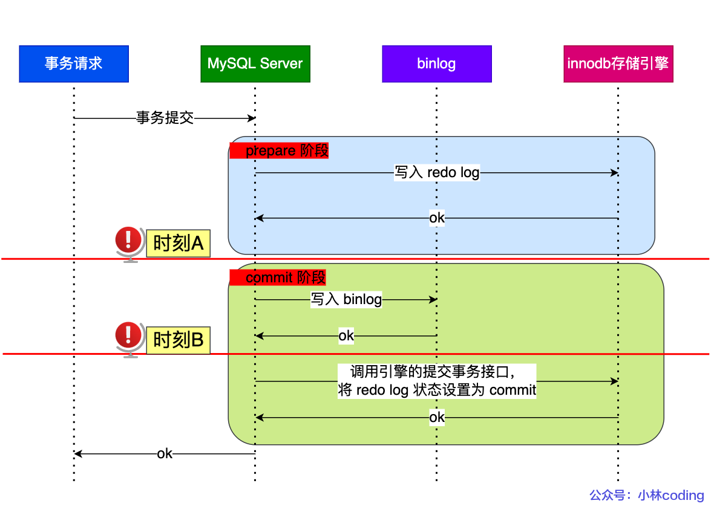

### 什么是 binlog

binlog 是 Server 层生成的二进制日志，记录对数据库中表结构和表数据的所有更改操作。

binlog 的主要作用为：

- **数据恢复**：当MySQL数据库发⽣故障或者崩溃时，可以通过BinLog进⾏数据恢复。
- **主从复制**: 在主数据库上开启BinLog，主数据库把BinLog发送⾄从数据库，从数据库获取 BinLog后通过I/O线程将⽇志写到中继⽇志，也就是Relay Log中。然后，通过SQL线程将 Relay Log中的数据同步⾄从数据库，从⽽达到主从数据库数据的⼀致性。

### 能不能只用 binlog 不用 redo log

不行，binog是 server 层的日志，**没办法记录哪些脏页还没有刷盘**，redolog 是存储引擎层的日志，可以记录哪些脏页还没有刷盘，这样崩溃恢复的时候，就能恢复那些还没有被刷盘的脏页数据。

### binlog 写入机制

binlog 文件保存的是全量的日志，采用**顺序写**的方式。

### 异步主从复制

## 两阶段提交

### 为什么要两阶段提交

事务提交后，redo log 和 binlog 都要持久化到磁盘，但是这两个是独立的逻辑。

为了保证 redo log 和 binlog  的一致性，MySQL 使用 XA 事务来保证一致性。其中， **binlog 作为协调者，存储引擎作为参与者**。

### binlog 两阶段提交过程

为了保证 Redo Log 和 Binlog 的一致性，MySQL 使用两阶段提交：

1. Prepare 阶段：：
   - 将事务的 XID 写入到 redo Log， redo log  持久化到磁盘，但此时的状态是 `prepare`。

2. Commit 阶段：

   - commit 操作：binlog 持久化到磁盘， binlog 中不包含 XID。此时，redo log 的状态变为 `commit`， 并提交事务。

   - rollback 操作：binlog 未被持久化到磁盘， binlog 中不包含 XID。此时，redo log 的状态保持为 `prepare`， 回滚事务。

[MySQL面试题 | 小林coding (xiaolincoding.com)](https://xiaolincoding.com/interview/mysql.html#binlog-两阶段提交过程是怎么样的)

**两阶段提交是以 binlog 写成功为事务提交成功的标识**

### redo log 在事务未提交时持久化

事务未提交时，Redo Log 可以被持久化到磁盘。

即使事务还没提交，MySQL 会将 Redo Log 写入磁盘，可以在崩溃恢复时用 Redo Log 恢复事务的中间状态，继续进行两阶段提交。