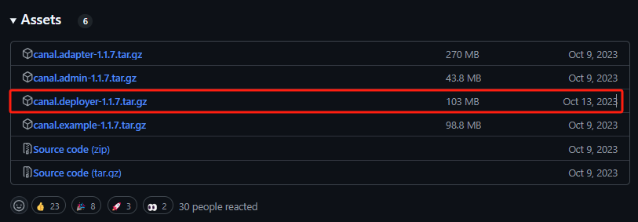

## 一、MySQL 配置 

[QuickStart · alibaba/canal Wiki (github.com)](https://github.com/alibaba/canal/wiki/QuickStart)

### 1.1 创建 binlog 配置文件

在你的主机上创建一个 `my.cnf` 文件，并添加需要的配置。

对于自建 MySQL , 需要先开启 Binlog 写入功能，配置 binlog-format 为 ROW 模式，`my.cnf` 中配置如下：

```
[mysqld]
log-bin=mysql-bin # 开启 binlog
binlog-format=ROW # 选择 ROW 模式
server_id=1 # 配置 MySQL replaction 需要定义，不要和 canal 的 slaveId 重复
```


### 1.2 启动 mysql 服务器

```bash
docker run --name mysql-canal ^
-p 3306:3306 ^
-v D:\Learning\java-demos\spring-boot-canal\src\main\resources\conf\my.cnf:/etc/mysql/my.cnf ^
-e MYSQL_ROOT_PASSWORD=root ^
-d mysql:5.7.36
```


### 1.3 修改配置文件权限

在启动mysql 容器的时候，MySQL 会警告配置文件 `/etc/mysql/my.cnf` 权限设置不当，允许所有用户写入（world-writable）。<font color="red">**由于安全原因，MySQL 会忽略这个配置文件**</font>。

```
[Warning] World-writable config file '/etc/mysql/my.cnf' is ignored.
```

因此，修改文件权限，确保只有合适的用户有写入权限。

```bash
chmod 644 /etc/mysql/my.cnf
```


### 1.4 创建账户并授权

进入 mysql  容器。

```bash
$ docker exec -it mysql-canal mysql -u root -p

$ mysql -uroot -proot
```

授权 canal 链接 MySQL 账号具有作为 MySQL slave 的权限, 如果已有账户可直接 grant

```sql
-- 创建用户名和密码都为 canal 的账户
CREATE USER canal IDENTIFIED BY 'canal';

-- 授予权限 GRANT ALL PRIVILEGES ON *.* TO 'canal'@'%' ;
GRANT SELECT, REPLICATION SLAVE, REPLICATION CLIENT ON *.* TO 'canal'@'%';
FLUSH PRIVILEGES;
```


### 1.5 检测 binlog 配置是否成功

进入 MySQL， 利用  `show variables like 'log_bin';`  查看是否打开 binlog 模式：

```bash
mysql> show variables like 'log_bin';
+---------------+-------+
| Variable_name | Value |
+---------------+-------+
| log_bin       | ON    |
+---------------+-------+
1 row in set (0.01 sec)
```


## 二、RocketMQ 安装及配置

### 利用 docker-compose 部署 RocketMQ

为了快速启动并运行 RockerMQ 集群，创建 `docker-compose.yml` 文件。

```yaml
# 定义该文件的格式版本
version: '3.8'

# 定义一组服务，这些服务构成一个RocketMQ集群
services:
  # NameServer服务，负责管理和发现RocketMQ集群中的其他组件
  namesrv:
    # 指定NameServer服务所使用的镜像
    image: apache/rocketmq:5.3.0
    # 定义容器的名称
    container_name: rmqnamesrv
    # 将容器的9876端口映射到主机的9876端口
    ports:
      - 9876:9876
    # 将NameServer服务加入到名为rocketmq的网络中
    networks:
      - rocketmq
    # 启动时执行的命令
    command: sh mqnamesrv

  # Broker服务，负责存储消息和提供消息的收发功能
  broker:
    # 指定Broker服务所使用的镜像
    image: apache/rocketmq:5.3.0
    # 定义容器的名称
    container_name: rmqbroker
    # 将容器的多个端口映射到主机的对应端口
    ports:
      - 10909:10909
      - 10911:10911
      - 10912:10912
    # 设置环境变量，指定NameServer的地址
    environment:
      - NAMESRV_ADDR=rmqnamesrv:9876
    # 确保在启动Broker之前，NameServer已经启动
    depends_on:
      - namesrv
    # 将Broker服务加入到名为rocketmq的网络中
    networks:
      - rocketmq
    # 启动时执行的命令
    command: sh mqbroker

  # Proxy服务，提供HTTP协议的访问接口
  proxy:
    # 指定Proxy服务所使用的镜像
    image: apache/rocketmq:5.3.0
    # 定义容器的名称
    container_name: rmqproxy
    # 将Proxy服务加入到名为rocketmq的网络中
    networks:
      - rocketmq
    # 确保在启动Proxy之前，Broker和NameServer已经启动
    depends_on:
      - broker
      - namesrv
    # 将容器的两个端口映射到主机的对应端口
    ports:
      - 8080:8080
      - 8081:8081
    # 设置在服务失败时自动重启
    restart: on-failure
    # 设置环境变量，指定NameServer的地址
    environment:
      - NAMESRV_ADDR=rmqnamesrv:9876
    # 启动时执行的命令
    command: sh mqproxy

# 定义网络，用于这些服务之间的通信
networks:
  rocketmq:
    # 指定网络的驱动类型为bridge
    driver: bridge

```

根据 `docker-compose.yml` 文件启动所有定义的服务。在cmd 中运行如下命令

```bash
docker-compose -p rockermq_project up -d
```


### 创建 Topic

进入 broker 容器，通过 mqadmin 创建 Topic。

```bash
# 进入名为rmqbroker的容器，并启动一个交互式的Bash shell
$ docker exec -it rmqbroker bash

# 在容器内部使用mqadmin工具更新名为TestTopic的主题配置，使其属于DefaultCluster集群
$ sh mqadmin updatetopic -t TestTopic -c DefaultCluster
```


## 二、canal.server 安装和配置

### 2.1 下载压缩包

在[官网](https://github.com/alibaba/canal/releases)下载最新压缩包 `canal.deployer-latest.tar.gz`， 并解压到指定目录




### 2.2 修改配置参数

修改 instance 配置文件  ``conf/example/instance.properties``

```
# 设置 mySQL 数据库地址
canal.instance.master.address=127.0.0.1:3306

# 数据库的用户名和密码
canal.instance.dbUsername = canal
canal.instance.dbPassword = canal

# mq config
canal.mq.topic=example
# 针对库名或者表名发送动态topic
#canal.mq.dynamicTopic=mytest,.*,mytest.user,mytest\\..*,.*\\..*
canal.mq.partition=0
# hash partition config
#canal.mq.partitionsNum=3
#库名.表名: 唯一主键，多个表之间用逗号分隔
#canal.mq.partitionHash=mytest.person:id,mytest.role:id
```


修改canal 配置文件`/canal/conf/canal.properties `

```
# ...
# 可选项: tcp(默认), kafka,RocketMQ,rabbitmq,pulsarmq
canal.serverMode = RocketMQ
# ...

# Canal的batch size, 默认50K, 由于kafka最大消息体限制请勿超过1M(900K以下)
canal.mq.canalBatchSize = 50
# Canal get数据的超时时间, 单位: 毫秒, 空为不限超时
canal.mq.canalGetTimeout = 100
# 是否为flat json格式对象
canal.mq.flatMessage = false
```


### 2.3 启动 canal


## 四、客户端代码

### 4.1 导入依赖

```
<dependency>
    <groupId>com.alibaba.otter</groupId>
    <artifactId>canal.client</artifactId>
    <version>1.1.4</version>
</dependency>

<!-- 客户端要使用请单独引入mq-clients依赖 -->
<dependency>
    <groupId>org.apache.rocketmq</groupId>
    <artifactId>rocketmq-client</artifactId>
    <version>${rocketmq_version}</version>
</dependency>
```


## 五、测试


### 参考资料

[Canal Kafka RocketMQ QuickStart · alibaba/canal Wiki (github.com)](https://github.com/alibaba/canal/wiki/Canal-Kafka-RocketMQ-QuickStart)

[超详细的canal入门，看这篇就够了-阿里云开发者社区 (aliyun.com)](https://developer.aliyun.com/article/770496)