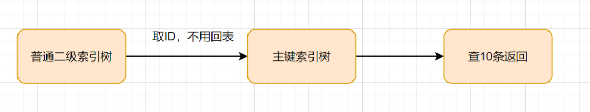

### 分页查询的必要性

分页查询是为了提升性能和用户体验而设计的，适用于任何需要处理大量数据的场景。为了支持分页查询，MySQL 提供了 [`LIMIT offset, count`](https://www.runoob.com/note/28032)。

在分页查询的前端界面中，使用方法有：

- **显示总页数和记录数**：在分页查询中，通常会在界面上显示总记录数和页数，用户可以选择查看特定的页。

- **动态加载**：很多现代应用（如 SPA 应用）会根据用户的滚动行为动态加载更多数据，逐渐填充页面。

- **用户交互**：用户在界面上选择查看第几页，应用会根据这个输入查询对应的数据。

值得注意的是，在使用不当的情况下，分页查询可能成为性能深渊。


### 什么是深分页

深分页是指<font color="blue">**分页查询中处理数据集较深位置时，可能导致的性能问题**</font>分。由于数据库在处理较大的 `offset` 时需要扫描并跳过大量的记录，因此查询效率会显著降低。

在分页查询中，我们通常会使用 MySQL  的  `LIMIT offset, count`  语句来获取特定页的数据。例如：

```sql
SELECT * FROM table_name ORDER BY column_name LIMIT 1000000, 10;
```

在这个查询中， `LIMIT 100000, 10` 的意思是从第 1000000 条记录开始，获取接下来的 10 条记录。但是，MySQL 依旧会扫描前 1000000 条记录， 导致查询时间随着 `offset` 增大而增加。

扫描更多的行数，也意味着无意义的**回表**更多的次数


### 复现深分页问题

(1) 创建表

创建一个简单的用户表：

```sql
CREATE TABLE users (
    id INT AUTO_INCREMENT COMMENT '用户ID',
    name VARCHAR(50) NOT NULL COMMENT '用户名',
    email VARCHAR(100) NOT NULL UNIQUE COMMENT '用户Email',
    password VARCHAR(255) NOT NULL COMMENT '用户密码',
    created_time TIMESTAMP DEFAULT CURRENT_TIMESTAMP COMMENT '创建时间',
    updated_time TIMESTAMP DEFAULT CURRENT_TIMESTAMP ON UPDATE CURRENT_TIMESTAMP COMMENT '更新时间',
    PRIMARY KEY (id),
    INDEX idx_name (name) COMMENT '用户名索引'
    KEY idx_update_time (update_time) //索引
) ENGINE=InnoDB DEFAULT CHARSET=utf8mb4 COMMENT='用户表';
```


(2)生成测试数据

使用存储过程在 `users` 中插入 100000 条数据。

```sql
DELIMITER //

CREATE PROCEDURE InsertUsers(IN num INT)
BEGIN
    DECLARE i INT DEFAULT 0;
    DECLARE batch_size INT DEFAULT 1000; -- 每批插入1000条记录
    DECLARE j INT; -- 在此声明 j

    WHILE i < num DO
        -- 开始事务
        START TRANSACTION;

        -- 重置 j 的值
        SET j = 0;

        -- 批量插入
        WHILE j < batch_size AND (i + j) < num DO
            INSERT INTO users (name, email, password) 
            VALUES (CONCAT('User', i + j), CONCAT('user', i + j, '@example.com'), 'hashed_password');
            SET j = j + 1;
        END WHILE;

        -- 提交事务
        COMMIT;

        -- 更新外层计数器
        SET i = i + batch_size;
    END WHILE;
END //

DELIMITER ;
```

执行存储过程，模拟出 100000 条数据，执行时间约为  12.24 s。

```sql
mysql> CALL InsertUsers(100000);
Query OK, 0 rows affected (12.24 sec)
```


（3） 测试查询时间

执行非深度分页查询， 执行时间为约为 8 ms。

```sql
SELECT * FROM users where updated_time > '2024-09-21' LIMIT 0, 10;
```

深度分页查询， 执行时间约为 420 ms。

```sql
SELECT * FROM users where updated_time > '2024-09-21' LIMIT 99990, 10;  
```

可以看出深度分页查询将会导致性能严重降低。


### 深分页解决方案

子查询优化和延迟关联都是减少回表的次数。但是，随着数据量的增多，性能依旧会下降。

标签记录法效果不错，但是只能查询上一页和下一页。

#### 子查询优化

扫描更多的行数，也意味着无意义的**回表**更多的次数。因此，<font color="red">**将查询条件转移回到主键索引树， 从而减少回表次数**</font>。具体方案为：使用辅助索引确定起始点，再用主键索引查询目标记录。



(1) 原始查询

MySQL 会用 `created_time` 上的非聚簇索引找到所有满足条件的行，但是因为 `SELECT *` 要求查询所有列， 而非聚簇索引只包含 `created_time` 和主键 `id`，因此， MySQL 需要回表， 使用这些 `id` 值去主键索引中获取完整的行数据。

```
SELECT * FROM users where created_time > '2024-09-21' LIMIT 99990, 10;  
```


(2) 优化查询

这个查询通过子查询先获取第 `99990` 条记录的 `id`，然后直接从该 `id` 开始向后查找 10 条记录。这种方式减少了大量无效扫描，也避免了频繁回表。

```
SELECT * 
FROM users 
WHERE id >= (
    SELECT id 
    FROM users 
    WHERE created_time > '2024-09-21' 
    ORDER BY created_time 
    LIMIT 99990, 1
)
LIMIT 10;
```


子查询使用索引。首先在索引上拿到了聚集索引的主键ID,省去了回表操作，然后第二查询直接根据第一个查询的 ID往后再去查10个就可以了!


```
select * from t_coupon_task_fail where batch_id = '1830889785603571980' limit 999990, 10;

mysql> select * from t_coupon_task_fail where id >=
    ->
    -> (SELECT id
    ->     FROM t_coupon_task_fail
    ->     WHERE batch_id = '1830889785603571980'
    ->     ORDER BY id
    ->     LIMIT 4999990, 1
    -> )
    ->
    -> limit 10;
```


#### **INNER JOIN 延迟关联** 


#### **标签记录法** 

标签记录法的基本思路是，在获取分页数据时，<font color="red">**通过每次查询的结果标记下一页查询的起点**</font>，从而避免大量的 `OFFSET` 跳过操作。从本质上说, 标签记录法本质上就是一种**滚动查询**。

**(1) 使用案例**

第一次查询：假设此查询返回的最后一条记录的 `id` 为 `1050`，那么下一页查询的起点就是 `id > 1050`。

```sql
SELECT id, name, email
FROM users
WHERE created_time > '2024-09-21'
ORDER BY created_time
LIMIT 10;
```

第二次查询：使用上一页标记的 `id` 作为条件，继续查询 10 条记录。

```
SELECT id, name, email
FROM users
WHERE created_time > '2024-09-21' AND id > 1050
ORDER BY created_time
LIMIT 10;
```

**后续查询**：按照相同的逻辑，继续使用上一次查询结果的最后一个 `id` 作为下一页的起点，进行分页查询。

**(2) 具体原理**

使用标签能够避免扫描前面的记录，主要是因为**标签记录法利用了索引的有序性和查询条件的优化**，从而跳过了不需要扫描的数据。

- 索引的有序性：大多数数据库表会对某些字段（如主键 `id` 或时间戳 `created_at`）建立索引，索引本身是有序的。标签记录法通过记录上一页最后一条记录的标识（如 `id` 或 `created_at`），并以此为起点进行查询，数据库可以直接定位到该标识之后的数据，而无需扫描前面的记录。
- 查询条件优化：标签记录法通过 `WHERE` 条件（如 `id > last_id`）直接过滤掉不需要的数据，数据库只需从指定位置开始扫描，避免了全表扫描。


#### 使用between...and...


### 参考资料

[实战！聊聊如何解决MySQL深分页问题-腾讯云开发者社区-腾讯云 (tencent.com)](https://cloud.tencent.com/developer/article/1884103)

[深分页优化 (zsxq.com)](https://articles.zsxq.com/id_mtlf2gzeord6.html)