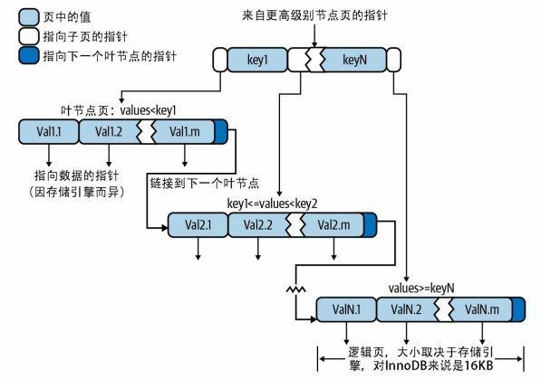
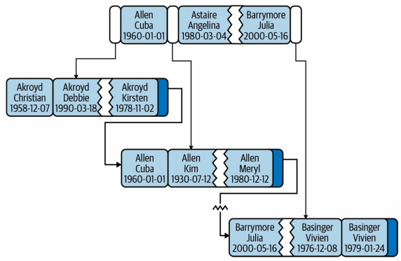

### 索引底层数据结构选型

在 MySQL 中，MyISAM 引擎和 InnoDB 引擎都是使用 B+Tree 作为索引结构。

B-tree是按照索引列中的数据大小顺序存储的，所以很适合按照范围来查询。


为什么不使用 HASH ？HASH 不支持顺序和范围查询

为什么不适用 B树？B 树查找性能不稳定，不支持范围查找


### 索引底层数据结构

B-tree 通常意味着<font color="blue">**所有的值都是按顺序存储的，并且每一个叶子页到根的距离相同**</font>。

在查询某些条件的数据时，存储引擎不再需要进行全表扫描。而是从索引的根节点（图中并未画出）开始进行搜索，根 节点的槽中存放了指向子节点的指针，存储引擎根据这些指针向下层查找。通过比较节点 页的值和要查找的值可以找到合适的指针进入下层子节点，这些指针实际上定义了子节点 页中值的上限和下限。最终存储引擎要么找到对应的值，要么该记录不存在。




其中，在 InnoDB 存储引擎中，叶子节点的指针指向的是被索引的数据，而不是其他的节点页。叶子节点之间使用双向链表相连接。


### 索引查询类型

假设有以下表：

```sql
CREATE TABLE People (
    last_name VARCHAR(50) NOT NULL,
    first_name VARCHAR(50) NOT NULL,
    dob DATE NOT NULL,
    KEY (last_name, first_name, dob)
);
```

 `key(last_name, first_name, dob)` 定义了一个索引。对于表中的每一行数据，索引中都包含对应的 last_name 、first_name 和 dob 列的值。**索引对多个值进行排序的依据是 CREATE TABLE 语句中定义索引时列的顺序**。




B+Tree 结构的索引支持全键值、键值范围或键前缀查找。其中，键前缀查找只适用于根据最左前缀的查找。

- 匹配最左前缀。例如，前面提到的索引可用于查找所有姓为Allen的人，即只使用索引的第一列。

- 匹配列前缀。也可以只匹配某一列的值的开头部分。例如，前面提到的索引可用于查找所有姓以J 开头的人。这里也只使用了索引的第一列。
- 匹配范围值。例如，前面提到的索引可用于查找姓在Allen和Barrymore之间的人。这里也只使用了 索引的第一列。
- 精确匹配某一列而范围匹配另外一列。前面提到的索引也可用于查找所有姓为Allen，并且名字是字母K开头（比如Kim、 Karl等）的人，即第一列last_name是全匹配，第二列first_name是范围匹配。
- 只访问索引的查询。 B-tree索引通常可以支持“只访问索引的查询”，即查询只需要访问索引，而无须访问 数据行。后面我们将单独讨论这种“覆盖索引”的优化。


### B+tree 索引的限制

由于索引树中的节点是有序的，索引支持按值查找、范围查找。

但是，使用索引的过程中，存在以下限制：

- **最左前缀匹配规则**： **必须从索引的最左列开始查找**。如果查询条件不以最左列开头，索引将无法被使用。例如，在 `KEY (last_name, first_name, dob)` 复合索引中，无法单独使用该索引来查找名字为 `Bill` 或者生日为某个特定日期的人，因为这些列不是索引的最左列。
- **不能跳过索引中的列**：使用索引时，不能跳过中间的列。也就是说，**查询必须逐步匹配每一列**。例如，对于 `KEY (last_name, first_name, dob)` 复合索引，如果查询条件只包括 `last_name` 和 `dob`，则无法充分利用索引，因为中间的 `first_name` 被跳过。如果不指定 `first_name` ，则 MySQL 只能使用索引的 第一列。
- **范围查询的限制**：如果查询中有某列的范围查询，则其**右边所有列都无法使用索引优化查找**。例如，假设有查询 `WHERE last_name='Smith' AND first_name LIKE 'J%' AND dob='1976-12-23'`，在这个查询中，`first_name` 列使用了 `LIKE` 范围条件，因此索引无法继续用于 `dob` 列。如果范围查询涉及的列的值较少，可以考虑将范围查询替换为多个精确匹配条件（`=`），从而最大化索引的使用。

<font color="red">**这些限制和索引列的顺序相关**</font>。在优化性能的时候，可能需要使用相同的列但顺序不同的索引来满足不同类型的查询需求。


### 索引的优缺点

- 索引大大减少了服务器需要扫描的数据量，避免全表扫描。
- 索引可以帮助服务器避免排序和临时表。
- 索引可以将随机I/O变为顺序I/O。

创建唯一性索引，可以保证数据库表中每一行数据的唯一性


### 参考资料

