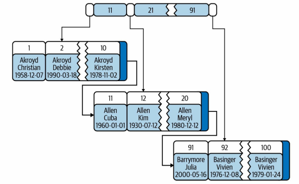

## 索引分类

[索引类型总结 | JavaGuide](https://javaguide.cn/database/mysql/mysql-index.html#索引类型总结)

按照数据结构的角度划分

- BTree 索引

按照底层存储方式维度划分

- 聚簇索引
- 非聚簇索引

按照应用维度划分 

- 主键索引
- 普通索引
- 唯一索引
- 覆盖索引

这里，我们还注意一下，按照应用维度，索引可以分为 主键索引 和 非主键索引(包含普通索引，唯一索引，覆盖索引)。


MySQL可以按照四个角度来分类索引。

- 按「数据结构」分类：**B+tree索引、Hash索引、Full-text索引**。
- 按「物理存储」分类：**聚簇索引（主键索引）、二级索引（辅助索引）**。
- 按「字段特性」分类：**主键索引、唯一索引、普通索引、前缀索引**。
- 按「字段个数」分类：**单列索引、联合索引**。


### 聚簇索引

聚簇索引：<font color="blue">**数据和索引存储在一起，数据行按照索引键的顺序进行物理排序并存储在磁盘上**</font>。

由于表的数据都是放在聚簇索引的叶子节点上，数据在物理上只会保存一份，所以一个表只能有一个聚簇索引。

在聚簇索引中，叶子页实际上是一个或多个磁盘页，包含了多条记录的全部数据。节点页只包含了索引列。




聚簇索引的优点：

- **范围查询速度快**：由于数据按索引排序，范围查询（如 `BETWEEN`、`ORDER BY` 等）效率很高。同时，聚簇索引将索引和数据保存在同一个B-tree中，因此从聚簇索引中 获取数据通常比在非聚簇索引中查找要快。

- **数据紧凑性**：数据行按照顺序存储，减少了访问磁盘时的随机性，提升了 I/O 密集型应用性能。但如果数据全部都放在内存中，则访问的顺序就没那么重要了，聚簇索引也就没什么优势了。

缺点：

- **插入和更新代价高**：插入新的数据行时，可能需要将行插入到已有数据中间，导致行移动或分裂。这对插入、删除或更新操作有额外的开销。


InnoDB 在创建聚簇索引时，会根据不同的场景选择不同的列作为索引:

- 如果有主键，默认会使用主键作为聚簇索引的索引键;（这也是聚簇索引被称为主键索引的原因）
- 如果没有主键，就选择第一个不包含 NULL值的唯一列作为聚簇索引的索引键;
- 在上面两个都没有的情况下，InnoD8 将自动生成一个隐式自增id 列作为聚簇索引的索引键;


### 二级索引

二级索引（非聚簇索引）可能比想象中的要更大，因为二级索引的叶子节点包含了引用行的主键列。

二级索引的查找过程：存储引擎需要找到二级索引的叶子节点，以获得对应的主 键值，然后根据这个值去聚簇索引中查找对应的行。这里做了双倍工作：两次B-tree 查找 而不是一次。


### 前缀索引

<font color="blue">**前缀索引 仅对列的前一部分（前缀）进行索引，而不是对整列数据创建索引**</font> 。这种索引方式通常用于**长文本数据**（如 `VARCHAR` 和 `TEXT` 字段），以减少索引占用的存储空间和提高查询效率。语法如下：

```sql
CREATE INDEX index_name ON table_name (column_name(prefix_length));
```

其中，`prefix_length` 是你想要索引的字符数。

但是，**前缀索引也存在一些缺陷**：

- **降低索引的选择性，降低精确匹配的能力**。索引的选择性是指，不重复的索引值（也称 为基数，cardinality）和数据表的记录总数（＃T）的比值，范围从1/＃T 到 1 之间。索引的选择性越高则查询效率越高，因为选择性高的索引可以让MySQL在查找时过滤掉更多的 行。唯一索引的选择性是1，这是最好的索引选择性，性能也是最好的。
- **无法使用前缀索引做 ORDER BY 和 GROUP BY 操作**。在 `ORDER BY` 和 `GROUP BY` 操作中，数据库通常需要根据**完整的列值**来排序或分组。但前缀索引只索引了列的前几位字符，因此它缺乏必要的完整数据来正确执行排序和分组。
- **无法使用前缀索引做覆盖扫描**。前缀索引只存储了列值的一部分（即前缀），因此无法提供完整的列值。如果查询需要访问列的完整值，前缀索引无法满足这一需求，数据库必须回表（访问实际的表数据）以获取完整的列值。

在实际生产中，前缀索引的字符数是个值得权衡的问题。


### 覆盖索引

覆盖索引：索引包含所有用于查询的字段的值，从而避免回表查询。


如果查询只需要扫描索引而无需回表，会带来以下好处：

- **避免二次查询**： 由于InnoDB的聚簇索引的特点，覆盖索引对InnoDB表特别有用。InnoDB的二级索 引在叶子节点中保存了记录的主键值，所以如果二级索引能够覆盖查询，则可以避 免对主键索引的二次查询。

- 索引条目通常远小于数据行大小，所以如果只需要读取索引，那么MySQL就会极 大地减少数据访问量。这对缓存型的应用负载非常重要，因为在这种情况下，响应 时间大部分花费在数据拷贝上。覆盖索引对于I/O密集型的应用也有帮助，因为索 引比数据更小，更容易全部放入内存中。
- 因为索引是按照列值的顺序存储的（至少在单页内如此），所以对于I/O密集型的 范围查询会比随机从磁盘读取每一行数据的I/O要少得多。可以通过OPTIMIZE命令 使得索引完全实现顺序排列，这让简单的范围查询能使用完全顺序的索引访问。