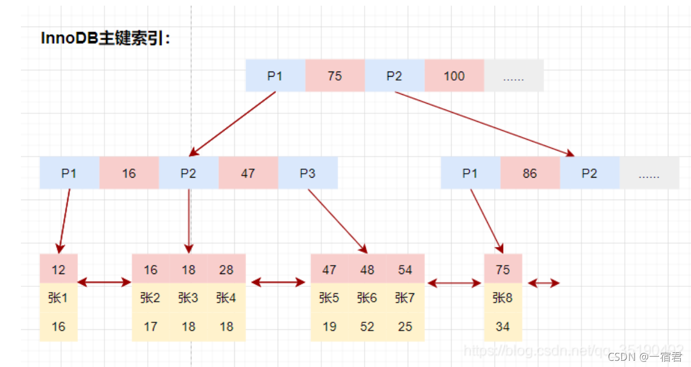
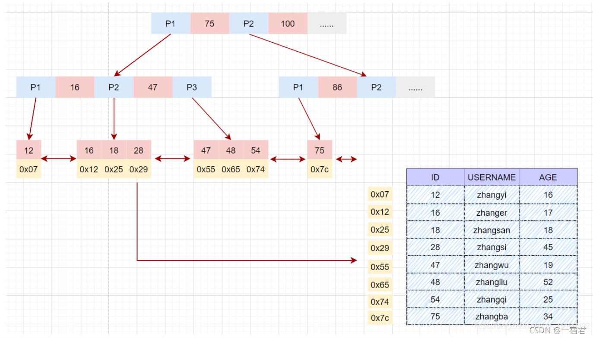

## 一、聚簇索引和非聚簇索引

InnoDB 存储引擎默认使用聚簇索引，而 MyISAM 存储引擎默认使用非聚簇索引。

### 1.1 什么是聚簇索引

**聚簇索引（Clustered Index）指索引结构和数据一起存放的索引。**一般情况下，**聚簇索引等同于主键索引**。

**聚簇索引是基于表中的某一列或多列创建的**，比如主键列。当一个表没有创建主键索引时，InnoDB 会自动创建一个 ROWID 字段来构建聚簇索引。**表中的每一行数据都会根据聚簇索引的键值进行排序**，并存储在磁盘的相应位置上。 

> 除聚簇索引之外的所有索引都被称为**辅助索引**（非主键索引或者二级索引）。在InnoDB中，辅助索引中的**叶子节点键值存储的是该行的主键值**。在检索时，InnoDB使用此主键在聚簇索引中搜索行记录。

在 InnoDB 存储引擎使用 B+ 树构建索引树时，叶子节点中键值 key 存储的是索引列的值，叶子节点的data域存储的是整行记录。在根据主键索引搜索时，直接找到 key 所在的节点即可取出数据；

其中，红色方块标识为键值，代表当前记录的主键；蓝色方块表示指针，存储子节点地址信息；黄色方块表示当前记录中除主键之外的数据。

### 1.2 什么是非聚簇索引

**非聚簇索引(Non-Clustered Index)指索引结构和数据分开存放的索引。**在 MyISAM 存储引擎使用 B+ 树构建索引树时，叶子节点中键值 key 存储的是索引列的值，数据 data 存储的是索引所在行的磁盘地址。在索引检索的时候，首先按照 B+Tree 搜索算法搜索索引，如果指定的 Key 存在，则取出其 data 域的值，然后以 data 域的值为地址读取相应的数据记录。

### 1.3 聚簇索引和非聚簇索引的区别

| 特征         | 聚簇索引（Clustered Index）                              | 非聚簇索引（Non-clustered Index）              |
| ------------ | -------------------------------------------------------- | ---------------------------------------------- |
| 物理排序方式 | 数据行按照索引键值顺序物理排序                           | 数据行在磁盘上存储的顺序与索引的键值顺序无关   |
| 存储方式     | 每个表只能有一个聚簇索引，决定表中数据行的物理存储顺序   | 表可以有多个非聚簇索引，与表的物理存储顺序无关 |
| 主键         | 通常是表的主键索引                                       | 通常不是表的主键索引                           |
| 性能优劣     | 通常能够提供更快的检索性能，特别是对于范围查询或排序查询 | 在某些情况下查询性能可能会略逊于聚簇索引       |

## 1.4 优缺点

[MySQL索引详解 | JavaGuide](https://javaguide.cn/database/mysql/mysql-index.html#聚簇索引-聚集索引)

## 二、细节补充

### 2.1 为什么每个表只能有一个聚簇索引

每个表只能有一个聚簇索引是由于聚簇索引的特性所决定的。聚簇索引决定了表中数据行的物理存储顺序，即数据行按照聚簇索引的键值顺序在磁盘上进行物理排序。

**如果一个表允许有多个聚簇索引，那么就会出现数据行按照不同索引的键值顺序进行排序**，这会导致磁盘上存在多种不同的物理排序方式，进而导致数据行的存储结构变得混乱和不确定。这样就会增加数据访问和维护的复杂性，降低数据库的性能和可维护性。

因此，为了保持数据的一致性和可维护性，数据库系统通常限制每个表只能有一个聚簇索引。这样可以确保表中数据行的物理存储顺序是确定的，便于数据库系统进行数据的高效访问和管理。

# 参考资料

[MySQL索引详解（一文搞懂）-阿里云开发者社区 (aliyun.com)](https://developer.aliyun.com/article/831250)

[MySQL索引详解 | JavaGuide](https://javaguide.cn/database/mysql/mysql-index.html#b-树-b-树)