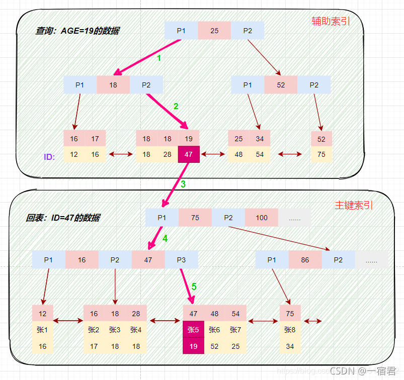

## 回表

回表是指**在流程中从非主键索引树搜索回到主键索引树搜索的过程**。回表是数据库查询过程中的一个步骤，指的是在通过索引找到符合条件的记录后，需要再次访问表中的数据行来获取完整的记录信息。

> 在了解回表之前，我们需要理解非主键索引(辅助索引)和主键索引的具体结构

更具体点，在 InnoDB 存储引擎中，非主键索引的叶子节点包含的是主键的值。这意味着，当使用非主键索引(辅助索引)进行查询时，数据库会先找到对应的主键值，然后再通过主键索引来定位和检索完整的行数据。这个过程被称为“回表”。

具体案例查看：[什么是覆盖索引?如何利用覆盖索引进行SQL语句优化？_覆盖索引优化-CSDN博客](https://blog.csdn.net/nishiwodebocai21/article/details/104497235)    基于非主键索引的查询需要多扫描一棵索引树

## 覆盖索引

覆盖索引（covering index ，或称为索引覆盖）即从非主键索引中就能查到的记录，而不需要查询主键索引中的记录。

这**避免了回表的产生**，减少了树的搜索次数，显著提升性能

> 如果一个索引包含（或者说覆盖）所有需要查询的字段的值，我们就称之为 **覆盖索引（Covering Index）** 。

**覆盖索引通常是用联合索引来实现的**，具体案例查看 [什么是覆盖索引?如何利用覆盖索引进行SQL语句优化？_覆盖索引优化-CSDN博客](https://blog.csdn.net/nishiwodebocai21/article/details/104497235)

## 联合索引

联合索引（Composite Index）是指在数据库中**同时使用多个列作为索引**的一种索引类型。这种索引允许在查询中同时使用多个列来加速检索数据。

**最左前缀匹配原则**：在使用联合索引时，MySQL 会根据索引中的字段顺序，从左到右依次匹配查询条件中的字段，直到遇到范围查询操作符（如 >、<）时才停止匹配。

如果查询条件与索引中的最左侧字段相匹配，那么 MySQL 就会使用索引来过滤数据，这样可以提高查询效率。

## 参考资料

[MySQL索引详解（一文搞懂）-阿里云开发者社区 (aliyun.com)](https://developer.aliyun.com/article/831250)

[什么是覆盖索引?如何利用覆盖索引进行SQL语句优化？_覆盖索引优化-CSDN博客](https://blog.csdn.net/nishiwodebocai21/article/details/104497235)

[在Mysql中，什么是回表，什么是覆盖索引，索引下推？ - 知乎 (zhihu.com)](https://zhuanlan.zhihu.com/p/401198674)