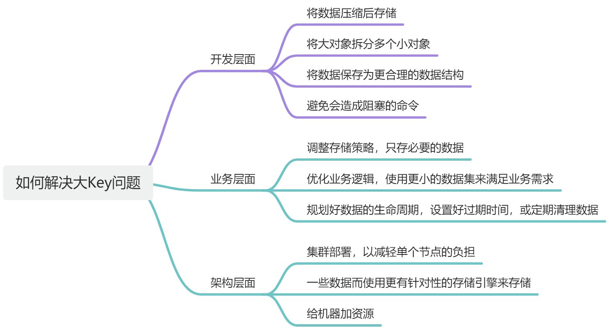

### 什么是 bigkey

**bigkey** 是指非常大的 key ，通常是指存储了大量数据或单个数据占用内存过大的 key。

具体参考标准由：

- `String` 类型的 value 超过 1MB。
- 复合类型（`List`、`Hash`、`Set`、`SortedSet`等）的 value 存储的元素超过 5000个。

### bigkey 产生原因

从不同的层面来考虑：

- **数据模型设计不合理**。例如，将过大的一段文本、序列化对象、或二进制数据直接存入一个字符串键中

- 在业务设计中**没有合理划分数据**，导致在单个键中存储了过多的数据。
- **没有及时清理过期的数据**，导致历史数据积累过多。例如，在 `Hash` 数据类型中以增量的形式不断写入大量数据而忽略了数据的时效性。
- **业务数据规模考虑不周到**。例如，使用 `List` 类型的时候，没有考虑到数据量的快速增长

### 怎么快速找到 bigKey

Redis 提供了几个有用的命令来检测和识别 BigKey：

- **使用 Redis 自带的 `--bigkeys` 参数来查找**

- **`MEMORY USAGE key`**：可以查看某个键占用的内存大小。
- **`SCAN`** 命令：可以用于遍历所有的键，并对每个键进行内存使用的统计。
- **`RDB` 文件分析**：通过分析 RDB 文件，可以快速定位哪些键占用了过多的内存。我们可以借助开源工具来分析 RDB 工具。

具体细节查看 [Redis常见面试题总结(下) | JavaGuide](https://javaguide.cn/database/redis/redis-questions-02.html#redis-bigkey-大-key)

### bigkey 解决方案 

开发层面：

- 拆分
- 重新设计合适的数据结构

业务层面：

- 清理过期数据。

### 总结
|          | bigkey                       | hotkey             |
| -------- | ---------------------------- | ------------------ |
| 解决方案 | 切割 bigkey                  | 读写分离           |
|          | 手动清理                     | 二级缓存           |
|          | 将数据转换成更合理的数据结构 | 使用 Redis Cluster |

## 参考资料

[Redis常见面试题总结(下) | JavaGuide](https://javaguide.cn/database/redis/redis-questions-02.html#redis-bigkey-大-key)

