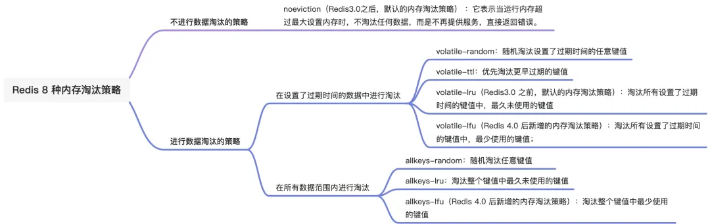

## 过期删除策略

### 给数据设置过期时间

**`expire`** 命令

### 怎么判断数据是否过期

Redis 使用了一个称为**过期字典**（Expires Dictionary）的内部结构来管理键的过期时间。

过期字典是一个特殊的哈希表：

- 它的键是 Redis 数据库中的键，
- 值是键的过期时间戳（timestamp）。

当键的过期时间到达时，Redis 将自动删除该键，以释放内存空间。

### 怎么删除过期的数据（过期数据删除策略）

常用的过期数据删除策略一般就两个：

- **惰性删除**：不主动删除过期键，每次从数据库访问 key 时，都检测 key 是否过期，如果过期则删除该 key。
- **定期删除**：每隔一段时间随机从数据库中取出一定数量的 key 进行检查，删除其中的过期 key。

惰性删除对内存不友好，而定期删除会带来额外的 CPU 开销。为了在合理使用 CPU 时间和避免内存浪费之间取得平衡，Redis 采用的**删除过期数据的策略为： 定期删除 + 惰性删除**。

## 内存淘汰策略

### 设置最大运行内存

在配置文件 redis.conf 中，可以通过参数 `maxmemory <bytes>` 来设定最大运行内存。

当 Redis 的运行内存超多最大运行内存，触发内存淘汰策略。

### 怎么避免内存耗尽（内存淘汰策略）

这里还存在一个问题：即使给 key 设置过期时间，内存依然可能耗尽

Redis 提供的解决方案是 内存淘汰机制

1. **volatile-lru（least recently used）**：从已设置过期时间的数据集（`server.db[i].expires`）中挑选最近最少使用的数据淘汰。

1. **volatile-lfu（least frequently used）**：从已设置过期时间的数据集（`server.db[i].expires`）中挑选最不经常使用的数据淘汰。

这个内存淘汰机制有点 类似学习操作系统时的内存淘汰机制

## 总结

**过期删除策略** 和 **内存淘汰策略**的触发时机和应用场景截然不同。

- **过期删除策略**: 主要用于处理已经设置了过期时间的键，确保这些键在过期后能够被删除。主要策略包括惰性删除、定期删除等。

- **内存淘汰策略**: 主要用于在 Redis 达到内存限制时，处理内存的释放和回收。主要策略包括 LRU、随机删除、TTL 删除等。

## 参考资料

[Redis 常见面试题 | 小林coding (xiaolincoding.com)](https://xiaolincoding.com/redis/base/redis_interview.html#redis-过期删除与内存淘汰)