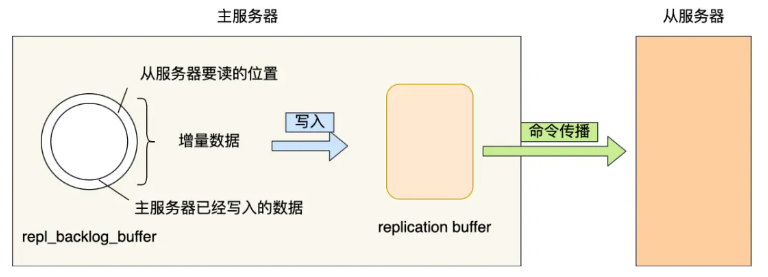
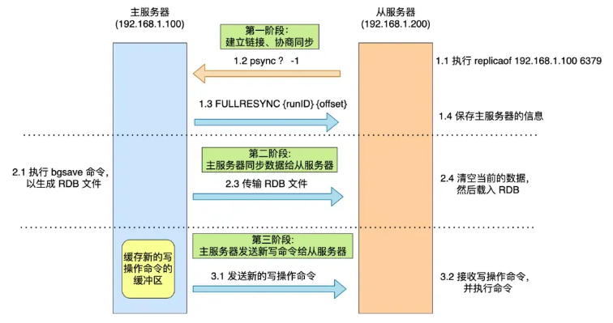
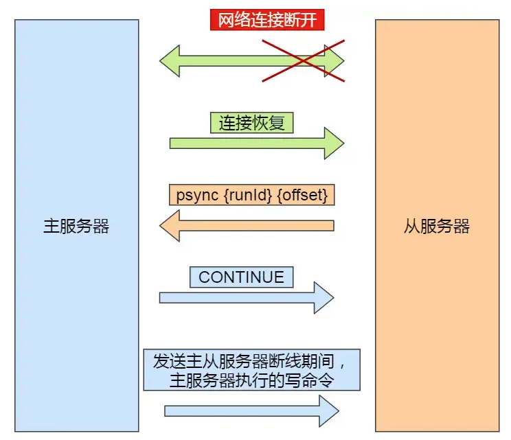

## 同步基础

### **Replication ID 和 offset**

**Replication ID** 和 **Offset** 是用于管理主从复制过程中的关键概念，确保数据在主节点和从节点之间的一致性和同步。

- Replication ID 是一个唯一的标识符，用于标识 Redis 节点（无论是主节点还是从节点）。每个 Redis 节点都有一个唯一的 Replication ID。
- Offset 是一个表示节点数据变更操作的偏移量。每个操作（例如写入命令）都有一个唯一的 Offset，用于标识在节点的 AOF（Append-Only File）或 RDB（Redis Database）文件中的位置。

任何两个随机实例的相同ID和相同偏移量意味着它们具有相同的数据集。

注意，redis 每次重新启动的时候都会生成一个新的 Replication ID。

### 缓冲区**repl_backlog_buffer**

`repl_backlog_buffer`，是一个「环形」缓冲区，用于主从服务器断连后，从中找到差异的数据;  用于实现增量同步

`replication` offset，标记上面那个缓冲区的同步进度，主从服务器都有各自的偏移量，主服务器使用master_repl_offset来记录自己,「写」到的位置，从服务器使用 slave_repl_offset 来记录自己「读」到的位置。

## 完全同步

完全同步指的是从节点与主节点在初次建立复制关系时进行的一次全面的数据同步。

### 完全同步发生情况

- 初次同步

- 主缓冲区中没有足够的积压，
- 副本引用的历史记录（复制ID）不再已知，则会发生完全重新同步：在这种情况下，副本将从头开始获得数据集的完整副本。

### 实现过程

完全同步主要使用 

## 增量同步

 增量同步是指在从节点与主节点建立连接后，主节点会仅发送自上次同步以来发生的所有数据变更操作（即增量数据）给从节点。

### 实现过程

增量同步主要使用  [`PSYNC`](https://redis.io/commands/psync) 和 AOF 文件来实现，并采用 Replication ID 和 offset 的概念

当副本连接到主机时，它们使用 PSYNC 命令发送它们的旧主机复制ID和它们迄今为止处理的偏移量。这样，主机可以只发送所需的增量部分。

## 参考资料

[Redis replication | Docs](https://redis.io/docs/latest/operate/oss_and_stack/management/replication/#important-facts-about-redis-replication)

[Redis面试题 | 小林coding (xiaolincoding.com)](https://xiaolincoding.com/interview/redis.html#redis主从同步中的增量和完全同步怎么实现)