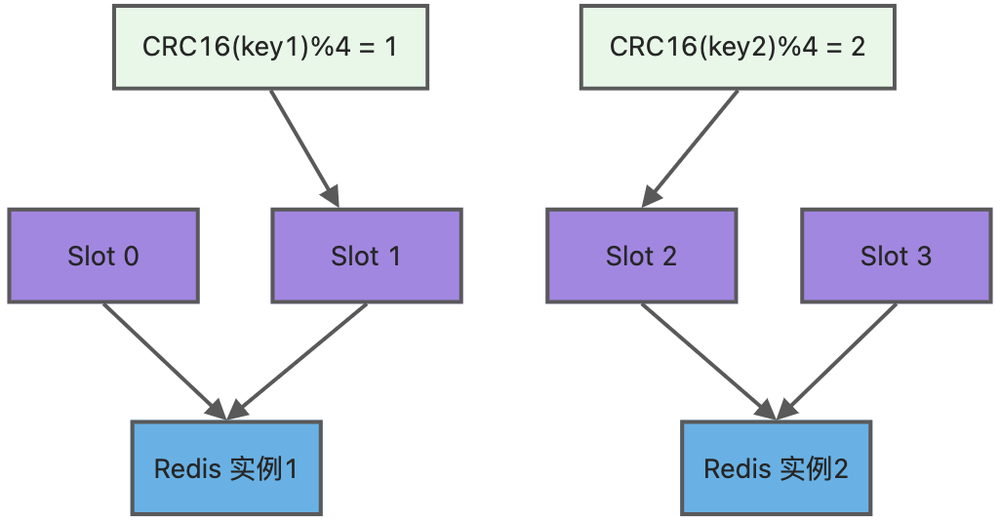

### Redis 集群可以保证数据一致性吗

Redis 集群不提供强一致性保证。由于使用的是<font color="red">**异步复制**</font>，可能会出现短暂的数据不一致情况。

但是， Redis 集群提供最终一致性保证。主节点和从节点的数据在正常情况下会最终达到一致。


### Redis 集群使用案例

[Scale with Redis Cluster | Docs](https://redis.io/docs/latest/operate/oss_and_stack/management/scaling/#add-a-new-node)


### Redis 集群的哈希槽机制

#### 哈希槽具体实现

Redis 集群采用哈希槽（Hash slot ）方案，将键映射到哈希槽中，然后将哈希槽分配到 Redis 节点中，从而处理数据和节点之间的关系。




**(1) 数据映射到哈希槽**

Redis 集群中的键空间被划分为 **16384 个哈希槽**，这也意味着集群最多可以有 **16384 个主节点**。不过，建议的集群节点数上限约为 **1000 个节点**。

```ASN.1
HASH_SLOT = CRC16(key) mod 16384
```

具体细节查看 [Key distribution model| Docs](https://redis.io/docs/latest/operate/oss_and_stack/reference/cluster-spec/#key-distribution-model)

**(2) 哈希槽映射到 Redis 节点**

集群中的每个节点负责一部分哈希槽。分配方式有：

- **平均分配**
- **手动分配**


#### 哈希槽的优点

- **方便数据迁移**：在节点扩容或缩容时，只需调整哈希槽的分配，不需要重分配整个键空间。

- **支持弹性扩展**：通过重新分配哈希槽，Redis 可以实现无停机扩容和缩容。


### 参考资料

[Redis cluster specification | Docs](https://redis.io/docs/latest/operate/oss_and_stack/reference/cluster-spec/)