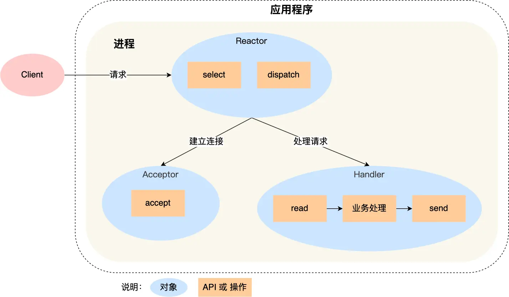
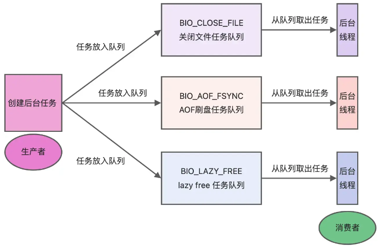

## 一、单线程模型（6.0 版本之前）

### 1.1 什么是 Redis 单线程模型

**Redis 单线程指的是「接收客户端请求->解析请求 ->进行数据读写等操作->发送数据给客户端」这个过程是由一个线程（主线程）来完成的**。

Redis 采用的是单 Reactor单线程的模式。

### 1.2 为什么 Redis 6.0 之前只用使用单线程

**CPU 并不是制约 Redis 性能表现的瓶颈所在**， 所以没有采用多线程。

### 1.3 后台线程

需要注意的是，Redis 程序并不是单线程。在启动的时候，**Redis 会启动后台线程（BIO）**。后台线程处理的任务主要有：

- **bio_close_file**: 关闭文件
- **bio_aof_fsync**: 刷盘
- **bio_lazy_free**: 释放内存

后台线程相当于生产者-消费者模式中的消费者。

## 二、多线程模型

### 2.1 为什么引入多线程

随着网络硬件性能的提升，**网络 I/O 处理为 Redis 的性能瓶颈**。

在引入多线程后，性能至少提升一倍以上。

### 2.2 什么是多线程模型

Redis 6.0 版本支持的 I/O 多线程特性，默认情况下 **I/O 多线程只针对发送响应数据（write client socket），并不会以多线程的方式处理读请求（read client socket**）。

I/O 多线程并不是为了优化 Redis 的命令执行逻辑，而是**专门用来优化网络 I/O 性能**。具体来说：

- **写响应数据（write client socket）**: 多线程模型主要应用于发送响应数据到客户端。当有多个客户端同时连接 Redis 并需要从 Redis 获取数据时，Redis 可以通过多个线程并行地将数据发送到客户端，从而提高了响应速度和吞吐量。
- **读请求（read client socket）**: 默认情况下，Redis 仍然使用单线程模型来处理客户端的读取请求。即所有的读请求都是在主线程中处理的。这意味着所有的命令解析、执行和处理逻辑仍然在单线程中完成。

因此，Redis 对命令的执行依然采用单线程来处理。

### 参考资料

[Redis 常见面试题 | 小林coding (xiaolincoding.com)](https://xiaolincoding.com/redis/base/redis_interview.html#redis-是单线程吗)