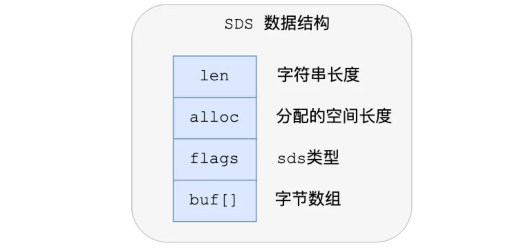

### 数据类型

| 数据类型   | 应用场景                                                     |
| ---------- | ------------------------------------------------------------ |
| String     | **存储常规数据**(缓存 Session、Token、图片地址、序列化后的对象) **计数**（用户单位时间的请求数（简单限流可以用到）、页面单位时间的访问数）  简易分布式锁 |
| List       | 信息流展示（最新文章、最新动态）                             |
| Hash       | 对象数据存储(用户信息、商品信息、文章信息、购物车信息)       |
| Set        | **存放的数据不能重复**（网站 UV 统计（数据量巨大的场景还是 `HyperLogLog`更适合一些）、文章点赞） 集合运算（共同好友） **随机获取数据源中的元素** |
| Sorted Set | **随机获取数据源中的元素根据某个权重进行排序**（排行榜）     |

### 不同数据的操作流程

[Redis 常见数据类型和应用场景 | 小林coding (xiaolincoding.com)](https://xiaolincoding.com/redis/data_struct/command.html#内部实现)：这篇文章将不同数据类型的内部实现、常用指令、应用场景讲的很详细

### ZSet 的底层实现

[Redis为什么用跳表实现有序集合 | JavaGuide](https://javaguide.cn/database/redis/redis-skiplist.html#模板定义)

ZSet 使用跳表来实现， 平均时间复杂度为 $O(log n)$ 。

- 

### 哈希表扩容

Redis 使用**渐进式 rehash**。

在哈希表扩容的时候， 读请求会先在 哈希表1 里面查找。如果找不到，就会继续到 哈希表2 里面查找。

### String 的存储结构

String 是用 SDS 数据结构存储的，克服了传统 C 字符串的一些局限性。

- **动态扩展**: 当字符串需要增长时，SDS 会自动调整内存大小以容纳更多的数据。这避免了传统 C 字符串在扩展时需要频繁复制和重新分配内存的问题。
- **不会发生缓冲区溢出**：`alloc - len`  表示剩余可用的空间大小，程序内部即可判断缓冲区是否足够用。但在C 语言的字符串操作函数中，程序内部并不会判断缓冲区是否够用。
- **不以 `\0` 结尾**: 由于 `len` 变量记录了长度，SDS 字符串可以不依赖于空字符（`\0`）作为结尾标记，这允许字符串中包含任意字节的数据（包括空字节）。

### 细节补充

#### [String 还是 Hash 存储对象数据更好呢？](https://javaguide.cn/database/redis/redis-questions-01.html#string-还是-hash-存储对象数据更好呢)

- String 存储的是序列化后的对象数据，存放的是整个对象。String 存储相对来说更加节省内存，缓存相同数量的对象数据，String 消耗的内存约是 Hash 的一半。如果系统对性能和资源消耗非常敏感的话，String 就非常适合。

- Hash 是对对象的每个字段单独存储，可以获取部分字段的信息，也可以修改或者添加部分字段，节省网络流量。

- 绝大部分情况下建议适用 String； 如果需要频繁修改或者查询对象的某个字段，适用 Hash；

#### 为什么 Redis 不使用 B+ Tree 作为存储数据结构

数据在内存中读取耗费的时间是从磁盘的IO读取的百万分之一。

- MySQL 使用 B+ Tree 是为了降低磁盘 I/O 次数。Redis是 内存中读取数据，不涉及IO。同时，跳表内的元素是有序的，哈希算法实现的 Map是无序的。
- 跳表占用内存更灵活。

### 参考资料

[Redis Strings | Docs](https://redis.io/docs/latest/develop/data-types/strings/)

[Redis 5 种基本数据类型详解 | JavaGuide](https://javaguide.cn/database/redis/redis-data-structures-01.html#常用命令)

[动画学Redis怎么实现分布式全局ID、浏览数、值缓存、分布式session_哔哩哔哩_bilibili](https://www.bilibili.com/video/BV1xm42177Fq/?spm_id_from=333.788&vd_source=52cd9a9deff2e511c87ff028e3bb01d2)