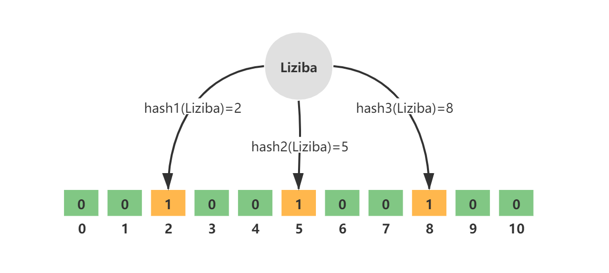

## 一、布隆过滤器概述

### 1.1 什么是布隆过滤器

布隆过滤器（Bloom Filter）是一种数据结构，用于快速检查一个元素是否属于一个集合。

它通常用于**解决海量数据的存在性问题**( 即快速查找某个元素是否存在于大规模数据集合），具有**高效的查询速度和低内存占用**的特点。

### 1.2 优缺点

优点：高效的查询速度；低内存占用；实现简单

缺点：**存在一定的误判率**（False Positive），即有些元素被错误地判断为存在于集合中。删除存在限制，因为多个元素可能哈希到布隆过滤器的同一个位置。

**布隆过滤器的性能和误判率受到 位数组大小和哈希函数数量的影响**。增加位数组的大小和哈希函数的数量可以降低误判率，但也会增加内存占用。

> 以上优缺点的具体解析查看布隆过滤器原理

## 二、布隆过滤器原理

### 2.1 布隆过滤器的组成

布隆过滤器 = 一个位数组（通常称为比特数组） +  多个哈希函数。

>这里使用多个哈希函数的原因在于降低因哈希碰撞所导致的误判

布隆过滤器**使用bit数组，可以节省内存**。Bloom Filter 会使用一个较大的 bit 数组来保存所有的数据，数组中的每个元素都只占用 1 bit ，并且每个元素只能是 0 或者 1（代表 false 或者 true）。

布隆过滤器**使用哈希函数，查询操作非常快速**。当需要查询一个元素是否存在于布隆过滤器中时，只需要对该元素经过多个哈希函数计算得到的位进行检查，通常是在位数组中进行一系列的位操作，这些操作的时间复杂度是常数级别的，与集合中元素的数量无关，因此查询速度非常快。

但是，**由于哈希碰撞（Hash Collisions），布隆过滤器存在误判率**。哈希函数将不同的输入映射到位数组中的不同位置，但由于布隆过滤器通常使用的是多个哈希函数，并且位数组的大小是有限的，所以不同的元素可能会映射到位数组中的相同位置，导致哈希碰撞。

### 2.2 元素添加和查询

当元素被添加到布隆过滤器中时，具体操作为：将元素经过多个哈希函数得到的多个哈希值对应的位标记为1。

当需要查询某个元素是否存在于布隆过滤器中时，具体操作为：

1. 对该元素进行哈希运算
2. 然后检查对应的位是否都为1，如果存在任意一位不为1，则说明该元素一定不存在于集；如果所有位都为1，则说明该元素可能存在于集合中，但也有一定的误判率。

## 三、 应用场景

布隆过滤器适用于海量数据中判定某个数据是否存在且容忍轻微误差这一场景。

例如，海量数据去重，[**缓存穿透**](https://www.yuque.com/magestack/12306/go6vg8whk9g1lyhp)。

## 参考资料

[布隆过滤器 | JavaGuide](https://javaguide.cn/cs-basics/data-structure/bloom-filter.html)

[布隆(Bloom Filter)过滤器——全面讲解，建议收藏-CSDN博客](https://blog.csdn.net/qq_41125219/article/details/119982158)

[手摸手之注册用户如何防止缓存穿透？ (yuque.com)](https://www.yuque.com/magestack/12306/go6vg8whk9g1lyhp)