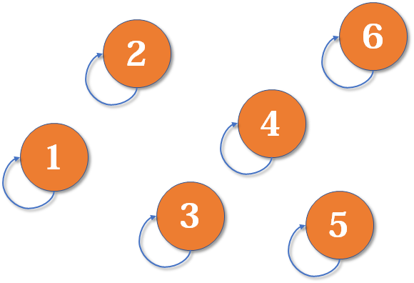
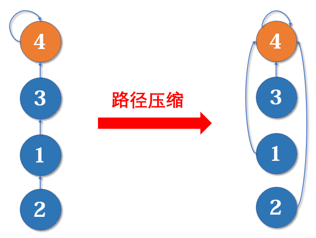

## 一、并查集概述

### 1.1 什么是并查集

并查集（Union-Find，或称为 Disjoint Set Union, DSU）是一种数据结构，<font color="blue">用于处理一些**不相交集合的合并和查询问题**</font>。它支持两种基本操作：

- **合并（Union）**：把两个不相交的集合合并为一个集合。
- **查询（Find）**：查询两个元素是否在同一个集合中。


### 1.2 实现思想

并查集的重要思想在于，<font color="red">**用集合中的一个元素代表集合**</font>。

这一代表元素称为集合元素所组成的树的根节点，它不仅指示了集合的身份，还用于判断不同元素是否属于同一集合。


### 1.3 应用场景

并查集为解决复杂的连接性问题提供了高效的工具。

- **网络连接**：用于判断网络中两个节点是否连通，常见于社交网络、计算机网络等。
- **动态连通性**：在图论中，处理图的连通性问题，例如在不断添加边的情况下检查两个节点是否仍然连通。
- **最小生成树**：在 Kruskal 算法中，使用并查集来检测环的形成，以便有效地构建最小生成树。


## 二、代码实现

图形化解释查看 [算法学习笔记(1) : 并查集 - 知乎](https://zhuanlan.zhihu.com/p/93647900)

### 2.1 简单版本

#### 2.1.1 初始化

使用数组 `parent[]` 存储每个元素的父节点。在初始化时，**将每个元素的父节点设置为自己**。



```java
class UnionFind {
    private int[] parent; // 存储每个元素的父节点

    // 构造函数，初始化并查集
    public UnionFind(int size) {
        parent = new int[size];
        for (int i = 0; i < size; i++) {
            parent[i] = i; // 每个节点初始指向自己
        }
    }
}
```


#### 2.1.2 查询

集合中元素组成一颗树，其<font color="red">**根节点为该集合的代表元素**</font>。

- **利用递归或者循环实现对代表元素的查询**：逐层访问父节点，直至根节点（**根节点的标志就是父节点是本身**）。
- **判断两个元素是否属于同一个集合**，只需要看它们的根节点是否相同即可。

```java
// 查找操作，返回 x 所在集合的代表元素(根节点)
public int find(int x) {
    while (parent[x] != x) {
        x = parent[x]; // 逐层查找父节点
    }
    return x;
}

// 判断两个元素是否在同一个集合
public boolean connected(int x, int y) {
    return find(x) == find(y);
}
```


#### 2.1.3 合并

合并的主要思路为：

1. 找到两个集合的代表元素。
2. 将一个集合的代表元素的父节点设置为另一个集合的代表元素。

```java
// 合并操作
public void union(int x, int y) {
    int rootX = find(x);
    int rootY = find(y);
    if (rootX != rootY) {
        parent[rootY] = rootX; // 将 rootY 的父节点设置为 rootX
    }
}
```


#### 2.1.4 完整代码

完整实现代码为：

```java
class UnionFind {
    private int[] parent;

    public UnionFind(int size) {
        parent = new int[size];
        for (int i = 0; i < size; i++) {
            parent[i] = i;
        }
    }
	
    // 查找操作，返回 x 所在集合的代表元素(根节点)
    public int find(int x) {
        while (parent[x] != x) {
            x = parent[x];
        }
        return x;
    }
	
    // 合并操作
    public void union(int x, int y) {
        int rootX = find(x);
        int rootY = find(y);
        if (rootX != rootY) {
            parent[rootY] = rootX;
        }
    }
	
   // 查找操作，返回 x 所在集合的代表元素(根节点)
    public boolean connected(int x, int y) {
        return find(x) == find(y);
    }
}
```


### 2.2 优化版本

事实上，无论是路径压缩还是按秩合并，最终目的是为了降低树的高度，优化查询效率。

#### 2.2.1 初始化

- 使用数组 `parent[]` 存储每个元素的父节点。在初始化时，**将每个元素的父节点设置为自己**。
- 使用 `rank[]` 存储每个树的秩（高度）。在初始化时，将每个树的秩设置为 1 。

```java
private int[] parent; // 存储每个元素的父节点
private int[] rank;   // 存储每个树的秩（高度）

// 构造函数，初始化并查集
public UnionFind(int size) {
     parent = new int[size];
     rank = new int[size];
     for (int i = 0; i < size; i++) {
         parent[i] = i; // 每个节点初始指向自己
         rank[i] = 1;   // 初始秩为1
     }
}
```


#### 2.2.2 查询(路径压缩)

在查询的时候，我们其实只关注元素对应的根节点，那我们希望每个元素到根节点的路径尽可能短，最好只需要一步。

**路径压缩**：在查询的过程中，**把沿途的每个节点的父节点都设为根节点**，从而减少树的高度，优化查询效率。



```java
// 查找操作(带路径压缩)，返回 x 所在集合的代表元素(根节点)
public int find(int x) {
    if (parent[x] != x) {
    	parent[x] = find(parent[x]); // 递归查找并路径压缩
    }
    return parent[x];
}

// 判断两个元素是否在同一个集合
public boolean connected(int x, int y) {
    return find(x) == find(y);
}
```


#### 2.2.3 合并(按秩合并)

**按秩合并**：在合并两个集合时，**始终将较小的树连接到较大的树**下，避免树的高度增加。

> 秩不是准确的子树高，而是子树高的上界，因为路径压缩可能改变子树高。还可以将秩定义成子树节点数，因为节点多的树倾向更高。无论将秩定义成子树高上界，还是子树节点数，按秩合并都是尝试合出最矮的树，并不保证一定最矮。

关键点有：

- **根节点不相同且秩不同**：在这种情况下，新的集合的秩保持不变。
- **根节点不相同且秩相同**：在合并后，新的集合的秩增加1。这意味着合并后的树深度会增加，反映了树结构的变化。

```java
// 合并操作，按秩合并
public void union(int x, int y) {
    int rootX = find(x);
    int rootY = find(y);
    if (rootX != rootY) {
        // 按秩合并
        if (rank[rootX] > rank[rootY]) {
            parent[rootY] = rootX;
        } else if (rank[rootX] < rank[rootY]) {
            parent[rootX] = rootY;
        } else {
            parent[rootY] = rootX;
            rank[rootX]++;	// 如果秩相同且根节点不同，则新的根节点的深度+1
        }
    }
}
```


#### 2.2.4 完整代码

```java
class UnionFind {
    private int[] parent; // 存储每个元素的父节点
    private int[] rank;   // 存储每个树的秩（高度）

    // 构造函数，初始化并查集
    public UnionFind(int size) {
        this.parent = new int[size];
        this.rank = new int[size];
        for (int i = 0; i < size; i++) {
            parent[i] = i; // 每个节点初始指向自己
            rank[i] = 1;   // 初始秩为1
        }
    }


    // 合并操作，按秩合并
    public void union(int x, int y) {
        int rootX = find(x);
        int rootY = find(y);
        if (rootX != rootY) {
            // 按秩合并
            if (rank[rootX] > rank[rootY]) {
                parent[rootY] = rootX;
            } else if (rank[rootX] < rank[rootY]) {
                parent[rootX] = rootY;
            } else {
                parent[rootY] = rootX;
                rank[rootX]++;	// 如果秩相同且根节点不同，则新的根节点的深度+1
            }
        }
    }

    // 判断两个元素是否在同一个集合
    public boolean connected(int x, int y) {
        return find(x) == find(y);
    }
}
```


## 三、leetcode 题目

### 3.1 账户合并

以 [721. 账户合并 - 力扣（LeetCode）](https://leetcode.cn/problems/accounts-merge/solutions/564305/zhang-hu-he-bing-by-leetcode-solution-3dyq/?envType=daily-question&envId=2024-07-15)为例，整体实现过程要使用哈希表，不停地使用哈希映射，还是有点转的。

```java
class Solution {
    public List<List<String>> accountsMerge(List<List<String>> accounts) {
        // 记录每个邮箱对应的编号和每个邮箱对应的名称
        Map<String, Integer> emailToIndex = new HashMap<>();
        Map<String, String> emailToName = new HashMap<>();
        int emailsCount = 0;
        for(List<String> account : accounts){
            String name = account.get(0);
            int size = account.size();
            for(int i = 1; i < size; i++){
                String email = account.get(i);
                if( !emailToIndex.containsKey(email) ){
                    emailToIndex.put(email, emailsCount++);
                    emailToName.put(email, name);
                }
            }
        }

        // 使用并查集进行合并操作
        // 遍历每个账户，对账户中的邮箱地址进行合并操作
        // 注意的是，并查集存储的是每个邮箱地址对象的编号
        UnionFind uf = new UnionFind(emailsCount);
        for(List<String> account : accounts){
            String firstEmail = account.get(1);
            int firstIndex = emailToIndex.get(firstEmail);
            int size = account.size();
            for(int i = 2; i < size; i++){
                String nextEmail = account.get(i);
                int nextIndex = emailToIndex.get(nextEmail);
                uf.union(firstIndex, nextIndex);
            }
        }

        // 整理合并后的账户包含哪些邮箱地址
        Map<Integer, List<String>> indexToEmails = new HashMap<>();
        for(String email : emailToIndex.keySet()){
            int index = uf.find(emailToIndex.get(email)); // 得到集合的代表元素 index
            List<String> account = indexToEmails.getOrDefault(index, new ArrayList<String>());
            account.add(email);
            indexToEmails.put(index, account);
        }

        // 构建结果
        List<List<String>> result = new ArrayList<>();
        for (List<String> emails : indexToEmails.values()) { // 遍历合并后的邮箱集合
            List<String> mergedAccount = new ArrayList<>(emails); // 创建新列表并添加邮箱
            Collections.sort(mergedAccount); // 对邮箱进行排序
            String name = emailToName.get(mergedAccount.get(0)); // 获取名称
            mergedAccount.add(0, name); // 将名称添加到列表的开头
            result.add(mergedAccount); // 添加到结果列表
        }


        return result;
        
    }
}

// 并查集，存储每个账户的所有邮箱
class UnionFind{
    private int[] parent;
    private int[] rank;

    public UnionFind(int size){
        this.parent = new int[size];
        this.rank = new int[size];
        for(int i = 0; i < size; i++){
            parent[i] = i;
            rank[i] = 1;
        }
    }

    // 查询
    public int find(int x){
        if(parent[x] != x){
            parent[x] = find(parent[x]);
        }
        return parent[x];
    }

    public void union(int x, int y){
        int rootX = find(x);
        int rootY = find(y);
        if(rootX != rootY){
            if(rank[rootX] > rank[rootY] ){
                parent[rootY] = rootX;
            }else if(rank[rootX] < rank[rootY] ){
                parent[rootX] = rootY;
            }else{
                 parent[rootY] = rootX;
                 rank[rootY] += 1;
            }
        }
    }
}
```


## 参考资料

[算法学习笔记(1) : 并查集 - 知乎](https://zhuanlan.zhihu.com/p/93647900)

[721. 账户合并 - 力扣（LeetCode）](https://leetcode.cn/problems/accounts-merge/solutions/564305/zhang-hu-he-bing-by-leetcode-solution-3dyq/?envType=daily-question&envId=2024-07-15)