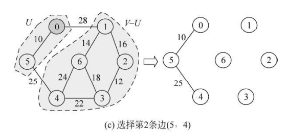
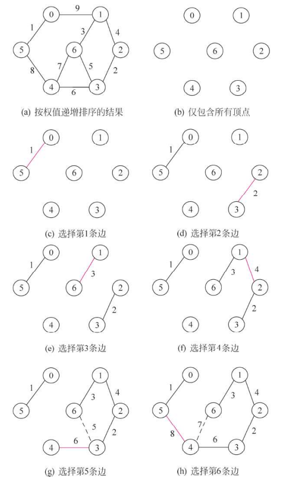

## 一、生成树

### 1.2 生成树

**生成树**：一个连通图的生成树是一个极小联通子图， 其中含有图中的全部顶点和构成一棵树的  $n - 1$  条边。

**最小生成树**：图的所有生成树中具有边上权值之和最小的数。最小生成树的准则有：

- 必须只使用该图中的边来构造最小生成树
- 必须使用且仅使用 $n-1$ 条边来连接图中的"个顶点
- 不能使用产生回路的边

### 1.1 无向图的连通分量和生成树

在对无向图遍历的时候，根据图是否联通，生成树的过程也不一样：

- 对于连通图，仅需要调用遍历过程(DFS 和 BFS)一次，从图中的任一顶点出发便可以遍历图中的各个顶点，从而得到连通分量的生成树
- 对于非连通图，需要多次调用遍历过程(DFS 和 BFS)，每次调用得到的顶点集连同相关的边就构成了一个联通分量。各个联通分量的生成树组成非联通图的生成森林。

### 1.3 最小生成树算法

- Prim 算法以**顶点**为中心进行操作，因此在**稠密图**（边的数量接近最大可能数量）中效率较高.
- Kruskal 算法以**边**为中心进行操作，因此更适合**稀疏图**，即边相对于顶点的数量较少的图。

- Prim 算法**只适用于连通图**
- Kruskal 更适用于**无向连通图**，但也可以适用于**非连通图**。

Prim 逐步选择点， Kruskal 算法逐步选择边

## 二、普利姆算法 

### 2.1 Prim 算法

Prim 算法是一种用于计算**最小生成树**的贪心算法，适用于**连通图**。该算法从一个起点开始，每次选择权值最小的边，逐步扩展树。

Prim 算法的步骤为：

1. **初始化**：从图中任意选择一个顶点作为起始点，将它加入生成树（已选择的顶点集合）

2. **选择最小权值的边**：**从已选择的顶点集合出发**，找出连接到未选择顶点集合的所有边中**权值最小**的一条边。示例如下图所示。

   

3. **扩展生成树**：将这条边连接的未选择顶点加入到生成树（即加入已选择顶点集合）。

4. **重复**：重复步骤 2 和 3，直到所有顶点都被加入生成树为止。

值得注意的是，Prim 算法**只适用于连通图**，不适用非联通图。

### 2.2 具体代码

由于 Prim 算法需要频繁地取一条条边的权，所以图更适合使用**邻接矩阵**来存储。

## 三、克鲁斯卡尔算法

### 3.1 Kruskal 算法

克鲁斯卡尔(Kruskal)算法是一种**按权值的递增次序选择合适的边**来构造最小生成树的方法。

Kruskal 算法具体步骤如下：

1. **初始化**：

	- 创建一个**空的集合**用于存储最小生成树的边。
	- 对图中的每个顶点，单独初始化一个集合（即每个顶点都处于不同的连通分量中）。

2. **按权值对所有边排序**：将图中的所有边按照权值从小到大排序。

3. **逐边处理**：从排序后的边集合中，依次选择权值最小的边。判断这条边连接的两个顶点是否属于不同的连通分量。

  - 如果是，则将这条边加入到最小生成树中，并合并这两个顶点所在的连通分量。

   - 如果不是（即两个顶点已在同一个连通分量中），则忽略这条边，避免产生环。

4. **重复**：重复步骤 3，直到最小生成树包含了 $n-1$ 条边（对于 $n$ 个顶点的图，最小生成树应有 $n-1$ 条边）。

设计 Kruskal 算法的关键是**如何判断选取一条边 ($i, j$) 加入到生成树中是否出现回路**,可以通过判断顶点 $i$、$j$ 是否属于同一个连通分量的方法来解决。因此，我们应该设置一个辅助数组 vset[0..n -1 ]  用于记录不同顶点所在的联通分量编号。

### 3.2 具体代码

