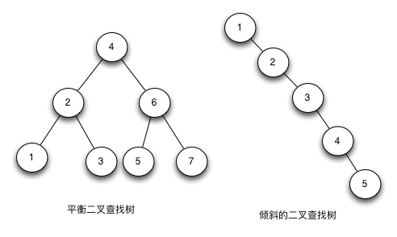
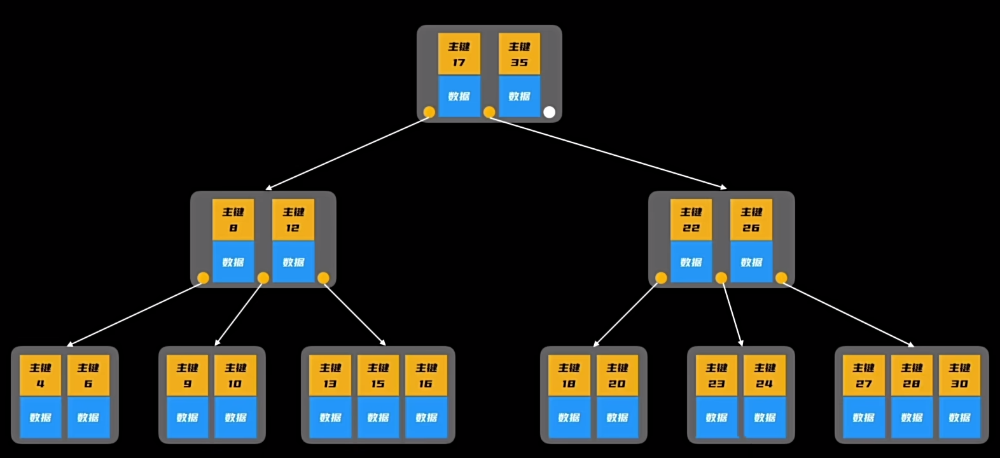
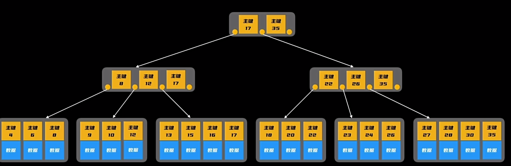

[为什么 MySQL 采用 B+ 树作为索引？ | 小林coding](https://xiaolincoding.com/mysql/index/why_index_chose_bpuls_tree.html#什么是自平衡二叉树)

### 二分查找

线性数据结构

在插入元素时，后续所有元素都要移动。

### 二分查找树

二分查找树： 一个非线形且天然适合二分查找的数据结构

在理想的情况下，二叉查找树增删查改的时间复杂度为 O(logN)（其中N为节点数），最坏的情况下为O(N)。当它的高度为 logN+1 时，我们就说二叉查找树是平衡的。

在某些特定的插入和删除顺序下，**二叉搜索树可能会退化为线性结构**，即一个链表，导致操作的时间复杂度从 $O(logn)$ 变为 $O(n)$。例如下图中右边的倾斜二叉查找树

### 自平衡二叉树(AVL 树）

在二叉查找树的基础上，增加条件约束： **每个节点的左子树和右子树的高度差不能超过 1**。

自平衡实现左旋和右旋。

但是，当节点越多时，树的高度会逐渐变大，磁盘 I/O 次数会增多

### B树

B-树，也称为B树，是一种自平衡**多叉树**，它比较适用于对外查找。

- 每个节点的子节点数量 > 2

- 一个节点里面可以有多个有序排列的数据。

#### 缺陷

- **查找性能不稳定**。查找数据可能位于任一层的节点

- **范围查找问题**。B 树要中序遍历，访问多个节点。但 B+ 树的所有叶子节点有双向链表，不需要从根节点查询。
- **数据大小问题**。B 树每个节点都包含数据(索引 + 记录) ， 但用户的记录数据大小远远超过索引数据，需要花费更多的 磁盘 I/O 操作次数来读到有用的索引数据。

## 二、B+ 树

### 优点

- B+ 树更加扁平。当利用 B+ 树作为 Mysql 索引时，I/O 查询次数更少。

- 查询性能稳定。只有叶子节点存在数据。

- 插入删除效率。在删除一个节点的时候，可以直接从叶子节点中删除，而不用动非叶子节点

## 参考资料

[一个动画搞懂MySQL索引原理！_哔哩哔哩_bilibili](https://www.bilibili.com/video/BV1pJ4m1j7Pm/?spm_id_from=333.880.my_history.page.click&vd_source=52cd9a9deff2e511c87ff028e3bb01d2)