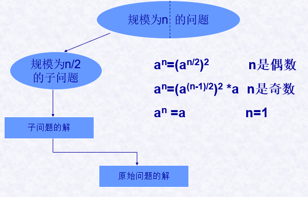
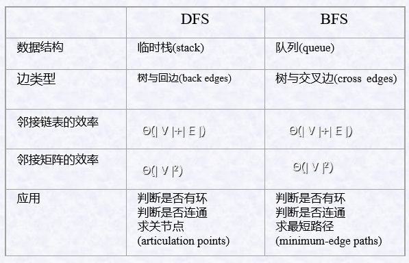

# 一、 减治法

## 1.1 定义

减治法解决的问题：插入排序，DFS，BFS，俄式乘法，选择问题

## 1.2 基本思想

将规模为n的问题递减为规模为n-1或n/2的子问题,反复递减后对子问题分别求解,再建立子问题的解与原问题的解的关系。一旦建立了这种关系，就可以从顶至下（递归），也可以从底至上（非递归）的来运用。

## 1.3 变形

### 1.3.1 减常数

  减常数(如1) :每次迭代规模减1，即$n→n-1$

### 1.3.2 减因子

减因子(如1/2):每次迭代规模减半，即$n→ n/2$

### 1.3.3 减可变规模

减可变规模:每次迭代减小的规模不同

## 1.4 减治法和分治法区别

- **分治法主要是将问题分成两个子问题，然后最后将问题合并起来，从而求得其解，**

- **减治法是将问题分解，但是没有将解合并，解就在子问题的解中**。 
- 通常来说，减治法的效率较高。

# 三、 实例

## 3.1插入排序

- 插入排序的过程类似玩牌时整理手中纸牌的过程。

- 它的**基本思想**是：每步将一个待排序的对象按照其关键字的大小，插到前面已经排好序的序列中的适当位置，直到全部对象插入完毕为止。

- 常用的插入排序有：直接插入排序、折半插入排序、链表插入排序和希尔排序（缩小增量排序），它们划分的依据是在排好序的序列中寻找插入位置所使用方法的不同。

## 3.2 深度优先查找

可以从任何顶点开始访问图的顶点，每次迭代时，处理与当前顶点相邻的未访问顶点。

> 用**栈**来跟踪深度优先查找的操作最方便

### 3.2.1 分析

### 3.2.2 搜索效率

深度优先搜索的效率与图的表示有关：

- 对邻接矩阵表示的图：遍历的效率为$Θ(| V |2)$
- 对邻接链表表示的图：遍历的效率为 $Θ(| V |+| E |)$

## 3.3 广度优先查找

可以从任何顶点开始访问图的顶点，每次迭代时，处理**所有**与当前顶点相邻的未访问顶点。

>  用**队列**来跟踪广度优先查找的操作较方便。

### 3.3.2 DFS和BFS的比较

## 3.4 拈游戏(Nim Game)

### 3.4.1 单堆棋子版本

**问题定义：**

- 有一堆 **n** 个棋子
- 两个玩家轮流从堆中拿走**最小** **1** **个**，**最多** **m** **个**棋子
- 每次拿走的棋子可以不同，但**上下限数量不变**
- 如果每个玩家都做出最佳选择，哪个玩家能胜利的拿走最后那个棋子，先走的还是后走的？

**拈游戏分析：**

- $n = 0$ ， 必输
- $1 \leq n \leq m$ 必赢
- $n = m + 1$   必输
- $m+2 \leq n \leq 2m+1$  必赢    (可以取走任意个棋子使$n = m + 1$，则对方必输 )

得到一个可以由数学归纳法严格证明的模式：**当且仅当n不是m+1的倍数的时候（$n \ mod (m+1) \neq 1$），n个棋子的实例是个胜局**。

### 3.4.2 单堆棋子变种

**问题定义：**

规定谁拿走最后一个棋子就输了。该游戏只有1堆棋子，该堆棋子有n个，两个玩家都是每次最多拿走m个，最少拿走1个棋子。

**拈游戏分析：**

- $n=0$ ,  剩下1个棋子的时候只能拿走这个棋子，因此是败局。

- $2 < n <m+1$ ,  剩下2到m+1个棋子的时候均可一次拿走棋子之后只留给对手1个棋子，因此是胜局。

- $n=m+2$  剩下m+2个棋子的时候不管拿走几个棋子，对手剩下的棋子数目都在2到m+1之间，因此是败局。
- $m+3 \leq 2m +2$  可以取走任意个棋子使$n = m + 2$，则对方必输,  因此是胜局

以此类推，可以得到相应**结论**：

败局的条件是剩下的棋子个数等于剩下的棋子个数等于$1+k*(m+1)，k=0,1,2,3, …$ ， 

或者 $n \ mod (m+1)=1$

其它情况都是胜局

### 3.4.3 多堆拈游戏

**问题定义：**

有多堆棋子， 每堆棋子的数量不一致，每次拿走棋子时可以从任意一堆中拿走任意允许数量的棋子，甚至可以把一堆都拿光。拿走最后一根棋子的是赢家。

**解法：**

- 解是基于堆中数量的二进制表示的。

- b1,b2,...,bi分别是各堆数量的二进制表示；计算它们的**二进制数位和**（忽略进位）
- **当且仅当**二进制数位**和中包含至少一个1时**，为胜局；**只包含0时，为败局**。