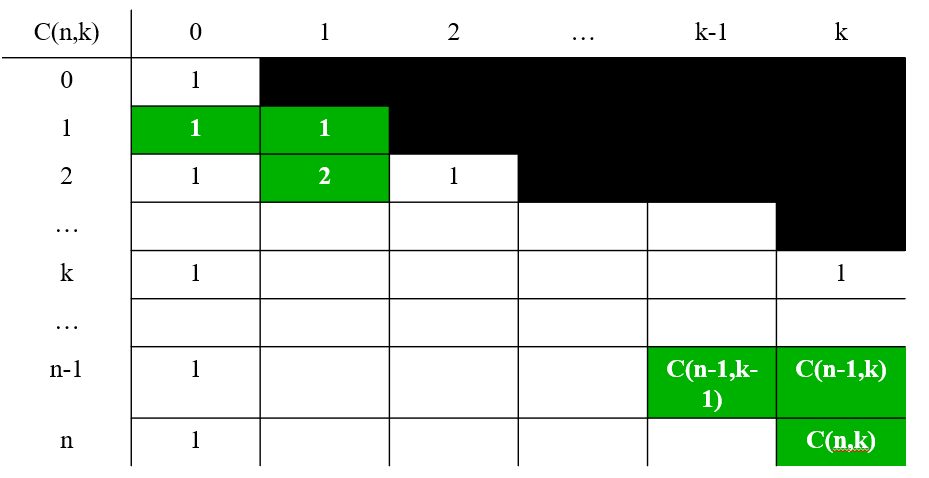

# 一、动态规划

## 1.1 定义

[一文学会动态规划解题技巧 - 力扣（LeetCode）](https://leetcode.cn/circle/discuss/lxC3ZB/)

动态规划是一种**多阶段决策**最优解模型，一般用来求最值问题，多数情况下它可以采用**自下而上**的递推方式来得出每个子问题的最优解（即**最优子结构**），进而自然而然地得出依赖子问题的原问题的最优解。

## 1.2 算法思想

## 1.3 怎么判断是否使用动态规划

怎么判断题目是否可以用动态规划求解呢？

当问题的定义是求最值问题，且问题可以采用递归的方式，并且递归的过程中有大量重复子问题的时候，基本可以断定问题可以用动态规划求解。

求解动态规划基本思路如下（解题四步曲）

1. 判断是否可用递归来解，可以的话进入步骤 2
2. 分析在递归的过程中是否存在大量的重复子问题
3. 采用备忘录的方式来存子问题的解以避免大量的重复计算（剪枝）
4. 改用自底向上的方式来递推，即动态规划

[一文学会动态规划解题技巧 - 力扣（LeetCode）](https://leetcode.cn/circle/discuss/lxC3ZB/)

## 1.4 求解问题步骤

根据动态规划的三大基本要素可以设计解题步骤如下：

- **状态定义：** 每个状态的决策，存放每个状态的变量
- **状态转移方程：** 当前状态与上一个状态之间的关系（**逆向思维去分析或正向思维去递归**）
- **初始状态：** 初始的状态或者边界条件

> 动态规划的代码都很简单，它的难点在于**问题的描述和解决阶段**

# 二、Leetcode 刷题策略

# 三、 常见题目

## 3.1 计算二项式系数

二项式系数(**Binomial Coefficient** )是 n 元素集合中 k 个元素组合的数量 （ $0 \leq k \leq n$）, 记作 $C(n,k)$或 $C_n^k$

**递推关系式：**

$C(n,k) = C(n-1,k-1) + C(n-1,k)， n > k > 0$

$C(n,0) = C(n,n)=1$

**图形表示：**

> **帕斯卡三角形**

**伪代码：**

## 3.2 棋盘最短路径计算

**问题：**

国际象棋中的车可以水平或竖直移到棋盘中同行或同列的任何一个格子。一个车要从棋盘的一角移到对角的另一角,有多少种最短路径?

>  **补充知识**：国际象棋棋盘是个正方形，由横纵各8格、颜色一深一浅交错排列的64个小方格组成。深色格称黑格，浅色格称白格，棋子就放在这些格子中移动，右下角是白格。

1）用初等排列组合方法求解，要求给出组合数的计算公式。

2）如何运用动态规划算法进行求解，要求给出递推公式及初始条件。

**问题一：**

假设棋盘大小是$n*n$的，答案是$C(2(n-1) , n-1)$，即$C(14,7)$

简单地理解：最短路径的长度为$2(n-1)$,  包含 $n-1$ 条横向单位路径 和 $n-1$ 条纵向向单位路径 ， 因此 ， 选择不同的组合方式即可

**问题二：**

(1)怎样建立动态规划的递推式

设C[i , j]表示从（0,0）移动到（i ,j）的方法数（**描述问题，怎么去刻画C[i , j]的含义，是动态规划的一个关键点**）

那么怎么才能走到（i ,j）呢，它的上一步必定是（i-1 ,j）或者（i ,j-1）-------（分析动态规划问题的逆向思维）

这样就将问题描述为了交叠子问题：
 C[i , j] = C[i -1, j]  + C[i , j-1]    （ C[i , j]的含义 ）

我们要求的是C[n , n]， 初始条件：

C[0 , j] = 1  j从0到n 

C[i , 0] = 1  i从0到n
 即第一行第一列确定。

(2)递推式：

$C[i,j] = C[i-1,j] + C[i,j-1] $

$C[0,j] = 1 , 0 \leq j \leq n$

$C[0,j] = 1 , 0 \leq j \leq n$

## 3.3 传递闭包

### 3.3.1 邻接矩阵和传递闭包

> 邻接矩阵表示两点之间的关系，传递闭包表示的是传递关系

**邻接矩阵**

- 一个有向图的邻接矩阵$A={a_{ij}}$是一个布尔矩阵

- **当且仅当**从第$i$个顶点到第$j$个顶点之间有一条有向边时，矩阵第i行第$j$列的元素为1；否则为0

**传递闭包**

- 一个n个顶点有向图的**传递闭包**可以定义为一个**n阶布尔矩阵**$T={t_{ij}}$
- 如果从第$i$个顶点到第$j$个顶点之间存在一条有效的有向路径（即长度大于0的有向路径），那么$t_{ij}$为1，否则为$0$

### 3.3.2 Warshall 算法

Warshall算法用于计算有向图的传递闭包

### 3.3.3 Floyd算法

完全最短路径问题要求找出一个有n个节点的加权连通图中每个节点到其他所有节点之间的最短距离。可以使用**类似于Washall算法的方法**来生成这个最短距离矩阵，这就是Floyd算法

## 3.4 0-1背包问题

### 3.4.1 问题定义

**问题：**有一个背包的容积为$W$，有$N$个物品，每个物品的价值为$v_i$，容量为$w_i$，**每个物品只能取1次**放入背包中，背包所有物品权重和最大是多少？

**问题形式化描述：**

$n$个不同容量的物品 背包容量 $W$ 

物品有着不同的 $v_i$, $w_i$

最大化： $\sum_{i=1}^n v_i x_i$

限制条件： $\sum_{i=1}^n w_i x_i \leq W，  x_i = 1 \ or \ 0 , \quad i = 1, \dots , n$

### 3.4.2 动态规划分析

> 递推式，初始值，

**问题描述（选择状态）：**

设**$V[i,j]$**为 前$i$个物品放到背包容量为$j$的背包中时最优解的物品总价值。则目标是：$V[n,W]$。

**递推式分析：**

(1)对于$n$个物品 ， 要得到 $V[n,W]$,  有两种情况：

- 第$n$个物品不在背包中，则最优解物品总价值为$V[n-1,W]$

- 第$n$个物品在背包中，则最优解物品总价值为前$n-1$个物品的最优解总价值$V[n-1,W-v_n]$与第$n$个物品价值的和，或者就是前$n-1$个物品的最优解总价值. 即
  $$
  V[n,W]=Max\{V[n-1,W-V_n]+v_n,V[n-1,W]\}
  $$

> 注意：
>
>  第$n$个物品不在背包中  可以理解成   第$n$个物品放不下
>
> 在第n个物品在背包中， 即背包可以放下 物品n 时， 还要考虑需不需要装 第n个物品 
>
> 着重理解 “放得下” 和 “要不要装”

(2)一般情况下分析， 要得到$V[i,j]$,  有两种情况：

- 第$i$个物品不在背包中，则最优解物品总价值为$V[i-1,j]$

- 第$i$个物品在背包中，则最优解物品总价值为前$i-1$个物品的最优解总价值$V[i-1,W-v_i]$与第$i$个物品价值的和，或者就是前$ i-1$个物品的最优解总价值. 即
  $$
  V[i,j]=Max\{V[i-1,j-w_i]+v_i,V[i-1,j]\}
  $$

**初始条件：**

$V[0,j] = 0, j \geq 0$     没有物品

$V[i,0] = 0, i \geq 0$   背包容量为0

**递推式：**

$V[i,j]=Max\{V[i-1,j-w_i]+v_i,V[i-1,j]\}$

$V[0,j] = 0, j \geq 0$

$V[i,0] = 0, i \geq 0$

**结果分析：**

> 主要包含 动态规划表， 结论推理

（1）实际背包问题

举个例子

承重量 $W = 5$

| 物品编号 | 物品质量 | 物品价值 |
| :------: | :------: | :------: |
|    1     |    2     |    12    |
|    2     |    1     |    10    |
|    3     |    3     |    20    |
|    4     |    2     |    15    |

结果是求 V[4, 5]

（2）动态规划表

| 物品编号\背包容量 | 0    | 1    | 2    | 3    | 4    | 5    |
| ----------------- | ---- | ---- | ---- | ---- | ---- | ---- |
| 0                 | 0    | 0    | 0    | 0    | 0    | 0    |
| 1                 | 0    | 0    | 12   | 12   | 12   | 12   |
| 2                 | 0    | 10   | 12   | 22   | 22   | 22   |
| 3                 | 0    | 10   | 12   |      |      |      |
| 4                 | 0    | 10   | 15   |      |      |      |

（3）结论推理

> 即**背包问题回溯**， 具体为：在使得背包内总价值最大的情况下，背包内装了哪些问题

回溯方式：

（1）**$V[i,j]=V[i-1,j]$** , 则说明没有装 第 i 个商品 ， 回溯到 $V[i-1,j]$

（2）**$V[i,j] \neq V[i-1,j]$**，则说明装了 第 i 个商品， 回溯到 $V[i-1,j-w_i]$

（3） 重复前二步，直到 $i=0$

## 3.5 完全背包问题

### 3.5.1 问题定义

**完全背包** ：有一个背包的容积为V，有N个物品，每个物品的体积为v[i]，权重为w[i]，**每个物品可以取无限次**放入背包中，背包所有物品权重和最大是多少？

> 01背包问题和完全背包问题的区别就在于，每个物品取的最大次数是1次还是无限次

### 3.5.2 动态规划分析

> [(19条消息) 算法之动态规划（DP）求解完全背包问题_PRML_MAN的博客-CSDN博客_完全背包问题的适用求解算法,](https://blog.csdn.net/PRML_MAN/article/details/114433408)

**问题描述（选择状态）：**

设**$V[i,j]$**为 前$i$个物品放到背包容量为$j$的背包中时最优解的物品总价值。则目标是：$V[n,W]$。

**状态转移方程分析：**

01背包问题每次增加第i物品时，因为只能取一次，从j中减去v[i]，再加上w[i]，这个操作只进行了一次。现在可以增加无数次，大家想想，怎么做呢？

$i$个物品可以增加0次（即$V[i-1][j]$），增加1次（即），增加2次，增加3次…增加k-1次，（这里$k*v[i] > j$），然后求所有值的最大值作为$V[i][j]$的值。

则状态转移方程可以设置为
$$
V[i][j] = max(V[i-1, j- k * v_i] + k * w_i，V[i-1,j])\\ (k= 0, 1, 2, 3, 4,...)
$$

**状态转移方程简化（重要）：**

0-1背包：
$$
\color{red}V[i,j] = max(V[i-1,j],  V[i-1,j - v_i] + w_i)
$$
完全背包：
$$
\color{red}V[i,j] = max(V[i-1,j],  V[i \quad\quad,j - v_i] + w_i)
$$

> 区别在于下标 从  i-1 变成 1

**完全背包状态转移方程简化原因：**

$V[i,j - v_i$ 已经将除去1个物品$i$时的所有最优解已经求出来了，因此在计算$f[i,j]$时，无需再重复计算$k=2,3,4,5…$时的值了。

# 参考资料

[[力扣刷题攻略\] Re：从零开始的力扣刷题生活 动态规划- 力扣（LeetCode）](https://leetcode.cn/circle/discuss/E3yavq/#动态规划篇)

