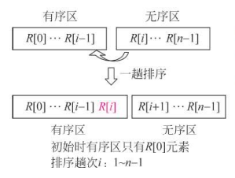
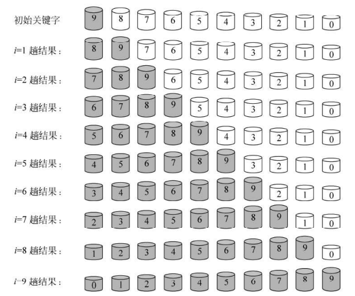
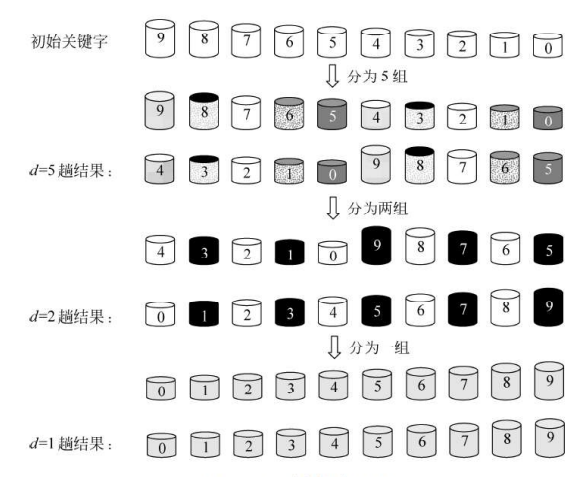
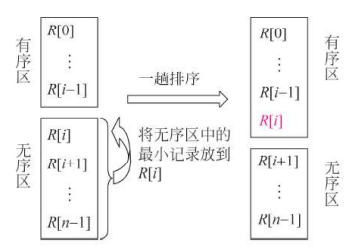
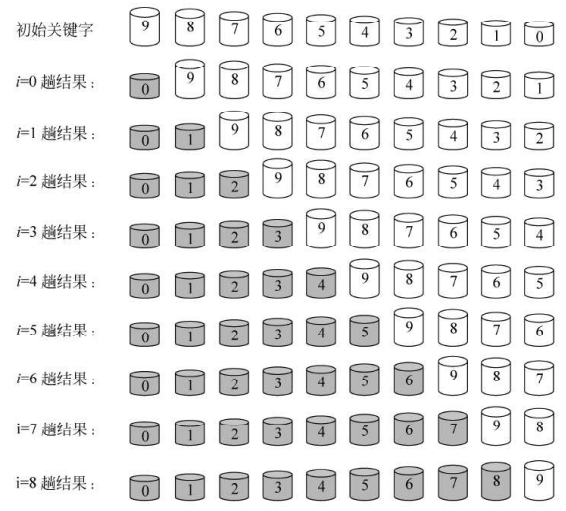
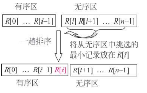
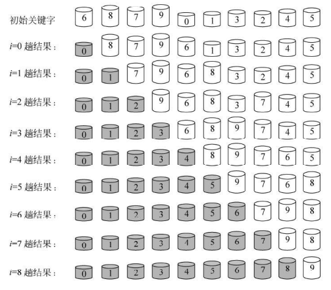
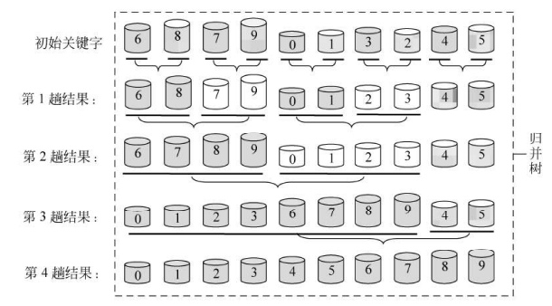

[TOC]
## 一、排序算法

### 1.1 排序算法概述

引用 [十大经典排序算法 | 菜鸟教程 (runoob.com)](https://www.runoob.com/w3cnote/ten-sorting-algorithm.html) 中的图片


### 1.2 名词解释

- n：数据规模
- k："桶"的个数
- In-place：占用常数内存，不占用额外内存
- Out-place：占用额外内存
- 稳定性：排序后 2 个相等键值的顺序和排序之前它们的顺序相同


内排序和外排序

- **内排序**是指在内存中对数据进行排序的算法，适用于数据量较小且可以全部载入内存的情况，如快速排序、归并排序等。
- **外排序**用于处理无法完全加载到内存中的大数据集，通常将数据分为多个块，先对每个块进行内排序，然后再通过归并的方式将已排序的块合并成最终的有序数据，典型方法如外部归并排序。

根据实现策略

- 需要关键字比较

- 不需要关键字比较


### 1.3 稳定性的理解

不稳定的排序算法在进行排序操作时，可能会在排序过程中交换相等的元素，这会导致它们的相对顺序被打乱。不稳定的算法有：

- 选择排序
- 堆排序
- 希尔排序
- 快速排序

**不稳定的排序算法往往效率较高**。


### 1.4 空间复杂度的理解

空间复杂度较大的算法有：

- 快速排序，调用栈较深。
- 归并排序，需要辅助数组来存放合并后的数据。


## 二、插入排序

插入排序的基本思想是:<font color="red"> **每次将一个待排序的元素按其关键字大小插入到前面已经排好序的子表中的适当位置, 直到全部元素插入完成为止**</font>。


### 2.1 直接插入排序

直接插入排序是一种简单的排序算法，**工作原理**是将待排序的数组分为有序区和无序区两个部分。每次从无序区部分中取出一个元素，找到其在有序区中的合适位置并插入，直到所有元素都被排序。



直接插入排序的具体过程如下图所示。图中用带阴影的部分表示当前的有序区，每趟都想有序中插入一个元素，并保持其有序性。




该算法的时间复杂度为 $O(n^2)$，空间复杂度为 $O(1)$ , 稳定，适合数据量较小的情况或部分有序的数组。


### 2.2 二分插入排序

二分插入排序算法思想：由于有序区的元素是有序的，可以利用二分查找在有序区中找到插入位置，再通过移动元素进行插入。

该算法的时间复杂度为 $O(n^2)$，空间复杂度为 $O(1)$ , 稳定，适合数据量较小的情况或部分有序的数组。但是，二分插入排序减少了关键字的比较次数。


### 2.3 希尔排序

希尔排序是一种基于插入排序的排序算法，采用分组的方式来提高效率。

希尔排序的具体过程如下：

1. **分组**： 首先将待排序数组按照一定的间隔 $d$（称为增量）分成多个子序列，将所有距离为 d 的倍数的元素放在同一个子序列中， 
2. **排序**：对每个子序列进行直接插入排序。
3. **重复**：然后逐渐减少增量 $d$（即 $d = d / 2$），重复分组和排序，直到增量 $d$ 为1，此时整个数组会被完全排序。

一个简单的希尔排序过程如下图所示。




## 三、交换排序

交换排序的基本思想是<font color="red">**两两比较**待排序元素的关键字,发现这两个元素的次序相反时即进行交换，直到没有反序的元素为止</font>。


### 3.1 冒泡排序

冒泡思想的思想是从最下面的元素开始，**对每两个相邻的关键字进行比较，且使关键字较小的元素换至关键字较大的元素之上,**使得经过一趟冒泡排序后关键字最小的元素到达最上端



冒泡排序的具体过程如下图所示，每次从无序区中冒出一个最小关键字的元素并将其定位(图中用带阴影的部分表示当前的有序区)。




冒泡排序是一种稳定的排序算法，时间复杂度为 $O(n^2)$，空间复杂度为 $O(1)$ 。


### 3.2 快速排序

快速排序是一种高效的排序算法，采用分治法的策略。其基本步骤是

- 划分：选择一个“基准”元素，将待排序数组分成两个子数组：一个子数组中的所有元素都小于基准，另一个子数组中的所有元素都大于基准。
- 合并：然后对这两个子数组递归地进行快速排序，最终合并成一个有序的数组。


快速排序是一种不稳定的排序算法， 平均时间复杂度为 $O(n log n)$，但在最坏情况下（如已排序数组）为 $O(n^2)$。

空间复杂度为 $O(log n)$


## 四、选择排序

选择排序的**基本思想**是每一趟从待排序的元素中**选出关键字最小的元素**，顺序放在已排好序的子表的最后， 直到全部元素排序完毕。

> 直接插入排序是在无序区随机选择一个元素，
>
> 选择排序则是在无序区选择关键字最大或者最小的元素。

由于选择排序方法每一趟总是从无序区中选出全局最小(或最大)的关键字,所以<font color="red">**适合于从大量的元素中选择一部分排序元素**</font>,例如从10000个元素中选择出关键字大小为前10位的元素就适合于采用选择排序方法。


### 4.1 简单选择排序

简单选择排序（Simple Selection Sort）的基本思想是：在第 i 趟排序开始时，数组被分为两个部分：已排序区 $R[0..i-1]$ 和未排序区 $R[i..n-1]$（其中 $0 \leq i < n-1$）。在这一趟排序中，从当前的未排序区 $R[i..n-1]$ 中选出关键字最小的元素 $R[k]$，并将其与未排序区的第一个元素 $R[i]$ 交换。交换后，已排序区扩展为 $R[0..i]$，未排序区缩小为 $R[i+1..n-1]$，从而完成一趟排序。




简单选择排序的具体过程如下图所示，每趟选择出一个元素（图中用带阴影的部分表示当前的有序区）。




### 4.2 堆排序

#### 4.2.1 堆的基本概念

**堆**（Heap）是一种特殊的完全二叉树数据结构，通常用于实现优先队列和排序算法。堆分为两种类型：

- **最大堆(大顶堆)**：在最大堆中，每个节点的值都大于或等于其子节点的值，根节点是最大值。
- **最小堆(小顶堆)**：在最小堆中，每个节点的值都小于或等于其子节点的值，根节点是最小值。

大顶堆和小顶堆如下图所示，黑色数字表示堆元素的具体值，红色数字表示堆元素在数组中的位置。

> 引用 [图解排序算法(三)之堆排序 - dreamcatcher-cx - 博客园 (cnblogs.com)](https://www.cnblogs.com/chengxiao/p/6129630.html) 中的图片


同时，对堆中的结点按层进行编号，将这种逻辑结构映射到数组中


该数组从逻辑上讲就是一个堆结构，我们用简单的公式来描述一下堆的定义就是：

- **大顶堆**：$arr[i] >= arr[2i+1]$ && $arr[i] >= arr[2i+2]$  ，$0 \leq i \leq  ⌊arr.length⌋  - 1$

- **小顶堆**：$arr[i] <= arr[2i+1]$ && $arr[i] <= arr[2i+2]$  ，$0 \leq i \leq  ⌊arr.length⌋  - 1$

注意，当根节点序号为 $0$ 时， 结点  $i$  的左右结点分别为 $2i+ 1$ 和 $2i+ 2$，  $⌊arr.length⌋  - 1$ 为最后一个非叶子结点的序号。


#### 4.2.2 堆排序的特点

堆排序的**核心思想**是利用堆的结构特点，反复将堆顶（最大值或者最小值）移到数组末尾，然后对剩下的元素进行调整，最终得到一个有序数组。堆排序本质上是选择排序。通常而言，数组左边内容为最大堆， 右边内容为有序区。

```
数组 = 最大堆 + 有序区
```

在大顶堆中，交换和调整的目的是将堆顶元素与末尾元素进行交换， 使最大元素"下沉"到数组末尾。换句话说，将堆顶元素放在有序区。

**堆排序**（Heap Sort）是一种基于堆数据结构的选择排序算法，具有以下特点：

1. **时间复杂度**：堆排序的时间复杂度为 $O(nlog⁡n)$，其中 $n$ 是待排序元素的数量。
2. **空间复杂度**：堆排序是原地排序算法，空间复杂度为 $O(1)$。
3. **不稳定排序**：堆排序是不稳定的排序算法，即相同元素的相对位置可能会改变。


#### 4.2.3 堆排序的步骤

在正式了解堆排序之间，我们要知道堆排序的关键—— **筛选**，即维护堆的性质。

以大根堆为例，其具体过程是假如完全二叉树的根节点为 $arr[i]$,  它的<font color="red">**左、右子树已经是大根堆**</font>， 将其两个孩子  $arr[2i + 1]$ 、 $arr[2i + 2]$  的最大值与  $arr[i]$ 比较。若   $arr[i]$ 较小，将其与最大孩子交换，但**这有可能破环下一级的堆**。继续采用上述方法构造下一级的堆，直到这个完全二叉树变成一个大根堆为止。具体代码如下所示。

```java
   // 调整以 arr[i] 为根节点的大顶堆, 维护堆的性质：父节点的值始终大于或等于它的子节点
    public void adjustHeap(int[] arr, int i, int heapSize){
        int temp = arr[i];

        for(int k = 2*i + 1; k < heapSize; k = k*2 + 1){
            // 如果右子节点存在且大于左子节点，选择右子节点
            if(k + 1 < heapSize && arr[k] < arr[k + 1]){
                k++;
            }
			
            // 如果子节点大于父节点，进行交换，继续向下调整
            if(arr[k] > temp){
            	// 调整父节点的值，并继续向下调整
                arr[i] = arr[k];
                i = k;
            }else{
            	// 堆的调整终止
                break;
            }
        }
		
		// 将原来在 arr[i] 位置的值（即 temp）放入堆中合适的位置
		// 如果堆调整过，此时 i 的值已经变更了
        arr[i] = temp;
    }
```


堆排序的具体步骤为：

1. **构建堆**：将待排序数组构建成一个最大堆或最小堆。

   - 对于一颗完全二叉树，从 $arr.length/2-1 $~ $0$ ，即从最后一个非叶子结点开始，利用筛选方法建堆。
   - 大者上浮，小者被筛选下去。以  `nums[]`  数组为例， 构建初始大顶堆的过程如下：

   ```java
     int heapSize = nums.length;
     // 在构建堆的时候，每个非叶子节点都要调整
     // 从最后一个非叶子结点开始
     for(int i = heapSize/2 - 1; i >= 0; i--){
     	adjustHeap(nums, i, heapSize);
     }
   ```

2. **交换和调整**：交换堆首和堆尾。

   - 将根节点（最大值或最小值）与堆的最后一个元素交换，将最大值移到数组的末尾（或最小值移到数组的开头）。减少堆的大小，并重新调整堆，使其再次满足堆的性质。
   - 举个例子，调整数组中 k 个最大元素到数组的末尾，具体代码如下：

   ```java
    for(int j = nums.length - 1; j >= nums.length - k + 1; j--){
        swap(nums, 0, j);	// 将堆顶元素(最大值)放到数组末尾（有序区）
        heapSize--;		// 堆的大小减一
        adjustHeap(nums, 0, heapSize);	// 将剩余的堆元素重新调整为大根堆
    }
   ```

3. **重复**：重复上述步骤，直到所有元素都排序完成，即堆的大小为 0。

建议阅读图解算法 [图解排序算法(三)之堆排序 - dreamcatcher-cx - 博客园 (cnblogs.com)](https://www.cnblogs.com/chengxiao/p/6129630.html) 


#### 4.2.4 Leetcode 刷题

[215. 数组中的第K个最大元素 - 力扣（LeetCode）](https://leetcode.cn/problems/kth-largest-element-in-an-array/description/?envType=study-plan-v2&envId=top-100-liked)

```java
class Solution {
    public int findKthLargest(int[] nums, int k) {
    	// 构建初始堆
        int heapSize = nums.length;
        for(int i = heapSize/2 - 1; i >= 0; i--){
            adjustHeap(nums, i, heapSize);
        }

        for(int j = nums.length - 1; j >= nums.length - k + 1; j--){
            swap(nums, 0, j);
            heapSize--;
            adjustHeap(nums, 0, heapSize);
        }

        return nums[0];
    }

    // 调整大顶堆, 维护堆的性质：父节点的值始终大于或等于它的子节点
    public void adjustHeap(int[] arr, int i, int heapSize){
        int temp = arr[i];

        for(int k = 2*i + 1; k < heapSize; k = k*2 + 1){
            if(k + 1 < heapSize && arr[k] < arr[k + 1]){
                k++;
            }

            if(arr[k] > temp){
            	// 调整父节点的值，并继续向下调整
                arr[i] = arr[k];
                i = k;
            }else{
            	// 堆的调整终止
                break;
            }
        }
		
		// 将原来在 arr[i] 位置的值（即 temp）放入堆中合适的位置
		// 如果堆调整过，此时 i 的值已经变更了
        arr[i] = temp;
    }

    public static void swap(int[] arr,int a ,int b){
        int temp=arr[a];
        arr[a] = arr[b];
        arr[b] = temp;
    }
}
```


## 五、归并排序

归并排序(merge sort)的核心思想是**多次将两个或两个以上的有序表合并成一个新的有序表**


### 5.1 二路归并排序

二路归并排序就是将两个有序的子表合并成一个有序的表。

基本步骤为：

1. 第一趟， 将 `R[0..n-1]` 看成是 $n$ 个长度为 $1$ 的有序序列，然后进行两两归并，得到 $\lceil  n/2\rceil$ 个长度为 $2$ 的有序序列（最后一个有序序列的长度有可能为 $2$）。
2. 第二趟，再进行两两合并，得到 $\lceil  n/4 \rceil$ 个长度为 $4$ 的有序序列（最后一个有序序列的长度有可能为 $4$）。
3. 循环往复，直到有序序列的长度为 $n$。

二路归并排序的示例过程如下图所示。




二路归并排序算法是一种稳定的排序算法，时间复杂度为 $O(nlogn)$,  空间复杂度为 $O(n)$


## 六、基数排序

基数排序并不是基于关键字之间的比较来实现的，而是通过分配和收集来实现的。其核心是**借助于多关键字排序来对单关键字排序**。

基数排序可以分为：

+ 最低位优先
+ 最高位优先


## 七、常见问题

在 1G 内存里面，哪个排序算法会出现问题？

这个主要是根据算法的空间复杂度来判断的。

- 快速排序
- 归并排序


## 参考资料

《 数据结构教程(第五版) 李春葆 》