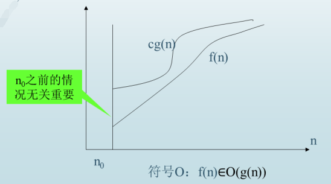
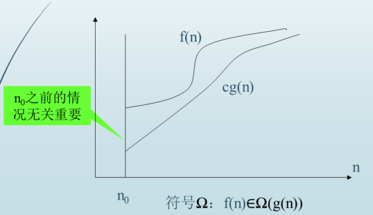
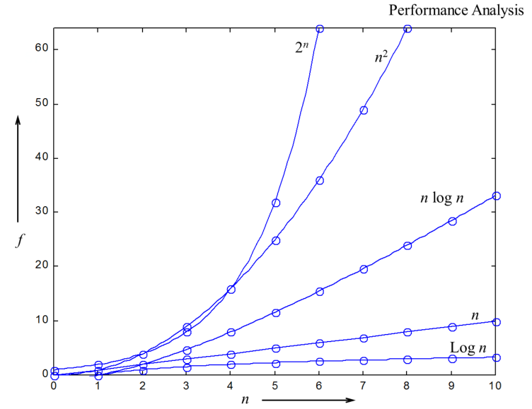
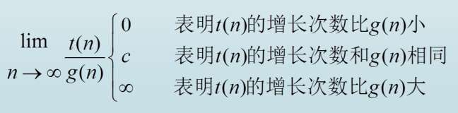

# 一、算法复杂性分析

- 算法复杂性=算法所需要的计算机资源
- 有两种算法效率指标:**时间效率**和**空间效率**。
  - 时间效率T(n)指出正在讨论的算法运行得有多快;
  - 空间效率S(n)关心算法需要的额外空间。
  - 其中n是问题的规模（输入大小）。

# 二、渐进分析符号

对于函数 $f(n)$, 利用渐进分析符号评估算法复杂度

## 2.1 渐进上界符号 $\Omicron$

 **$\Omicron$(g(n))** 是增长次数**小于等于****g(n)** (以及其常数倍，n趋向于无穷大)的函数集合。

## 2.2 渐进下界符号 $\Omega$

**$\Omega$(g(n))** 是增长次数**大于等于****g(n)** (以及其常数倍，n趋向于无穷大)的函数集合。

## 紧渐近界符号 $\theta$

# 三、渐进分析

## 3.1常见的复杂性函数分析

## 3.2 利用极限进行渐进分析和比较

虽然符号$\Omicron$，$\Omega$ 和  $\theta$ 的正式定义对于证明它们的抽象性质是不可缺少的，但我们很少直接用它们来比较两个特定函数的增长次数。

一般是利用已有的函数和目标函数的比率求极限来讨论

