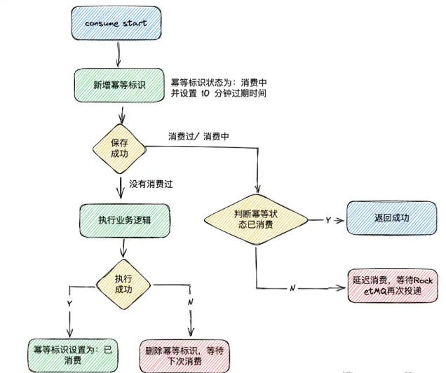

# 一、幂等问题概述

幂等性是数学和计算机科学中的概念，用于描述操作无论执行多少次，都产生相同结果的特性。

在系统中，幂等问题主要包括：

- 接口幂等： 即防重复提交
- 消息队列幂等

# 二、接口幂等解决方案

## 2.1 分布式锁

## 2.2 token 令牌

# 三、消息队列幂等解决方案

## 3.1 去重表

# 参考资料

[手摸手实现接口幂等组件库 (yuque.com)](https://www.yuque.com/magestack/12306/xoea6i2yluci1w0q)