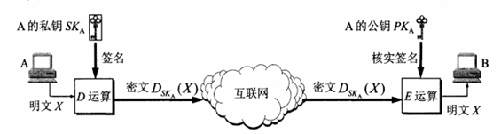

# 一、数字签名概述

数字签名是一种基于公钥加密技术的数字身份验证和数据完整性验证的技术手段。

数字签名必须实现的功能：

1. **报文鉴别**：接收者能够核实发送者对报文的签名。也就是说，接收者能够确信该报文的确是发
   送者发送的。其他人无法伪造对报文的签名。
2. **报文的完整性**：接收者确信所收到的数据和发送者发送的完全一样而没有被篡改过。
3. **不可否认**：发送者事后不能抵赖对报文的签名。

# 二、数字签名工作原理

数字签名主要**使用公钥算法来实现**。它通过使用私钥对数据进行加密生成签名，然后使用相应的公钥对签名进行验证，以确保数据的完整性和真实性。

> 引用《 计算机网络（第7版》一书中的图片

# 参考资料

《 计算机网络（第7版）》