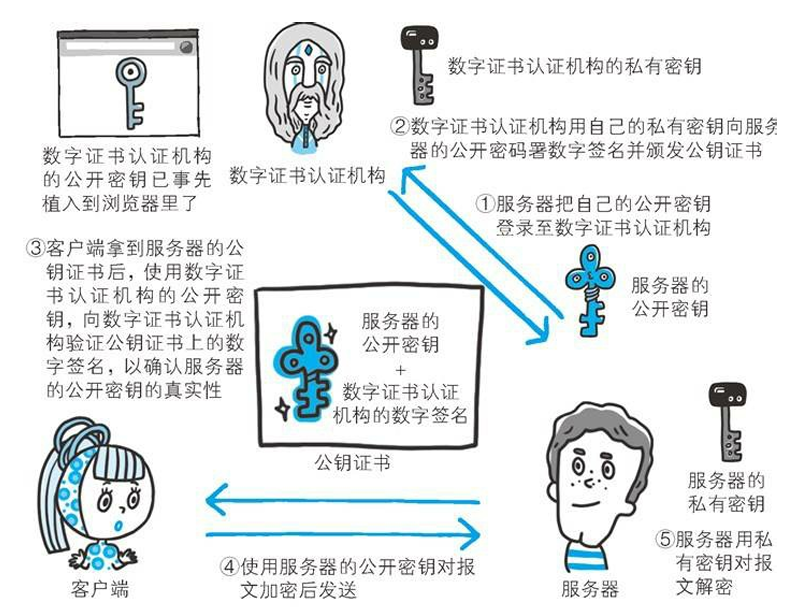

## 一、数字证书认证概述

### 1.1 为什么引入数字证书

公钥密码体制存在一些问题：**无法证明公开密钥本身就是货真价实的公开密钥**。比如，正准备和某台服务器建立公开密钥加密方式下的通信时，如何证明收到的公开密钥就是原 本预想的那台服务器发行的公开密钥。或许在公开密钥传输途中，真正的公开密钥已经被攻击者替换掉了。

为了解决上述问题，可以使用由数字证书认证机构（CA，Certificate Authority）和其相关机关颁发的公开密钥证书。

### 1.2 什么是数字证书

数字证书是一种数字文档，**证明用于服务端加密在线资产（即电子邮件通信、文档、网站或软件应用程序）的公钥的真实性**。数字证书通常由权威的第三方机构（证书颁发机构，Certificate Authority，CA）颁发。

数字证书主要用于验证通信方的身份和确保通信的机密性、完整性和不可抵赖性。

### 1.3 数字证书内容

这些证书中包含了实体（如网站、服务器等）的标识信息、公钥和数字签名，证明该证书确实由CA颁发，没有被篡改。

## 二、数字证书工作原理

### 2.1 数字证书的签发和验证流程

数字证书认证机构的业务流程：

1. 首先，服务器的运营人员向数字证书认证机构提出公开密钥的申请。
2. 数字证书认证机构在判明提出申请者的身份之后，会对已申请的公开密钥做数字签名，
3. 数字证书认证机构分配这个已签名的公开密钥，并将该公开密钥放入公钥证书后绑定在一起

[3.3 HTTPS RSA 握手解析 | 小林coding (xiaolincoding.com)](https://xiaolincoding.com/network/2_http/https_rsa.html#客户端验证证书)

### 2.2 数字证书的工作流程

当客户端接收到一个数字证书时，可以**使用数字证书认证机构的公开密钥来验证该数字证书的签名**，从而确定数字证书的真实性和合法性。这个过程通常称为数字证书的验证。一旦验证通过，客户端便可明确两件事：

1. 认证服务器公开密钥的数字证书认证机构是真实有效的。
2.  服务器的公开密钥是值得信赖的。

总的来说，通过数字证书的验证，我们 **最后得到值得信赖的服务器的私钥密钥**

> 引用《 图解HTTP》一书中的图片

这里还有一个问题，**如何将数字证书认证机构的公开密钥必须安全地转交给客户端**？利用通信方式转交是一件很困难的事情。，因此，多数浏览器开发商发布 版本时，会事先在内部植入常用认证机关的公开密钥。