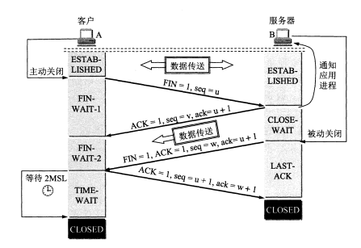
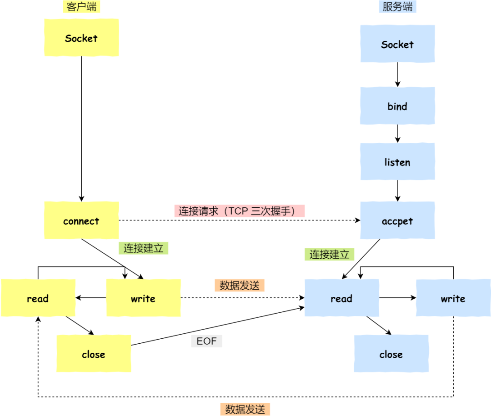

[TOC]

## 一、TCP 协议概述

### 1.1 什么是 TCP 协议

TCP 是**面向连接的、可靠的、基于字节流**的传输层通信协议。

- **面向连接:** 在数据传输之前，通信的双方必须先建立一对一的连接。其关键机制有三次握手和四次挥手。
- **可靠的: **：通过确认机制、重传机制和顺序控制，确保数据在传输过程中不会丢失、重复，且能够按顺序到达目的地。
- **基于字节流的:** 数据被视为一个无结构的字节流，发送方将数据分割成一个个小的“段”进行传输，接收方将这些段组合起来恢复原始数据。TCP 不关心应用层传输的具体数据结构（如消息、文件等），它只是简单地处理字节的传输。

## 二、TCP 是面向连接的

在数据传输之前，通信的双方必须先建立一对一的连接。

其关键机制有:

- 三次握手。
- 四次挥手。

### 2.1 三次握手

#### 2.1.1 三次握手的主要过程

三次握手的每个数据包都带有一些特定的标志位。具体来说，三次握手的字段含义如下：

- **SYN**：同步序列编号。表示请求建立连接。用于同步客户端和服务器的序列号。
- **ACK**：确认序列号。表示确认接收到对方的数据包。确认号用于确认序列号。
- **Seq**（Sequence Number）：序列号。用来标识 TCP 数据流中的每个字节，确保数据按顺序到达。
- **Ack**（Acknowledgment Number）：确认号。表示期望收到的下一个字节的序列号。确认号是上一个数据包序列号加 1。

#### 2.1.2 为什么要三次握手

三次握手的原因有：

- 防止重复历史连接请求
- 同步双方的初始序列号

**(1) 防止重复历史连接请求——首要原因**

三次握手的**首要原因是为了防止旧的重复连接初始化造成混乱 **，即避免**旧的连接请求** 被错误地重新接收。

假设某个客户端曾经发起过连接请求，但由于某些原因（比如网络延迟），该请求未得到及时回应。这个请求可能被错误地重复发送。如果没有三次握手，这种旧请求可能会被错误地认为是一个新的连接请求。通过三次握手中的 **确认号**，客户端发现这个不符合自己期望收到的确认号，发送 RST 报文给服务端来释放连接，从而避免因旧请求而引发的连接问题。

**(2) 保证双方都能接收数据**

三次握手目的就是双方确认自己与对方的发送与接收是正常的。

**第一次握手**：Client 什么都不能确认；Server 确认了对方发送正常，自己接收正常

**第二次握手**：Client 确认了：自己发送、接收正常，对方发送、接收正常；Server 确认了：对方发送正常，自己接收正常

**第三次握手**：Client 确认了：自己发送、接收正常，对方发送、接收正常；Server 确认了：自己发送、接收正常，对方发送、接收正常

更具体地来说：

第一次握手 + 第二次握手的 ACK =  建立并确认从客户端到服务端的通信 = 客户端发送正常 + 服务器接收正常

第二次握手的 SYN + 第三次握手 = 建立并确认从服务端到客户端的通信 = 服务端发送正常 + 客户端接收正常

#### 2.1.3 为什么两次握手不行

客户端是根据第二次握手的报文确认服务端接收到旧的历史连接，从而终止连接建立。

在两次握手的情况下，服务端可能建立一个历史连接，造成资源浪费。**服务端没有中间状态给客户端来阻止历史连接。**

#### 2.1.4 为什么四次握手不行

三次握手就已经理论上最少可靠连接建立，所以不需要使用更多的通信次数。

### 2.2 四次挥手

#### 2.2.1 四次挥手的过程

> 只要四次挥手没有结束，客户端和服务端就可以继续传输数据

个人理解，四次挥手跟三次握手的区别主要有：

- 在四次挥手里，服务器分两次发送ACK 、FIN； 在三次握手里面，服务器直接将一次性发送 SYN + ACK。具体来说，不能将服务器发送的 ACK 和 FIN 结合起来。

- 第四次挥手后，客户端需要等待 2 * MSL 时间。

#### 2.2.2 为什么不能将服务器发送的 ACK 和 FIN 结合起来，变成三次挥手

因为收到客户端断开连接的请求时，服务器可能**还有一些数据没有发完**，这时先回复 ACK，表示接收到了断开连接的请求。等到数据发完之后再发 FIN，断开服务器到客户端的数据传送。

#### 2.2.3 为什么客户端需要等待 2 * MSL 时间

- **避免客户端发送给服务端的 ACK 丢失**。如果ACK 丢失，则会重新进行第三次挥手和第四次挥手。

- `MSL` 是 Maximum Segment Lifetime，**报文最大生存时间**。**2MSL时长** 这其实是相当于**至少允许报文丢失一次**。

### 2.3 TCP 连接函数调用过程

客户端是在调用 connect 函数的时候，由内核随机选取一个端口作为连接的端口

## 参考资料

[TCP 三次握手和四次挥手（传输层） | JavaGuide](https://javaguide.cn/cs-basics/network/tcp-connection-and-disconnection.html#建立连接-tcp-三次握手)