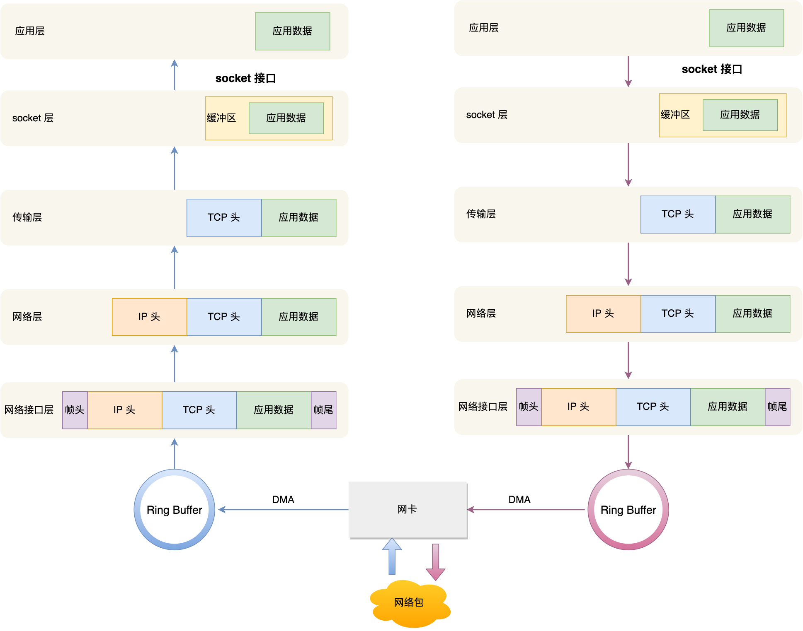

在计算机网络体系结构中，添加以下内容：

- socket接口：  发送数据包
- 网卡驱动程序和网卡：将内存中二进制数字信息转换为电子信息，从而实际传输。 

**DMA（Direct Memory Access，直接内存访问）是一种允许外设**直接与系统内存进行数据传输的技术，不需要通过 CPU 进行中介处理。

**Socket**是网络通信的一个**抽象层接口**，允许不同设备或应用程序通过网络进行数据交换。它可以理解为网络编程中的一种通信端点，用来在两个设备之间创建连接、发送和接收数据。**应用程序通过它访问和利用传输层提供的功能来进行网络通信。**

### Linux 接收网络包

### 参考资料

[2.3 Linux 系统是如何收发网络包的？ | 小林coding (xiaolincoding.com)](https://xiaolincoding.com/network/1_base/how_os_deal_network_package.html#总结)