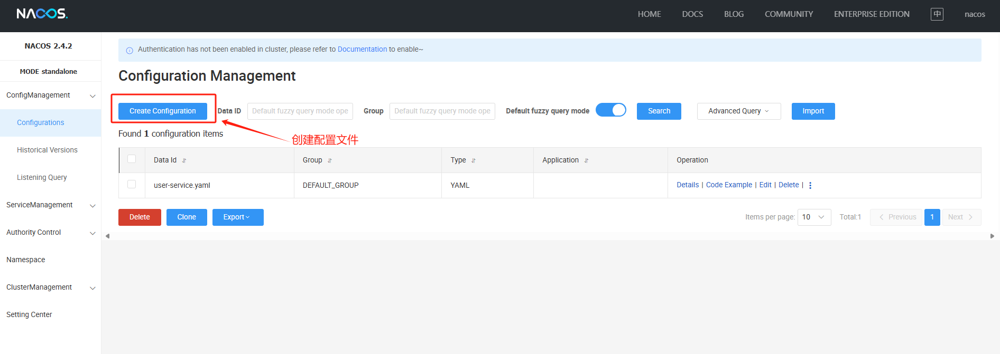
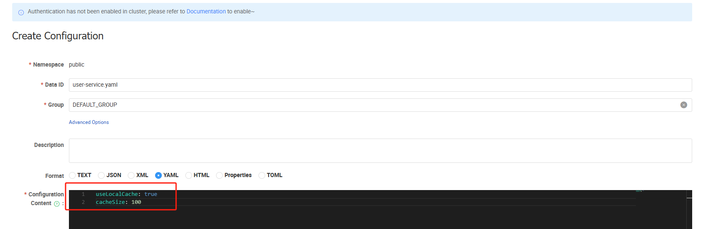

[TOC]

> 完整示例代码参考： [java-demos/spring-cloud-openfeign at main · idealzouhu/java-demos (github.com)](https://github.com/idealzouhu/java-demos/tree/main/spring-cloud-openfeign)

## 一、Nacos 部署

### 1.1 启动 Nacos Server

```bash
docker run ^
-d -p 8848:8848 ^
-p 9848:9848 ^
--name nacos-test1 ^
-e MODE=standalone ^
-e TIME_ZONE='Asia/Shanghai' ^
nacos/nacos-server:v2.1.2
```

```
docker run ^
-d -p 8848:8848 ^
-p 9848:9848 ^
--name nacos-test ^
-e MODE=standalone ^
-e TIME_ZONE='Asia/Shanghai' ^
nacos/nacos-server:v2.4.2
```

部分指令的含义如下：

- `-e MODE=standalone`: 使用环境变量 `MODE` 设置 Nacos 的启动模式。这里设置为 `standalone` 模式，意味着单机模式运行（适合开发环境使用）。在生产环境中，通常会配置为集群模式。
- `-e TIME_ZONE='Asia/Shanghai'`: 设置容器内的时区为 `Asia/Shanghai`，即中国标准时间（CST，东八区）

运行成功，稍等几秒启动时间，浏览器输入  http://localhost:8848/nacos/index.html  查看控制台。


## 二、项目创建

### 2.1 创建项目并导入依赖

创建 [Spring Cloud](https://start.aliyun.com/?spm=0.29160081.0.0.3f5812ffZRXpdF) 项目 `user-service`,  导入以下依赖。

```xml
<dependency>
			<groupId>com.alibaba.cloud</groupId>
			<artifactId>spring-cloud-starter-alibaba-nacos-discovery</artifactId>
			<version>2023.0.1.2</version>
		</dependency>

		<dependency>
			<groupId>com.alibaba.cloud</groupId>
			<artifactId>spring-cloud-starter-alibaba-nacos-config</artifactId>
			<version>2023.0.1.2</version>
		</dependency>


```

关于 Nacos Spring Cloud 的详细文档请参看：[Nacos Config](https://github.com/spring-cloud-incubator/spring-cloud-alibaba/wiki/Nacos-config) 和 [Nacos Discovery](https://github.com/spring-cloud-incubator/spring-cloud-alibaba/wiki/Nacos-discovery)。

- 通过 Nacos Server 和 `spring-cloud-starter-alibaba-nacos-config` 实现配置的动态变更。
- 通过 Nacos Server 和 `spring-cloud-starter-alibaba-nacos-discovery` 实现服务的注册与发现。


### 2.2 **`application.yml`** 配置

```yaml
spring:
  application:
    name: user-service
  cloud:
    nacos:
      # nacos 注册中心
      discovery:
        server-addr: 127.0.0.1:8848   # nacos 注册中心地址
        namespace: public
      # nacos 配置中心
      config:
        server-addr: 127.0.0.1:8848
        file-extension: yaml    # 配置文件类型，支持 `properties`, `yaml` 等
        namespace: public             # 可以选择命名空间，默认是 public
        group: DEFAULT_GROUP         # 配置分组，默认是 DEFAULT_GROUP
        # 配置文件导入检查，默认为 true
        import-check:
          enabled: false
        refresh-enabled: true
  config:
    import: nacos:user-service.yaml?refresh=true


server:
  port: 8080
```


## 三、测试自动配置

### 3.1 配置文件概述

Nacos 配置信息如下：

```
Data ID:    nacos-config.properties

Group  :    DEFAULT_GROUP

配置格式:    Properties

配置内容：   user.name=nacos-config-properties
            user.age=90
```

>  注意：dataId 是以 properties （默认的文件扩展名）为扩展名。

在 Nacos Spring Cloud 中，`dataId` 的完整格式如下：

```
${prefix}-${spring.profiles.active}.${file-extension}
```

- `prefix` 默认为 `spring.application.name` 的值，也可以通过配置项 `spring.cloud.nacos.config.prefix`来配置。
- `spring.profiles.active` 即为当前环境对应的 profile，详情可以参考 [Spring Boot文档](https://docs.spring.io/spring-boot/docs/current/reference/html/boot-features-profiles.html#boot-features-profiles)。 **注意：当 `spring.profiles.active` 为空时，对应的连接符 `-` 也将不存在，dataId 的拼接格式变成 `${prefix}.${file-extension}`**
- `file-exetension` 为配置内容的数据格式，可以通过配置项 `spring.cloud.nacos.config.file-extension` 来配置。目前只支持 `properties` 和 `yaml` 类型。


### 3.2 发布配置

我们可以通过 Nacos Open API 或者 Nacos 控制台 来发布配置。

~~**（1）Nacos Open API**~~

通过调用 [Nacos Open API](https://nacos.io/docs/latest/guide/user/open-api/) 向 Nacos Server 发布配置：dataId 为`example.properties`，内容为`useLocalCache=true`。

打开 cmd 运行以下内容：

```bash
$ curl -X POST "http://127.0.0.1:8848/nacos/v2/cs/config?dataId=user-service.yaml&group=DEFAULT_GROUP&content=cacheSize=100&content=useLocalCache=true"
{"code":0,"message":"success","data":true}
```

该指令暂时存在问题，创建的配置文件里面内容为 text 类型。

**（2）Nacos 控制台**

在 Nacos 控制台中创建配置文件。




配置内容如下：




### 3.3 验证获取配置

我们可以通过 Nacos Open API 或者 Java 客户端来获取配置。

**(1) Nacos Open API**

```bash
$ curl -X POST "http://127.0.0.1:8848/nacos/v2/cs/config?dataId=user-service.yaml&group=DEFAULT_GROUP&content=cacheSize=100&content=useLocalCache=true"
{"code":0,"message":"success","data":"useLocalCache=true,cacheSize=100"}
```

**(2) Java 客户端**

在 user-service 类中，创建 `com.zouhu.userservice.controller.ConfigController`类， 具体内容如下： 

```java
/**
 *  测试 nacos 配置中心
 *  <p>
 *      配置文件具体信息如下：            <br/>
 *      dataID：user-service.yaml     <br/>
 *      Group： DEFAULT_GROUP         <br/>
 *      Content：useLocalCache: true  <br/>
 *               cacheSize: 100       <br/>
 *  </p>
 *
 * @author zouhu
 * @data 2024-09-07 23:34
 */
@RestController
@RequestMapping("/config")
@RefreshScope   // 支持配置动态刷新
public class ConfigController {
    @Value("${useLocalCache:false}")    // 从配置文件中读取useLocalCache的值，默认值设置为false
    private boolean useLocalCache;

    @Value("${cacheSize:0}")
    private String cacheSize;       // 配置文件里面字段的内容默认为 String 类型

    /**
     * 获取配置信息
     * <p>
     *     <a href="http://localhost:8080/config/get"> get()调用路径 </a>
     *     <a href="http://localhost:8848/nacos/index.html"> Nacos 控制台 </a>
     * </p>
     *
     * @return
     */
    @RequestMapping("/get")
    public Map get() {
        Map<String, Object> configMap = new HashMap<>();
        configMap.put("useLocalCache", useLocalCache);
        configMap.put("cacheSize", cacheSize);
        return configMap;
    }
}
```

在浏览中访问 http://localhost:8080/config/get， 可以看到返回内容， 说明程序中的`useLocalCache`值已经被动态更新。


微服务中也可以看到相应的日志，具体内容如下：

```bash
2024-09-08T20:34:13.111+08:00  INFO 26688 --- [r-127.0.0.1-337] com.alibaba.nacos.common.remote.client   : [c538aeac-343c-4366-af4f-29c7fca3ae48_config-0] Receive server push request, request = ConfigChangeNotifyRequest, requestId = 13
2024-09-08T20:34:13.111+08:00  INFO 26688 --- [r-127.0.0.1-337] c.a.n.client.config.impl.ClientWorker    : [c538aeac-343c-4366-af4f-29c7fca3ae48_config-0] [server-push] config changed. dataId=user-service.yaml, group=DEFAULT_GROUP,tenant=null
2024-09-08T20:34:13.111+08:00  INFO 26688 --- [r-127.0.0.1-337] com.alibaba.nacos.common.remote.client   : [c538aeac-343c-4366-af4f-29c7fca3ae48_config-0] Ack server push request, request = ConfigChangeNotifyRequest, requestId = 13
2024-09-08T20:34:13.121+08:00  INFO 26688 --- [s.client.Worker] c.a.n.client.config.impl.ClientWorker    : [fixed-127.0.0.1_8848] [data-received] dataId=user-service.yaml, group=DEFAULT_GROUP, tenant=, md5=6dc5f7bb510c8b43c88884bf37e9bfa4, content=useLocalCache: true
cacheSize: 100
, type=yaml
2024-09-08T20:34:13.122+08:00  INFO 26688 --- [s.client.Worker] c.a.nacos.client.config.impl.CacheData   : [fixed-127.0.0.1_8848] [notify-listener] time cost=0ms in ClientWorker, dataId=user-service.yaml, group=DEFAULT_GROUP, md5=6dc5f7bb510c8b43c88884bf37e9bfa4, listener=com.alibaba.cloud.nacos.refresh.NacosContextRefresher$1@ec1de6a 
2024-09-08T20:34:13.122+08:00  INFO 26688 --- [ternal.notifier] c.a.nacos.client.config.impl.CacheData   : [fixed-127.0.0.1_8848] [notify-context] dataId=user-service.yaml, group=DEFAULT_GROUP, md5=6dc5f7bb510c8b43c88884bf37e9bfa4
2024-09-08T20:34:13.327+08:00  INFO 26688 --- [ternal.notifier] c.a.c.n.c.NacosConfigDataLoader          : [Nacos Config] Load config[dataId=user-service.yaml, group=DEFAULT_GROUP] success
2024-09-08T20:34:13.343+08:00  INFO 26688 --- [ternal.notifier] o.s.c.e.event.RefreshEventListener       : Refresh keys changed: [cacheSize]
2024-09-08T20:34:13.343+08:00  INFO 26688 --- [ternal.notifier] c.a.nacos.client.config.impl.CacheData   : [fixed-127.0.0.1_8848] [notify-ok] dataId=user-service.yaml, group=DEFAULT_GROUP, md5=6dc5f7bb510c8b43c88884bf37e9bfa4, listener=com.alibaba.cloud.nacos.refresh.NacosContextRefresher$1@ec1de6a ,cost=221 millis.

```


  


## 参考资料

[Nacos 融合 Spring Cloud，成为注册配置中心 | Nacos 官网](https://nacos.io/docs/latest/ecology/use-nacos-with-spring-cloud/)

[Nacos Docker 快速开始 | Nacos 官网](https://nacos.io/docs/latest/quickstart/quick-start-docker/#_top)

[Nacos快速入门教程：从零开始搭建配置中心与服务注册发现_慕课手记 (imooc.com)](https://www.imooc.com/article/352069#:~:text=Nacos适用场景 1 微服务架构中的服务发现与配置管理。,2 多团队或部门的资源隔离与权限控制。 3 实时更新配置以快速响应业务需求的变化。)

[【On Nacos】SpringBoot 方式使用 Nacos-阿里云开发者社区 (aliyun.com)](https://developer.aliyun.com/article/979730)