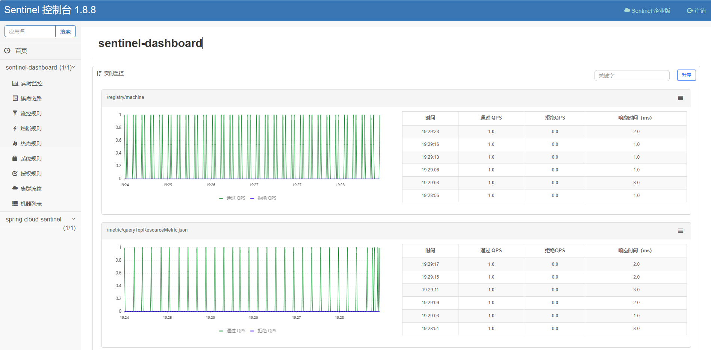
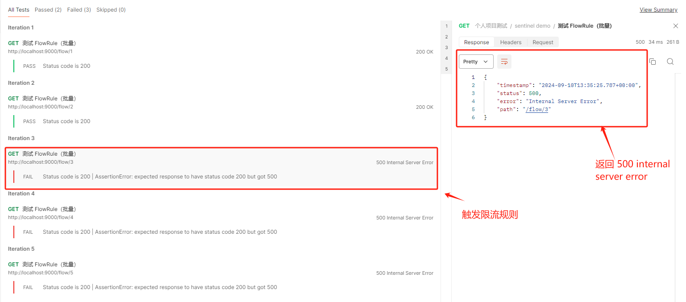
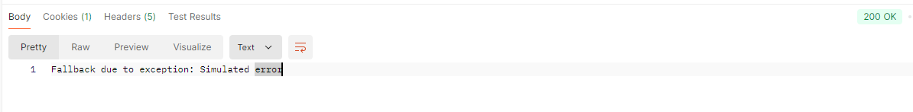

[TOC]

[TOC]

> 完整案例代码：[java-demos/spring-cloud-sentinel at main · idealzouhu/java-demos (github.com)](https://github.com/idealzouhu/java-demos/tree/main/spring-cloud-sentinel)

## 一、Sentinel 使用

Sentinel 分为两个部分:

- **核心库（Java 客户端）**不依赖任何框架/库，能够运行于所有 Java 运行时环境，同时对 Dubbo / Spring Cloud 等框架也有较好的支持。
- **控制台（Dashboard）**基于 Spring Boot 开发，打包后可以直接运行，不需要额外的 Tomcat 等应用容器。

### 1.1 Sentinel 客户端

Sentinel客户端对应的依赖为 sentinel-core。

```xml
<!-- sentinel核心库依赖 -->
<dependency>
    <groupId>com.alibaba.csp</groupId>
    <artifactId>sentinel-core</artifactId>
    <version>1.8.6</version>
</dependency>
```

同时，Sentinel 还针对不同的开源框架做适配，比较常用的有 `spring-cloud-starter-alibaba-sentinel`。


### 1.2 Sentinel 控制台

[Sentinel 控制台](https://sentinelguard.io/zh-cn/docs/dashboard.html)支持实时监控和规则管理， 可以在本地或者公网部署。

从  [release 页面](https://github.com/alibaba/Sentinel/releases) 下载最新版本的控制台 jar 包，使用如下命令启动控制台：

```bash
java -Dserver.port=8080 -Dcsp.sentinel.dashboard.server=localhost:8080 -Dproject.name=sentinel-dashboard -jar sentinel-dashboard-1.8.8.jar
```

其中，各部分参数的含义如下：

- `-Dserver.port=8080`：指定 Sentinel 控制台端口为 `8080`
- `-Dcsp.sentinel.dashboard.server=localhost:8080`：指定 Sentinel 客户端连接的 Dashboard 服务地址。也就是说 Sentinel 客户端会连接到本地 `8080` 端口上的 Sentinel Dashboard 进行监控。

在启动控制台后，可以通过 http://localhost:8080 来访问控制台, 默认用户名和密码都是 `sentinel`。




### 1.3 客户端和控制台的通信所需依赖

客户端需要引入 Transport 模块来与 Sentinel 控制台进行通信。

```xml
<dependency>
    <groupId>com.alibaba.csp</groupId>
    <artifactId>sentinel-transport-simple-http</artifactId>
</dependency>
```

同时，还要在 `application.yaml` 中进行相应的配置：

```yaml
spring:
  cloud:
    sentinel:
      transport:
        dashboard: localhost:8080   # 指定 Sentinel Dashboard 地址
        port: 8719                  # 客户端监控端口，用于与 Sentinel Dashboard 通信
```


## 二、测试 Sentinel 限流规则

 使用 Sentinel 来进行资源保护，主要分为几个步骤:

1. 定义资源
2. 定义规则
3. 检验规则是否生效


### 2.1 启动配置

对 Sentinel 客户端进行相应的[配置](https://github.com/alibaba/spring-cloud-alibaba/wiki/Sentinel)

```yaml
spring:
  cloud:
    sentinel:
      transport:
        dashboard: localhost:8080   # 指定 Sentinel Dashboard 地址
        port: 8719                  # 客户端监控端口，用于与 Sentinel Dashboard 通信
      eager: true
      filter:
        enabled: true
```

不同配置的含义如下：

- `spring.cloud.sentinel.transport.port` 端口配置会在应用对应的机器上启动一个 Http Server，该 Server 会与 Sentinel 控制台做交互。比如 Sentinel 控制台添加了一个限流规则，会把规则数据 push 给这个 Http Server 接收，Http Server 再将规则注册到 Sentinel 中。


### 2.2 定义限流资源

创建 `com.zouhu.spring.cloud.sentinel.controller.SentinelController` 类，具体代码如下：

```java
RestController
public class SentinelController {

    /**
     * 测试限流规则的使用
     *  <p>
     *      定义资源  "SentinelController#testFlowRule"。
     *      限流规则  {@link com.zouhu.spring.cloud.sentinel.config.FlowRuleInit}。
     *      方法调用链接： http://localhost:9000/flow/10。
     *  </p>
     *
     *
     * @return
     */
    @GetMapping("/flow/{id}")
    @SentinelResource(value = "SentinelController#testFlowRule", blockHandler = "handleBlock")
    public String testFlowRule(@PathVariable("id") int id) {
        System.out.println("test" + id);
        return "Request success!" + id;
    }
    
     /**
     * blockHandler 函数
     * <p>
     *     在资源请求被限流/降级/系统保护的时候调用, 相当于替换原方法。
     *     处理 BlockException。
     * </p>
     * @param ex
     * @return
     */
    public String handleBlock(int id, BlockException ex) {
        return "Request blocked!";
    }

}
    
```

[**`@SentinelResource` 注解**](https://sentinelguard.io/zh-cn/docs/annotation-support.html)：为 `test` 接口定义了一个受保护的资源。如果该接口的流量超过设定的阈值，则会触发限流，进而调用 `handleBlock` 方法。

**`blockHandler`**：当流量控制或熔断降级触发时，会调用该方法，返回对应的提示信息。


### 2.3 配置流量控制规则

除了通过注解定义限流规则，你还可以使用 Sentinel 控制台（Dashboard）动态配置规则，或者在代码中编写限流规则。流量规则代码如下:

```java
@Component
public class FlowRuleInit implements CommandLineRunner {
    @Override
    public void run(String... args) {
        List<FlowRule> rules = new ArrayList<>();
        FlowRule rule1 = new FlowRule();
        rule1.setResource("SentinelController#testFlowRule");
        rule1.setGrade(RuleConstant.FLOW_GRADE_QPS);
        rule1.setCount(2); // QPS 限制为 2
        rules.add(rule1);
        FlowRuleManager.loadRules(rules);
    }
}
```


### 2.4 运行项目

我们可以在是否使用 `blockHandler` 这两种情况下测试限流规则。

**(1) 不使用 blockHandler**

使用 Postman 批量测试 `http://localhost:9000/flow/{{id}}`，Sentinel 会触发流控，**状态码为 `500 internal server error`**。否则返回正常结果 `Request success!`。



同时，Sentinel 会抛出异常 FlowException。相关日志如下：

```bash
2024-09-10T17:21:19.962+08:00 ERROR 19288 --- [nio-8080-exec-6] o.a.c.c.C.[.[.[/].[dispatcherServlet]    : Servlet.service() for servlet [dispatcherServlet] in context with path [] threw exception [Request processing failed: java.lang.reflect.UndeclaredThrowableException] with root cause

com.alibaba.csp.sentinel.slots.block.flow.FlowException: null
```

**（2）使用  blockHandler**

使用 Postman 批量测试 `http://localhost:9000/flow/{{id}}`，Sentinel 会触发流控，**状态码为 `200 OK`**， 返回 `Request blocked!`。否则返回正常结果 `Request success!`。


## 三、 测试 Sentinel 熔断降级规则


### 3.1 定义限流资源

```java
@RestController
public class SentinelController {
	/**
     * 测试熔断降级规则的使用(存在问题)
     * <p>
     *      定义资源  "SentinelController#testFlowRule"。
     *      限流规则  {@link com.zouhu.spring.cloud.sentinel.config.FlowRuleInit}。
     *      方法调用链接： http://localhost:8080/degrade/10。
     * </p>
     *
     * @param id
     * @return
     */
    @GetMapping("/degrade/{id}")
    @SentinelResource(value = "SentinelController#testDegradeRule", blockHandler = "handleBlock")
    public String testDegradeRule(@PathVariable("id") int id) throws FlowException {
        // 模拟可能抛出的异常
        // 注意：熔断降级规则针对的异常只是 BlockException 以及其子类，不针对其他异常
        if (new Random().nextInt(10) < 8) {
            throw new FlowException("Simulated FlowException");
        }
        return "Request success!" + id;
    }

    /**
     * blockHandler 函数
     * <p>
     *     在资源请求被限流/降级/系统保护的时候调用, 相当于替换原方法。
     *     处理 BlockException。
     * </p>
     * @param ex
     * @return
     */
    public String handleBlock(int id, BlockException ex) {
        return "Request blocked!";
    }

}
```


### 3.2 配置熔断降级规则

```java
public class DegradeRuleInit  implements CommandLineRunner {

    /**
     * 根据异常比例熔断
     * <p>
     *     当单位统计时长（statIntervalMs）内请求数目大于设置的最小请求数目，
     *     并且异常的比例大于阈值，则接下来的熔断时长内请求会自动被熔断
     * </p>
     *
     * @param args
     */
    @Override
    public void run(String... args) {
        List<DegradeRule> rules = new ArrayList<>();
        DegradeRule rule1 = new DegradeRule("SentinelController#testDegradeRule")
                .setGrade(CircuitBreakerStrategy.ERROR_RATIO.getType())
                .setCount(0.5) // 阈值为 50% 错误率
                .setMinRequestAmount(20)
                .setStatIntervalMs(1000) // 统计时长 1 秒
                .setTimeWindow(10); // 熔断持续时间 10 秒
        rules.add(rule1);
        DegradeRuleManager.loadRules(rules);

    }
}
```


### 3.3 运行项目

使用 Postman 批量测试 `http://localhost:9000/degrade/{{id}}`，Sentinel 会触发熔断降级，返回 `Request blocked!`。否则返回正常结果 `Request success!`。


## 四、测试 fallback 函数

### 4.1 定义资源

```java
@RestController
public class SentinelController {
 	/**
     * 测试 fallback 规则的使用
     * <p>
     *     定义资源  "SentinelController#testFlowRule"。
     *     方法调用链接： http://localhost:8080/degrade/10。
     * </p>
     *
     * @return
     */
    @GetMapping("/testFallback")
    @SentinelResource(value = "SentinelController#testFallback", fallback = "handleFallback")
    public String testFallback() {
        // 可能抛出运行时异常的业务逻辑
        if (new Random().nextInt(10) < 5) {
            throw new RuntimeException("Simulated error");
        }
        return "Request success!";
    }

    /**
     * fallback 函数
     * <p>
     *       当业务异常或降级规则触发时调用此方法
     * </p>
     *
     * @param ex
     * @return
     */
    public String handleFallback(Throwable ex) {
        return "Fallback due to exception: " + ex.getMessage();
    }

	
}
```


### 4.2 运行项目

多次运行 `http://localhost:9000/testFallback`。

当出现异常的时候，结果如下：




## 参考资料

[Spring Cloud Alibaba Sentine 官方使用案例](https://github.com/alibaba/spring-cloud-alibaba/wiki/Sentinel)

[basic-api-resource-rule | Sentinel (sentinelguard.io)](https://sentinelguard.io/zh-cn/docs/basic-api-resource-rule.html)

[介绍 · alibaba/Sentinel Wiki (github.com)](https://github.com/alibaba/Sentinel/wiki/介绍)

[sentinel-guides/sentinel-guide-spring-cloud at master · sentinel-group/sentinel-guides (github.com)](https://github.com/sentinel-group/sentinel-guides/tree/master/sentinel-guide-spring-cloud)

